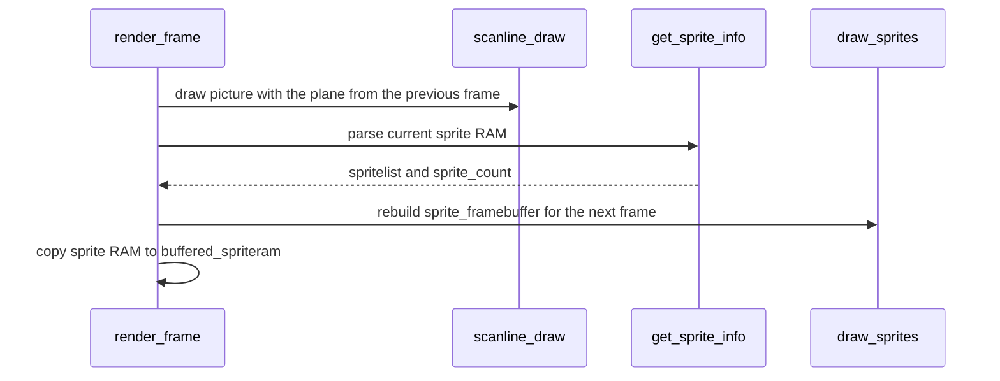

# FDP sprites: list walk and raster

**What you will learn:** how `Video::Impl::get_sprite_info` reads the sprite RAM, how `draw_gfx_sprite` draws a tile into the sprite plane, and which rules the game-data renderer must copy.

The code is in `runtime/video.cpp`. The sprite RAM format is in [F3 video hardware](/developer/runtime/video/hardware).

The sprite rules below describe the MAME-derived FDP model. Matching game-data
sprite output is internal parity, not independent physical-chip verification.

## The sprite plane

The sprite plane is a 432x256 array of `uint16_t` (`sprite_framebuffer`). One entry is a palette index:

```text
plane value = 0x1000 + (color_byte << 4 | pen)
```

The value 0 means "no sprite pixel". Bits 10 and 11 of the value are bits 6 and 7 of the color byte. They name the **sprite group** (0 to 3). The mixer for group `g` ignores every plane pixel whose bits 10 and 11 are not `g` (`sprite_inf::inactive_group`).

Each draw builds the plane for **one frame** at a time. The plane is cleared before drawing unless `sprite_trails` is on. When `sprite_trails` is on, the old pixels stay. `sprite_pri_row_usage[y]` has bit `g` set when line `y` has a pixel of group `g`. The mixer uses it to skip groups with no pixels on a line.

## Stage 1: walk the list (`get_sprite_info`)

The function clears `sprite_count` and then walks up to 1024 entries. The entry address is `bank_offset + offs * 16`. The `bank_offset` is 0x8000 when `sprite_bank` is on. Each entry is processed in this order:

1. **Special command.** If bit 15 of word 3 is set, read the command from word 5. Set `flipscreen` (bit 13), `sprite_extra_planes` (bits 8 and 9), `sprite_pen_mask` (`(planes << 4) | 0x0f`), `sprite_trails` (bit 1) and `sprite_bank` (bit 0). The entry still continues with the steps below.
2. **Jump.** If bit 15 of word 6 is set, the target is bits 0 to 9. If the target equals the current index, the walk stops. Otherwise the walk continues at the target after this entry. The total number of entries read is also limited to 1024.
3. **Color.** If the "lock" bit (bit 2 of the flags byte) is clear, the color byte comes from the low byte of word 4. Otherwise the previous color stays.
4. **Position.** Two `sprite_axis` objects, `x` and `y`, update their positions. See below.
5. **Multi flag.** `multi` takes bit 3 of the flags byte for the next entry.
6. **Tile code.** `tile = word0 | ((word5 & 1) << 16)`. A tile code of 0 ends the work for this entry. The entry produces no sprite.
7. **Flip screen.** If `flipscreen` is on, the position becomes `(512 << 8) - scale * 16 - pos` for X and `(256 << 8) - scale * 16 - pos` for Y. The flip flags invert.
8. **Cull.** The code drops the entry if its box lies outside the visible area. The box test uses 24.8 values: the right side must be above `46 << 8`, the left side must be at most `365 << 8`, the bottom must be above `24 << 8` and the top must be at most `255 << 8`.
9. **Store.** The entry becomes a `tempsprite` in `spritelist`. The group is `(color >> 6) & 3`.

### Position update (`sprite_axis::update`)

Each axis keeps a block position, a block scale, a position, and two scroll values: `global` and `subglobal`. The inputs are the scroll mode (word 2, bits 12 to 15), the 12-bit signed position, the `multi` flag, the block control bits and the zoom byte.

- Scroll mode bit 0 loads `subglobal` from the new position. Bit 1 loads `global`.
- If scroll mode bit 3 is clear, the new position adds `global`. If bit 2 is also clear, it adds `subglobal` too.
- The block control value (2 bits) then chooses what to do:

| Block control | Action |
| --- | --- |
| 00 | If this entry is not inside a multi block, start a new block: `block_pos = new_pos << 8` and `block_scale = 0x100 - zoom`. Then set `pos = block_pos`. |
| 10 | Set `pos = block_pos`. |
| 11 | Add `block_scale * 16` to `pos`. This steps to the next tile of the block. |
| 01 | Do nothing. `pos` keeps its value. |

The X axis takes the control bits from bits 6 and 7 of the flags byte and the zoom from the low byte of word 1. The Y axis takes bits 4 and 5 and the high byte of word 1. A multi-tile sprite is therefore a run of entries: the first entry has control 00 and the next entries use 11 on one axis and 10 on the other.

## Stage 2: draw the plane (`draw_sprites`, `draw_gfx_sprite`)

`draw_sprites` clears the plane unless trails are on. It visits the stored list in reverse order and writes only into empty pixels. Later stored descriptors therefore win overlaps.

`draw_gfx_sprite` draws one 16x16 tile:

1. The tile pointer is `decoded_sprites[(code % 32768) * 256]`.
2. The vertical start is `sprite.y` plus 255 (no addition if the screen is flipped). For each source row `y` from 0 to 15, the destination row is `dy8 >> 8`, and `dy8` then adds `scale_y`. The code skips destination rows outside lines 24 to 255.
3. The horizontal start is `sprite.x + 128`. For each source column `x` the destination column is `dx8 >> 8` and `dx8` adds `scale_x`. The code skips columns outside 46 to 365.
4. If the next `dx8 >> 8` is the same as the current one, the code skips the pixel. This prevents double sampling when the sprite is shrunk.
5. The pen is the source pixel (with the flips applied by XOR with 0x0f) masked with `sprite_pen_mask`. A pen of 0 is transparent.
6. If the pen is not 0 and the plane pixel is 0, the code writes the plane value and sets bit `pri` in `sprite_pri_row_usage[dy]`.

The `+255` and `+128` values are the retained oracle's raster phases. `GameSprites::raster` reproduces them. The parity evidence does not establish every physical-chip edge case.



## Rules the game-data renderer copies

- **Later stored descriptors win overlaps.** Both renderers visit descriptors in reverse order and write only into empty plane pixels. The source comment claims earlier sprites have priority, but the executed rule gives later descriptors precedence.
- **The cull test runs before row rounding.** A sprite whose nominal box ends exactly at line 24 is not drawn. If a renderer rounds first, it draws one extra row at the top of the picture.
- **The plane value format is the same.** The value is `0x1000 + (palette << 4) + pen`, and the group is in bits 10 and 11.
- **The one-frame lag is the same.** The plane that `render_frame` draws is the plane that the previous call prepared.

The rules about integer tile origins and about the masked X zoom belong to the game's own sprite compiler, not to the FDP. They are in [Sprites](/developer/runtime/video/sprites).

Source: [runtime/video.cpp](https://github.com/ansxor/f3-recomp/blob/main/runtime/video.cpp).
