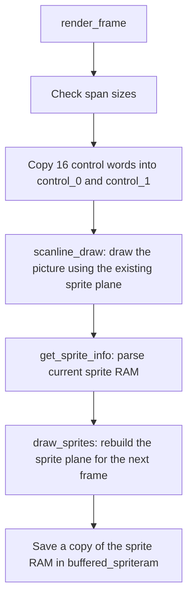
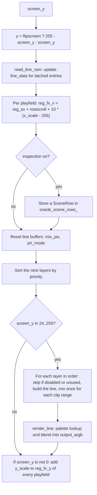
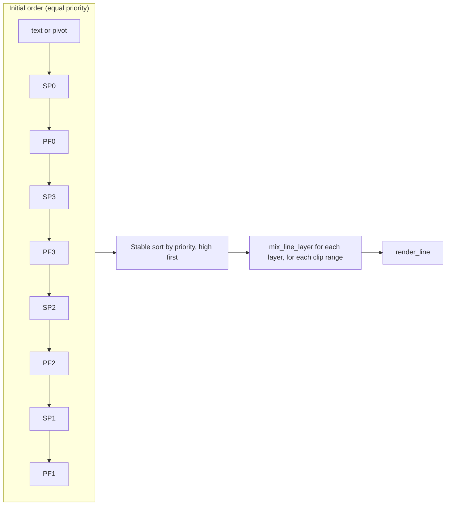

# FDP renderer (the oracle)

**What you will learn:** how `f3rt::Video` turns the hardware RAM into a 320x232 picture, what every public function does, what each internal structure holds, and which rules you must keep when you change it.

The files are `include/f3rt/video.hpp` and `runtime/video.cpp`. The renderer is a MAME-derived software model of the TC0630FDP, not a chip-verified copy. Read [F3 video hardware](/developer/runtime/video/hardware) first.

::: info
**Reference ownership.** `Video` is the internal oracle for game-data renderer comparisons. Matching it establishes agreement with this implementation, not physical-chip correctness. Changes to the oracle need independent evidence, such as a recorded MAME capture or a documented hardware measurement. See [Parity evidence and limits](/developer/runtime/video/parity).
:::

## Design

The renderer draws **line by line**, following the retained MAME-derived model. It does not build a full-screen buffer for each layer. It has three reasons for this:

1. The line RAM can change every setting on every line. A per-line loop handles all cases with one code path.
2. Playfield lines are 1024 pixels wide. The renderer builds only the lines it needs.
3. Sprites are the exception. The renderer draws all sprites into one 432x256 buffer first, because sprites can be zoomed, overlap in a list order and lag by one frame.

## Public interface

`Video` is a pimpl class: `Video::Impl` holds all state. The class is movable and not copyable. The table lists every public function.

| Function | What it does |
| --- | --- |
| `Video()`, `~Video()`, move operations | Create and destroy the `Impl`. |
| `void reset()` | Clears the sprite plane, the buffered sprite RAM, `flipscreen`, `sprite_bank`, `sprite_trails`, `sprite_extra_planes`, the control copies, the row-usage tables, the line caches and the inspection rows. `sprite_pen_mask` returns to 0x0f. It does not touch the decoded ROM tiles. |
| `bool load_roms(sprites, sprites_hi, tilemap, tilemap_hi)` | Decodes the four ROM regions into one byte per pixel. It returns false if a region is too small (sprites and tile ROM 0x400000 bytes, high planes 0x200000 bytes). `Machine` calls it once at construction. |
| `void render_frame(palette_ram, graphics_ram, control_regs, output_argb)` | Renders one frame. Returns without work if a span is too small. See the pipeline below. |
| `void vblank(graphics_ram)` | Parses the current sprite RAM, redraws the sprite plane and saves a copy of the sprite RAM. It does not draw a frame. |
| `void set_active_spriteram(spriteram)` | Copies 0x10000 bytes into the buffered sprite RAM and builds the sprite plane from it. The replay tool uses it for single-frame captures. |
| `sprite_tiles()`, `playfield_tiles()` | Return the decoded tile data (32768 tiles of 256 bytes each). `GameVideo` shares these spans. |
| `inspect_playfield_line(layer, y, graphics_ram)` | Builds one 1024-pixel playfield line and returns the palette and flags spans (`VideoLine`). It invalidates the line cache first. It does not change the sprite state. |
| `prepare_text_inspection(graphics_ram)` | Decodes the character RAM so that `inspect_text_line` can run. |
| `inspect_text_line(y, graphics_ram)` | Builds 512 meaningful text pixels for source row `y`, from 0 through 511. Its backing spans contain 1024 entries; diagnostics use only the first 512. |
| `sprite_plane()` | Returns the 432x256 sprite plane prepared for the **next** `render_frame` call. |
| `roms_loaded()` | True after a successful `load_roms`. |
| `flipscreen()` | The current screen flip flag. |
| `inspect_scene_row(scanout_y)` | Returns the `SceneRow` that the last render stored for a line. Valid only if scene inspection is on. |
| `enable_scene_inspection(bool)` | Turns on the fill of `oracle_scene_rows_` during `scanline_draw`. |
| `state_size()`, `save_state(dst)`, `load_state(src)` | Snapshot support. The functions throw `std::invalid_argument` if the span size is wrong. |

`VideoLine` (in `video.hpp`) holds two spans: `palette` (`uint16_t`) and `flags` (`uint8_t`). The spans point into a line cache of `Video::Impl`. The next call to any render or inspection function invalidates them.

## Frame pipeline

`render_frame` runs these steps.

Steps D to F make the **sprite lag**: the picture of this frame uses the sprites that the game built in the previous frame. Step E and F prepare the plane for the next call.

### What `scanline_draw` does

The function `Video::Impl::scanline_draw` has a setup part and a loop of 256 iterations.

**Setup (once per frame):**

1. `decode_charram` converts the 256 text glyphs (8x8, 4 bits per pixel) to bytes.
2. `decode_pivot_ram` converts the 2048 pivot glyphs the same way.
3. `update_row_usages` counts, for each tile row of each playfield and for each text row, how many cells have a non-zero tile code. It stores the counts in `tilemap_row_usage` and `textram_row_usage`. The renderer later skips a layer on a line when its count is zero.
4. All line caches are invalidated (`last_y = -1`).
5. A fresh `f3_line_inf` is created. Each sprite group gets its `index`. Each playfield gets its scroll from `get_pf_scroll`, the `width_mask` 0x3ff and its `index`.
6. The pivot X and Y scroll come from `control_1[4]` and `control_1[5]`. For a flipped screen the code uses `control_1[4] - 12` and `control_1[5]`. Otherwise it uses `-control_1[4] - 5` and `-control_1[5]`.

**Loop (for each `screen_y` from 0 to 255):**

Details to know:

- Lines 0–23 are processed but not drawn. They update line latches and vertical accumulators. These are retained oracle rules, not separate physical-chip measurements.
- The Y accumulator does not advance after row zero. Rows zero and one therefore start at the same phase. Keep this measured compatibility rule.
- **The line buffer is reset for each line.** `dst_pal` gets the background palette index, `dst_blend` is 8, `src_blendmode` and `dst_blendmode` are 0xff.
- **Layer order.** `layers` starts as `pivot, sp[0], pf[0], sp[3], pf[3], sp[2], pf[2], sp[1], pf[1]`. An insertion sort moves higher priority first. The sort is stable and uses no heap memory.

For each layer the loop does the same three things:

1. Test `layer_enable()` and the row-usage test `is_used(layer, y)`. Skip the layer if either fails.
2. Compute the clip ranges with `calc_clip` and build the layer line. A pivot layer chooses `generate_pixel_line` when `use_pix()` is true and `generate_text_line` otherwise. A playfield calls `generate_playfield_line`. A sprite group reads the sprite plane at row `line_data.y`.
3. Call `mix_line_layer` once for each clip range. [FDP mixing](/developer/runtime/video/fdp-mixing) explains this function.

::: warning
`is_used` for a playfield looks at the tile **code** only (`update_row_usages` counts a cell when its code word is not 0). The renderer skips a line of tiles whose codes are all 0, even if tile 0 has visible pixels. The game-data renderer has no such skip. If a future game uses tile 0 with visible pixels, the two renderers will differ.
:::

### Line builders

| Function | Output | Notes |
| --- | --- | --- |
| `generate_playfield_line(pf, y, pf_ram)` | 1024 palette indexes and flags for one source line `y` of a playfield | Caches by `last_y`. For each of 64 columns it reads attribute and code, applies flip and the pen mask, and looks up the decoded tile pixel. With `flipscreen` the column and row indexes mirror and the flips invert. |
| `generate_text_line(y, textram)` | 64 cells of 8 pixels | Reads the text word. Palette index is `palette * 16 + pen`. |
| `generate_pixel_line(y, textram)` | 64 cells of 8 pixels from the pivot RAM | Tile index is `column * 32 + row` (column-major). It reads palette and flips from the **text RAM**, not from the pivot RAM. The text RAM row choice adds `control_1[5]` to the line offset. |

### Final color

`render_line` runs once for each drawn line. For columns 46 to 365 it reads the source and destination palette indexes (masked with 0x1fff), loads both 32-bit colors, multiplies each channel by the weight, adds, shifts right by 3, limits to 255 and writes ARGB8888 with alpha 0xff.

## Structures inside `video.cpp`

All of these live in an anonymous namespace or in `Video::Impl`. The table explains each one.

| Name | Purpose |
| --- | --- |
| `H_TOTAL`, `H_VIS`, `H_START`, `V_VIS`, `V_START` | Screen constants (432, 320, 46, 232, 24). |
| `OFFS_*`, `GRAPHICS_RAM_SIZE` | Offsets of each RAM area in `graphics_ram`. |
| `read_be16`, `read_be32` | Big-endian reads. |
| `sext12(v)` | Sign-extend a 12-bit value. |
| `mosaic(x, sample)` | Returns the first x of the mosaic block that contains `x`. |
| `clip_plane_inf` | One clip plane: `l`, `r`. `set_upper` sets bit 8 and above. `set_lower` sets the low 8 bits. |
| `pri_mode` | Per-column arrays: `src_prio`, `dst_prio`, `src_blendmode`, `dst_blendmode`. |
| `mix_pix` | Per-column arrays: `src_pal`, `dst_pal`, `src_blend`, `dst_blend`. |
| `mixable` | Base of all layer settings: `mix_value`, `prio`, `blend_mode`, `index`, `x_sample_enable`. Accessors `clip_inv`, `clip_enable`, `clip_inv_mode`. Virtual `layer_enable`. |
| `sprite_inf` | A `mixable` with `blend_select_v`. It overrides `layer_enable` (blend mode not 0). `inactive_group(color)` tests the group bits of a sprite plane value. |
| `pivot_inf` | A `mixable` with `pivot_control`, `pivot_enable`, `reg_sx`, `reg_sy`, `blend_select_v`. `use_pix` tests `pivot_control & 0xa0`. `x_index` adds the scroll. `y_index` masks with 0xff (pixel mode) or 0x1ff (text mode). |
| `playfield_inf` | A `mixable` with `colscroll`, `x_scale`, `y_scale`, `pal_add`, `rowscroll`, `reg_sx`, `reg_sy`, `reg_fx_x`, `reg_fx_y`, `width_mask`. `x_index` and `y_index` implement the source formula. `blend_select` reads bit 0 of the line flags. |
| `f3_line_inf` | All settings of one line: `y`, four `clip_plane_inf`, four `blend` weights, `x_sample`, `bg_palette`, one `pivot_inf`, four `sprite_inf`, four `playfield_inf`. |
| `tempsprite` | One parsed sprite: `code`, `color`, `flip_x`, `flip_y`, 24.8 `x` and `y`, `scale_x`, `scale_y`, `pri` (group). |
| `clip_ranges` | A fixed array of 16 `clip_plane_inf` with a `count`. It has `begin()` and `end()`. |
| `calc_clip(clip, layer)` | Builds `clip_ranges` for a layer. |

`Video::Impl` holds these members:

| Member | Meaning |
| --- | --- |
| `decoded_sprites`, `decoded_tiles` | 32768 tiles of 256 bytes (one byte per pixel). Each is 8 MiB. |
| `decoded_chars`, `decoded_pivot` | Decoded text glyphs (256 x 64) and pivot glyphs (2048 x 64). |
| `spritelist`, `sprite_count` | Up to 1024 parsed `tempsprite` entries. |
| `sprite_framebuffer` | The 432x256 `uint16_t` sprite plane. |
| `sprite_pri_row_usage` | One byte for each line. Bit `g` is set if a pixel of group `g` exists on the line. |
| `buffered_spriteram`, `has_buffered_spriteram` | Copy of the last sprite RAM. |
| `flipscreen`, `sprite_bank`, `sprite_trails`, `sprite_extra_planes`, `sprite_pen_mask` | State set by sprite command entries. |
| `control_0`, `control_1` | The two halves of the control block (8 words each). |
| `tilemap_row_usage`, `textram_row_usage` | The row-usage counts. |
| `pf_lines`, `text_line`, `pivot_line` | Line caches (`LineBuffer`: `last_y`, 1024 `pix`, 1024 `flags`). |
| `oracle_scene_rows_`, `m_scene_inspection_enabled` | The stored `SceneRow` for each scanout line, and the switch. |

## ROM decoding

`decode_roms` builds one byte per pixel for 32768 tiles of 16x16 pixels. The ROM format has two parts for each tile: the low four planes, packed two pixels to a byte, and the high two planes. The high planes of sprites use 2 bits per pixel. The high planes of playfield tiles use one bit per pixel in separate bytes. The two formats differ, so the code has two loops. `decode_charram` and `decode_pivot_ram` decode the 4-bit RAM glyphs on each frame, because the game can change them at any time.

## Scene inspection

When `enable_scene_inspection(true)` is on, `scanline_draw` also fills one `SceneRow` per scanout line. The row records clips (with the `left - 1` and `right - 2` calibration), blend weights, background, mosaic period, bitmap flag, the text layer state and position, the four sprite layer states and, for each playfield, the layer state, `source_x`, `source_y`, `x_step`, `y_step`, `y_fraction` and `palette_add`. `GameLines::compare_rows` compares these rows with the rows of the game-data renderer. See [Scene types](/developer/runtime/video/scene).

## Snapshot state

`Video::Impl::save_state` writes a packed `CanonicalVideo` struct (flags, sprite state, both control copies, the row-usage tables and the 1024 parsed sprites), the buffered sprite RAM (0x10000 bytes), the sprite plane (432 x 256 x 2 bytes) and `sprite_pri_row_usage` (256 bytes). `state_size()` returns the sum. It does not save the decoded ROM, the line caches or the inspection rows. `load_state` clears the line caches and the inspection rows. See [Snapshots](/developer/netplay/snapshots) for how netplay uses this.

## Invariants to keep

- `Video::render_frame` must draw with the sprite plane from the previous call and then prepare the next plane.
- The layer order list and the stable sort must not change.
- `read_line_ram` must keep old values for lines without a latch bit.
- Lines 0 to 23 must run the line loop even though the code does not draw them.
- `inspect_*` functions must not change sprite or frame state.

Sources: [video.hpp](https://github.com/ansxor/f3-recomp/blob/main/include/f3rt/video.hpp) and [video.cpp](https://github.com/ansxor/f3-recomp/blob/main/runtime/video.cpp).
