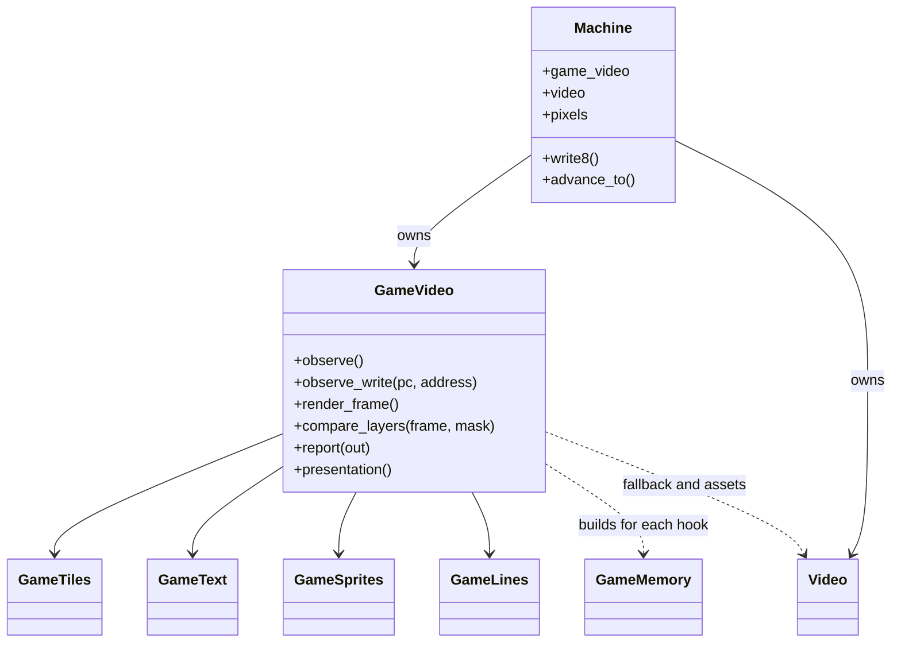
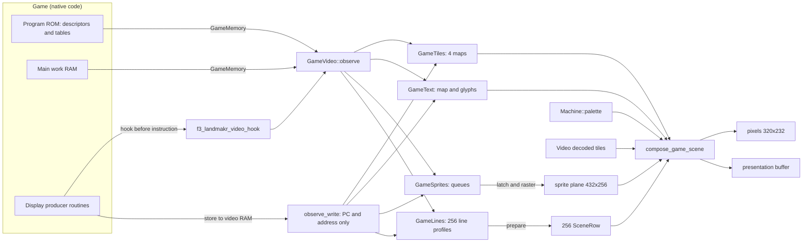
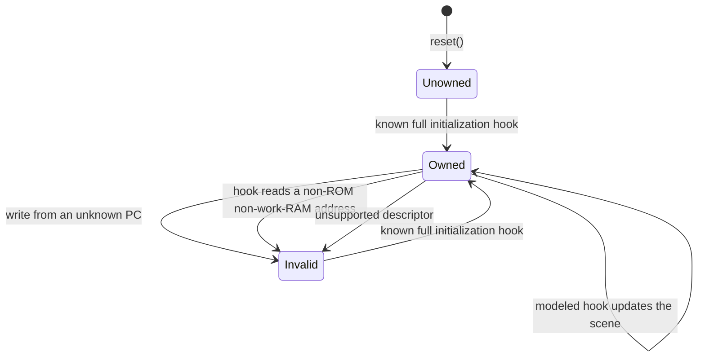
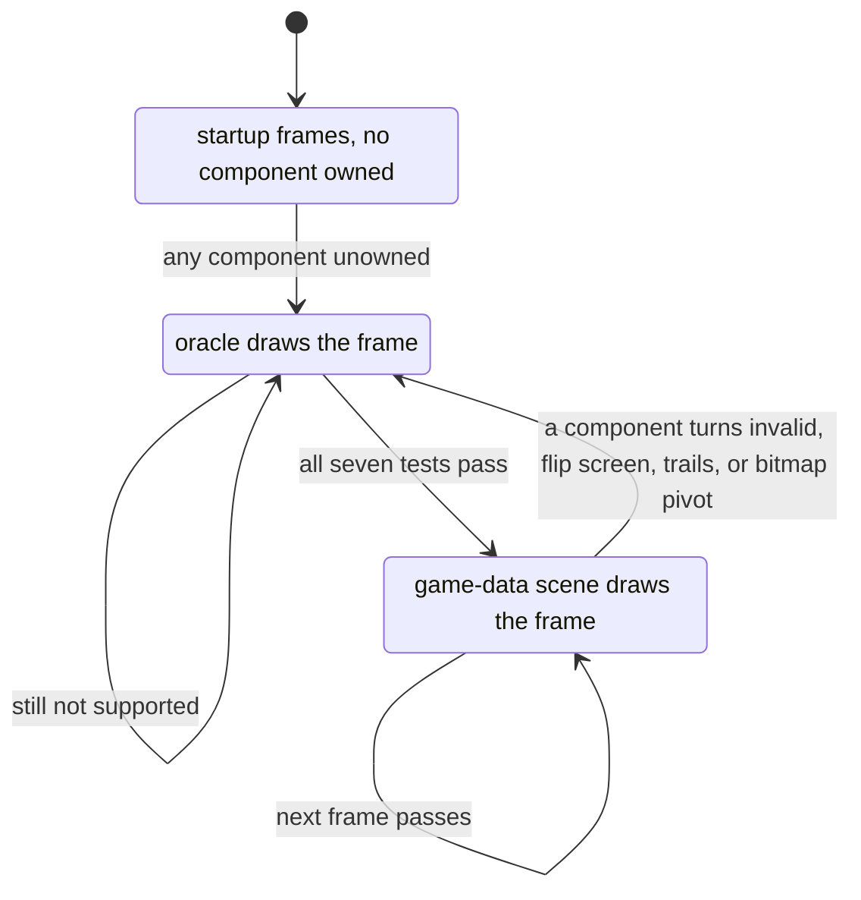

# GameVideo: the game-data renderer

`GameVideo` reconstructs the scene from native producer hooks. This page covers its API, frame selection, oracle fallback, and saved state.

The files are `include/f3rt/game_video.hpp` and `runtime/game_video.cpp`. The target is the Japan program `landmakrj` (version 2.01J). All addresses in these pages are addresses in that program.

## The idea

The original game builds the picture in two steps. First it builds **display data** in its own work RAM and ROM: lists of tile blocks, text strings, sprite queues and tables of line effects. Then small routines (the **display producers**) copy this data into the video RAM. The FDP reads the video RAM.

The game renderer observes producers before they write FDP records. It builds semantic tiles, glyphs, sprite geometry, and per-line settings. It never reads FDP geometry. This scene supports higher-resolution rasterization and extra horizontal columns.

::: info
**Why this works only with recompiled code.** The recompiler (see [Emission](/developer/recompiler/emission)) can place a call to a C function before any 68020 instruction. The configuration file lists these hook addresses. The native code keeps running unchanged. The hook only reads CPU registers and memory.
:::

## Boundary rules

These rules keep the game-data renderer independent from the oracle.

1. **Hooks observe only.** A hook runs before the instruction at its address. It does not change registers, memory or time. The native code still does all the writes to the video RAM.
2. **`GameMemory` reads only ROM and work RAM.** The type is in `runtime/game_scene.hpp`. Its `u8`, `u16` and `u32` functions return program ROM bytes (address below the ROM size) or main work RAM bytes (0x400000 to 0x43ffff, 128 KiB mirrored by `address & 0x1ffff`). Any other address sets `supported = false` and returns 0. The type has no way to read the FDP RAM.
3. **Write guards use only the PC and the address.** `Machine::write8` calls `GameVideo::observe_write(pc, address)` for each byte written to 0x600000 to 0x63ffff and to 0x660000 to 0x66001f. The guard never receives the value. It checks whether the writing instruction is one that a hook already models. If it is not, the component becomes unsupported.
4. **The palette is shared.** The compositor reads colors from `Machine::palette`. A palette is a color asset and not geometry. The game writes it with a palette queue and the renderer does not model it.
5. **ROM tiles are shared.** `GameVideo` uses `Video::playfield_tiles()` and `Video::sprite_tiles()`. This avoids a second 16 MiB decode.

## Class overview



`GameVideo` owns one object for each source of scene data. [Playfield tiles](/developer/runtime/video/tiles), [Text layer](/developer/runtime/video/text), [Sprites](/developer/runtime/video/sprites) and [Line effects](/developer/runtime/video/lines) explain them. The function `compose_game_scene` draws the result ([Compositor](/developer/runtime/video/compositor)).

## Data flow



## Public interface

| Function | What it does |
| --- | --- |
| `GameVideo(Machine&, GameVideoMode mode = Diagnostic, GameVideoOptions options = {})` | Stores the machine, mode and options. It throws `std::runtime_error` if `scale` is 0 or above 4, or `border` is above 160. When the options expand the picture, it allocates two buffers: `presentation_pixels` (ARGB) and `presentation_sprites` (`uint16_t`), each of `width() * height()` entries. It calls `Video::enable_scene_inspection(mode != Game)` and `reset()`. |
| `reset()` | Resets the four scene objects, the sprite plane, the presentation buffers (black), the counters and the fallback list. `Machine::reset` calls it. |
| `observe()` | Called by the hook. Builds a `GameMemory` and calls `observe` on tiles, text, sprites and lines. It resets `memory.supported` to true between the calls so that one component cannot mark the others bad. |
| `observe_write(pc, address)` | Calls `observe_write` on all four components. |
| `render_frame()` | Called at VBSTART by `Machine::advance_to`. See the frame decision below. |
| `compare_layers(frame, layer_mask)` | Diagnostic: compares layers with the oracle and throws on a difference. See [Compare mode](/developer/runtime/video/compare-mode). |
| `report(std::ostream&)` | Prints the `VIDEO ...` summary lines. |
| `presentation()` | Returns the presentation buffer if `options.expanded()`, else `Machine::native_pixels()`. |
| `enable_gpu_presentation(enabled)`, `gpu_scene()` | Enable/read the host-only scanout snapshot. Native/expanded reconstruction caches are preallocated when GPU Game snapshots need them; CPU diagnostic raster storage stays lazy. |
| `set_gpu_scale(scale)`, `render_reference(output, options, mask, serial)` | Select host GPU/reference scale 1..8 and render that geometry; constructor-fixed presentation/state buffers and border do not change. Player scales remain capped at 4. |
| `state_size()`, `save_state(dst)`, `load_state(src)` | Snapshot support. They throw `std::invalid_argument` for a wrong size and `std::logic_error` for leftover bytes. |
| `sync_state_size()`, `save_sync_state(dst)`, `load_sync_state(src)` | Canonical native rendering/trails without expanded presentation buffers; guest keeps its own geometry. |

`latch_sprites()`, `render()` and `compare_composite(frame)` are private.

### Types in `game_video.hpp`

| Type | Definition |
| --- | --- |
| `GameVideoMode` | `enum class` with `Diagnostic`, `Game`, `Compare`. |
| `GameVideoOptions` | `scale` (default 1), `border` (default 0), constants `max_scale = 4`, `max_gpu_scale = 8` (diagnostic/render API only) and `max_border = 160`. `width()` = `(320 + border * 2) * scale`. `height()` = `232 * scale`. `expanded()` is true when `scale != 1` or `border != 0`. |

### The C hook

```cpp
extern "C" void f3_landmakr_video_hook(f3_cpu *cpu) {
    auto &machine = *static_cast<f3rt::Machine *>(cpu->runtime);
    if (machine.game_video) machine.game_video->observe();
}
```

The recompiler writes this call into the generated block for every address in a `[[hooks]]` entry whose `symbol` is `f3_landmakr_video_hook`. The generated code first calls `f3_cc_flush(cpu)` to write the lazy condition flags into `cpu->sr`, then calls the hook, and then checks that `cpu->pc` is unchanged. If `game_video` is null (`fdp` mode), the hook returns at once. The hooks are always in the generated code. See [Producer hooks](/developer/runtime/video/producers).

## Deciding between the two pictures

`GameVideo::render_frame` runs for every frame. It always calls `render()` first. `render()` sets `rendered` to true only if all of these tests pass, in this order. Each failed test calls `fallback(component, pc)` and returns.

| Order | Test | Fallback component name | PC shown in the report |
| --- | --- | --- | --- |
| 1 | `lines.supported()` | `lines` | `lines.unsupported_pc()` |
| 2 | `text.supported()` | `text` | `text.unsupported_pc()` |
| 3 | `sprites.supported()` | `sprites` | `sprites.unsupported_pc()` |
| 4 | Not `sprites.flipped()` | `flipped-screen` | 0x43e0 |
| 5 | Not `sprites.trails()` | `sprite-trails` | 0x43e0 |
| 6 | `tiles.supported(layer)` for layers 0 to 3 | `pf0` to `pf3` | `tiles.unsupported_pc(layer)` |
| 7 | After `lines.prepare(false)`, no row from 24 to 255 has `bitmap` set | `bitmap-pivot` | 0 |

If all tests pass, CPU presentation builds the 8192-entry color table from
`Machine::palette` (bytes 1, 2 and 3 are R, G and B) and composes native `pixels`,
plus `presentation_pixels` when expanded. Supported GPU `Game` frames instead
retain immutable scene data and the current native sprite plane; the first
native observation composes that exact frame. Diagnostic/Compare stay eager.
Both paths set `rendered` and count the frame at the same beam boundary.

After `render()`, `render_frame` acts as follows:

| `rendered` | Mode | Action |
| --- | --- | --- |
| true | `Game` | CPU: copy `pixels` to private native scanout. GPU: retain exact scanout until observed. Both call `Video::vblank` to keep oracle sprite lag current. |
| true | `Compare` | Run `Video::render_frame` into private native scanout, then call `compare_composite`. |
| true | `Diagnostic` | Run `Video::render_frame`. No comparison. |
| false | any | Materialize any retained preceding game composite, then render the oracle into private native scanout. |

If the options expand the picture and `rendered` is false, the function fills the presentation buffer with black and copies the native oracle picture into the center, enlarged by the integer `scale` (nearest neighbor), with `border * scale` black columns on each side. No border content is invented. In every case the function ends with `latch_sprites()`.

`latch_sprites()` calls `GameSprites::latch()` and rasters the **next** native
432x256 plane, preserving the oracle's one-frame lag. GPU retention alternates
two preallocated native planes while an unobserved composite needs the current
one; only the original next plane is canonical. Entering trails first finishes
any retained composite, then updates the trail plane in place. CPU expanded
presentation also rasters `presentation_sprites`; GPU expanded reconstruction is
on demand except when trail history must be retained.

::: warning
In `Game` mode the oracle still keeps its sprite lag current through `Video::vblank`. This is what makes a fallback frame exact: the oracle has the right sprite plane for the frame that follows a game-data frame. Do not remove the `vblank` call.
:::

### Fallback is not CPU fallback

The word "fallback" has two meanings in this project. **Renderer fallback** means the oracle draws one frame. **CPU fallback** means the runtime interprets a 68020 instruction because the recompiler has no native code for it. They are unrelated. Game-data video needs strict native execution and never enables CPU fallback.

### Fallback bookkeeping

`Impl::fallback(component, pc)` records the frame number as `machine.frame + 1` (the frame that is being produced). It keeps an array of 32 `Fallback` entries with `component`, `pc`, `frames`, `first` and `last`. A repeated pair of component and PC increments `frames` and updates `last`. A new pair uses a new entry. If all 32 entries are used, it throws `std::runtime_error`. The counters `rendered_frames` and `fallback_frames` count frames.

## Life cycle of a component

A component is supported only while it knows its semantic state. Known initialization establishes ownership. Unknown writes or unsupported source reads can invalidate it. Text also checks completeness of every referenced glyph.



The initialization hook is different for each component:

| Component | Becomes owned at | Details |
| --- | --- | --- |
| Tiles, layer `n` | Clear hook of layer `n`: 0x5a22, 0x5a5e, 0x5a9a, 0x5af4. Also 0x9bcea (all four). | `GameTiles::clear` |
| Text | 0x59bc (clear the map) **and** every glyph that a cell uses is complete. | `GameText::supported` |
| Sprites | 0x41d0 (sprite initialization). Also the first batch submit at 0x4480 if no write was rejected. | `GameSprites::observe` |
| Lines | 0x5cd8 (profile initialization). | `GameLines::observe` |

## Frame decision as a state machine



In the measured runs, 231 startup frames use the oracle. The last of them is frame 418 (see [Parity evidence and limits](/developer/runtime/video/parity)). After that, the game-data scene draws each frame until the game reaches an unsupported state, such as an ending sequence.

## Per-frame sequence in `Game` mode

```mermaid
sequenceDiagram
    participant CPU as Native game code
    participant H as f3_landmakr_video_hook
    participant GV as GameVideo
    participant M as Machine
    participant FDP as Video (oracle)
    loop during the frame
        CPU->>H: before a producer instruction
        H->>GV: observe()
        CPU->>M: write to video RAM
        M->>GV: observe_write(pc, address)
    end
    M->>GV: render_frame() at VBSTART
    GV->>GV: render(): seven tests; compose eagerly or retain GPU scanout
    alt rendered
        GV->>M: eager native pixels or exact retained frame
        GV->>FDP: vblank(graphics) keeps the sprite lag
    else not rendered
        GV->>FDP: render_frame(palette, graphics, control, pixels)
    end
    GV->>GV: latch_sprites() for the next frame
    M->>CPU: raise IRQ2
```

## Saved state

`GameVideo::Impl::save_state` writes, in this order: one byte for `rendered`, then the state of tiles, text, sprites and lines, then the native sprite plane (432 x 256 x 2 bytes), the native pixels (320 x 232 x 4 bytes), the presentation pixels and the presentation sprite plane. The sizes of the last two are zero when the picture is not expanded. The state does not include the fallback table or the compare counters (these are diagnostics). The structures use the packed `Canonical*` types in `runtime/state_io.hpp`: `CanonicalGameTileCell`, `CanonicalGameTextCell`, `CanonicalSceneSprite`, `CanonicalSceneLayer`, `CanonicalScenePlayfield`, `CanonicalSceneClip`, `CanonicalSceneRow`, `CanonicalLinePivot`, `CanonicalLineSprite`, `CanonicalLinePlayfield` and `CanonicalLineParams`. Rollback netplay saves this state every frame, so it must contain every value that affects the next picture. See [Snapshots](/developer/netplay/snapshots).

Full local snapshots retain the expanded buffers for slots and rollback restore. Canonical sync state omits those two buffers only; hardware/native rendering/trail state remains. Handoff and network CRCs use canonical state, while each client's rollback ring uses full local state. Safe-field validation applies before accepting loads. See [sync proof and parser evidence](https://github.com/ansxor/f3-recomp/blob/main/docs/developer/IMGUI-NETPLAY.md).


## Report output

`report` prints one line for each layer that `compare_layers` sampled, a line for the composite, one summary line and one line for each fallback entry:

```text
VIDEO layer=pf0 domain=1024x512-indexed-texture sampled_frames=46 compared_pixels=24117248 pixel_mismatches=0
VIDEO layer=composite domain=320x232-RGB sampled_frames=46 compared_pixels=3415040 pixel_mismatches=0
VIDEO game_frames=5769 oracle_fallback_frames=231
VIDEO fallback=lines producer_pc=0x1003a frames=229 first=... last=...
```

The `domain` is `1024x512-indexed-texture` for playfields, `320x232-next-sprite-plane` for sprite groups and `512x512-indexed-texture` for text. The numbers above are examples taken from [docs/developer/VIDEO-HLE.md](https://github.com/ansxor/f3-recomp/blob/main/docs/developer/VIDEO-HLE.md) and not output of a run on your machine. The frontend prints the report when a run ends.

Sources: [game_video.hpp](https://github.com/ansxor/f3-recomp/blob/main/include/f3rt/game_video.hpp) and [game_video.cpp](https://github.com/ansxor/f3-recomp/blob/main/runtime/game_video.cpp).
