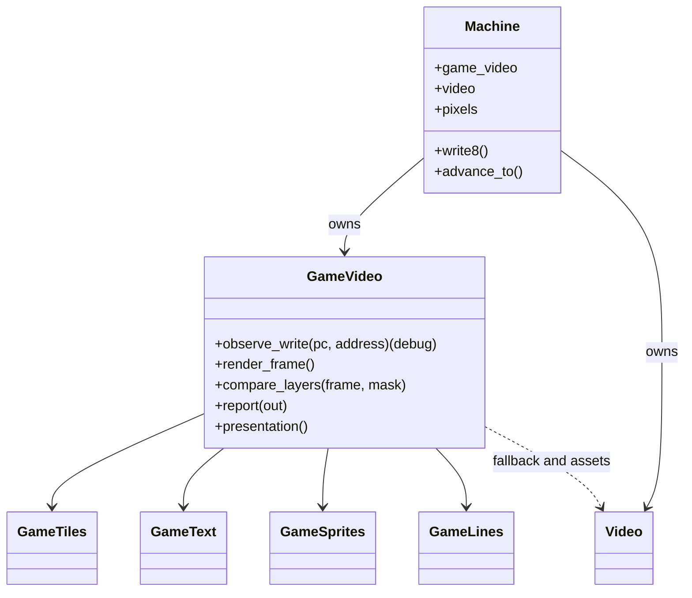
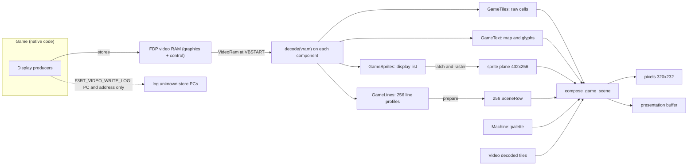
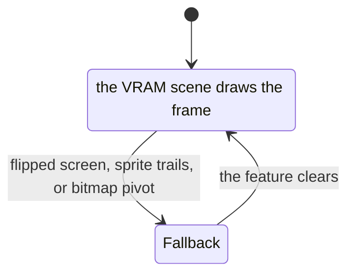

# GameVideo: the game-data renderer

`GameVideo` reconstructs the scene by decoding FDP video RAM at VBSTART. This
page covers its API, frame selection, oracle fallback and saved state.

The files are `include/f3rt/game_video.hpp` and `runtime/renderer/game/video.cpp`. The
target is the Japan program `landmakrj` (version 2.01J). All addresses in these
pages are addresses in that program.

## The idea

The original game builds the picture in two steps. First it builds **display
data** in its own work RAM and ROM: lists of tile blocks, text strings, sprite
queues and tables of line effects. Then small routines (the **display
producers**) copy this data into the **video RAM**. The FDP reads the video RAM.

`GameVideo` no longer observes the producers. At each VBSTART it decodes the
video RAM the FDP itself reads, building raw playfield cells, glyph pens, sprite
geometry and per-line settings. The scene then supports higher-resolution
rasterization and extra horizontal columns.

::: info
**Per-game scene file.** A game provides `games/<game>/video/` (Land Maker uses a
single `video.cpp`). It defines, when `F3RT_VIDEO_WRITE_LOG` is on,
`observe_game_video_write` with every component's store-PC list. The shared
sprites, tiles, text and line decoders live in
`runtime/renderer/game/sprites.cpp`, `runtime/renderer/game/tiles.cpp`, `runtime/renderer/game/text.cpp` and `runtime/renderer/game/lines.cpp`; generic decode
helpers live in `runtime/renderer/decode.{hpp,cpp}`. CMake compiles
the folder and defines `F3RT_GAME_VIDEO`; games without it can still run but
cannot select `game` or `compare`. There are no recompiler hooks.
:::

## Boundary rules

1. **Video RAM is the source of truth.** `VideoRam` (in `runtime/renderer/game/scene.hpp`)
   is a big-endian view of `graphics` (0x40000 bytes at 0x600000) and `control`
   (0x20 bytes at 0x660000).
2. **Write logging is opt-in and uses only the PC and the address.** In a
   `F3RT_VIDEO_WRITE_LOG` build, `Machine::write8` calls
   `GameVideo::observe_write(pc, address)` for each byte written to 0x600000 to
   0x63ffff and 0x660000 to 0x66001f. It never receives the value. It calls the
   per-game `observe_game_video_write`, which returns for the store PCs the
   addressed component knows; any other PC calls
   `log_unknown_video_write(layer, pc, address, frame)`, which prints the first
   occurrence of each `(layer, pc)` to stderr. With the option off no write is
   observed, and either way a write from an unknown PC does not invalidate
   anything.
3. **The palette is shared.** The compositor reads colors from `Machine::palette`.
4. **ROM tiles are shared.** `GameVideo` uses `Video::playfield_tiles()` and
   `Video::sprite_tiles()` to avoid a second 16 MiB decode.

## Class overview



`GameVideo` owns one object for each source of scene data. [Playfield tiles](/developer/runtime/video/tiles), [Text layer](/developer/runtime/video/text), [Sprites](/developer/runtime/video/sprites) and [Line effects](/developer/runtime/video/lines) explain them. The function `compose_game_scene` draws the result ([Compositor](/developer/runtime/video/compositor)).

## Data flow



## Public interface

| Function | What it does |
| --- | --- |
| `GameVideo(Machine&, GameVideoMode mode = Diagnostic, GameVideoOptions options = {})` | Stores the machine, mode and options. It throws `std::runtime_error` if `scale` is 0 or above 4, or `border` is above 160. When the options expand the picture, it allocates `presentation_pixels` (ARGB) and `presentation_sprites` (`uint16_t`), each of `width() * height()` entries. It calls `Video::enable_scene_inspection(mode != Game)` and `reset()`. |
| `reset()` | Resets the four scene objects, the sprite plane, the presentation buffers (black), the counters and the fallback list. `Machine::reset` calls it. |
| `observe_write(pc, address)` | Only compiled with `F3RT_VIDEO_WRITE_LOG`. Calls the per-game `observe_game_video_write(pc, address, frame)` with `frame = machine.frame + 1`; the addressed component's known-PC list decides whether to log. |
| `render_frame()` | Called at VBSTART by `Machine::advance_to`. Builds `VideoRam{machine.graphics, machine.control, machine.frame + 1}`, calls `decode(vram)` on tiles/text/sprites/lines, then `render()`, then `latch_sprites()`. See the frame decision below. |
| `compare_layers(frame, layer_mask)` | Diagnostic: compares layers with the oracle and throws on a difference. See [Compare mode](/developer/runtime/video/compare-mode). |
| `report(std::ostream&)` | Prints the `VIDEO ...` summary lines. |
| `presentation()` | Returns the presentation buffer if `options.expanded()`, else `Machine::native_pixels()`. |
| `enable_gpu_presentation(enabled)`, `captured_frame()` | Enable/read the host-only `CapturedFrame` scanout snapshot (typed tiles, text, rows, colors, sprite list; overwritten once per VBSTART capture). |
| `set_gpu_scale(scale)`, `render_reference(output, options, mask, serial)` | Select host GPU/reference scale 1..8 and render that geometry; constructor-fixed presentation/state buffers and border do not change. |
| `state_size()`, `save_state(dst)`, `load_state(src)` | Snapshot support. They throw `std::invalid_argument` for a wrong size and `std::logic_error` for leftover bytes. |
| `sync_state_size()`, `save_sync_state(dst)`, `load_sync_state(src)` | Canonical native rendering/trails without expanded presentation buffers. |

`latch_sprites()`, `render()` and `compare_composite(frame)` are private.

### Types in `game_video.hpp`

| Type | Definition |
| --- | --- |
| `GameVideoMode` | `enum class` with `Diagnostic`, `Game`, `Compare`. |
| `GameVideoOptions` | `scale` (default 1), `border` (default 0), constants `max_scale = 4`, `max_gpu_scale = 8` and `max_border = 160`. `width()` = `(320 + border * 2) * scale`. `height()` = `232 * scale`. `expanded()` is true when `scale != 1` or `border != 0`. |

## Deciding between the two pictures

`GameVideo::render_frame` decodes VRAM and then calls `render()`. `render()` sets
`rendered` to true unless one of these tests fails. Each failed test calls
`fallback(component, reason)`, logs once with `log_unsupported_video` and
returns.

| Order | Test | Fallback component | Logged kind |
| --- | --- | --- | --- |
| 1 | Not `sprites.flipped()` | `sprites` | `flipped-screen` |
| 2 | Not `sprites.trails()` | `sprites` | `sprite-trails` |
| 3 | After `lines.prepare(...)`, no row 24..255 has `bitmap` set | `text` | `bitmap-pivot` |

There is no per-component "unsupported producer" test and no tile validity: every
layer is decoded from video RAM. Write logging is a separate, opt-in debug path
(see [Video write logging](/developer/runtime/video/producers)).

If all tests pass, CPU presentation builds the 8192-entry color table from
`Machine::palette` (bytes 1, 2 and 3 are R, G and B) and composes native `pixels`,
plus `presentation_pixels` when expanded. Supported GPU `Game` frames instead
retain immutable scene data and the current native sprite plane. Diagnostic and
Compare stay eager.

After `render()`, `render_frame` acts as follows:

| `rendered` | Mode | Action |
| --- | --- | --- |
| true | `Game` | CPU: copy `pixels` to private native scanout. GPU: retain exact scanout until observed. Both call `Video::vblank` to keep oracle sprite lag current. |
| true | `Compare` | Run `Video::render_frame` into private native scanout, then call `compare_composite`. |
| true | `Diagnostic` | Run `Video::render_frame`. No comparison. |
| false | any | Materialize any retained preceding game composite, then render the oracle into private native scanout. |

If the options expand the picture and `rendered` is false, the function fills the
presentation buffer with black and copies the native oracle picture into the
center. In every case the function ends with `latch_sprites()`.

`latch_sprites()` calls `GameSprites::latch()` and rasters the **next** native
432x256 plane, preserving the oracle's one-frame lag: the submission decoded at
this VBSTART is shown in the *following* frame. GPU retention alternates two
preallocated native planes while an unobserved composite needs the current one.

::: warning
In `Game` mode the oracle still keeps its sprite lag current through
`Video::vblank`. This is what makes a fallback frame exact. Do not remove the
`vblank` call.
:::

### Fallback is not CPU fallback

**Renderer fallback** means the oracle draws one frame. **CPU fallback** means the
runtime interprets a 68020 instruction because the recompiler has no native code
for it. They are unrelated. Game-data video needs strict native execution and
never enables CPU fallback.

### Fallback bookkeeping

`Impl::fallback(component, reason)` records the frame number as
`machine.frame + 1`, calls `log_unsupported_video(component, reason, frame)` and
keeps an array of 32 `Fallback` entries with `reason`, `frames`, `first` and
`last`. A repeated reason increments `frames` and updates `last`. If all 32
entries are used, it throws `std::runtime_error`. The counters
`rendered_frames` and `fallback_frames` count frames.

## Frame decision as a state machine



Startup frames are also drawn from VRAM: the decoders always produce a complete
scene from the current bytes, so there is no ownership/poison state.

## Per-frame sequence in `Game` mode

```mermaid
sequenceDiagram
    participant CPU as Native game code
    participant GV as GameVideo
    participant M as Machine
    participant FDP as Video (oracle)
    loop during the frame
        CPU->>M: write to video RAM
        M->>GV: observe_write(pc, address) [F3RT_VIDEO_WRITE_LOG only]
    end
    M->>GV: render_frame() at VBSTART
    GV->>GV: build VideoRam; decode(vram) on tiles/text/sprites/lines
    GV->>GV: render(): fallback tests; compose eagerly or retain GPU scanout
    alt rendered
        GV->>M: eager native pixels or exact retained frame
        GV->>FDP: vblank(graphics) keeps the sprite lag
    else not rendered
        GV->>FDP: render_frame(palette, graphics, control, pixels)
    end
    GV->>GV: latch_sprites() for the next frame
    M->>CPU: raise IRQ2
```

## Saved state

State derived from video RAM is not saved. `GameVideo::Impl::save_state` writes,
in this order: one byte for `rendered`, then the state of sprites and lines,
then the native sprite plane (432 x 256 x 2 bytes), the native pixels
(320 x 232 x 4 bytes), the presentation pixels and the presentation sprite plane.
Playfield tiles and text are rebuilt from the serialized video RAM by `decode` at
the next VBSTART. The state does not include the fallback table or the compare
counters. The structures use the packed `Canonical*` types in
`runtime/state_io.hpp`: `CanonicalSceneSprite`, `CanonicalSceneLayer`,
`CanonicalScenePlayfield`, `CanonicalSceneClip`, `CanonicalSceneRow`,
`CanonicalLinePivot`, `CanonicalLineSprite`, `CanonicalLinePlayfield` and
`CanonicalLineParams`. Rollback netplay saves this state every frame, so it must
contain every value that affects the next picture. See [Snapshots](/developer/netplay/snapshots)
and [ABI changes](/developer/abi-changes).

## Report output

`report` prints one line for each layer that `compare_layers` sampled, a line for
the composite, one summary line and one line for each fallback entry:

```text
VIDEO layer=pf0 domain=1024x512-indexed-texture sampled_frames=46 compared_pixels=24117248 pixel_mismatches=0
VIDEO layer=composite domain=320x232-RGB sampled_frames=46 compared_pixels=3415040 pixel_mismatches=0
VIDEO game_frames=5769 oracle_fallback_frames=231
```

The `domain` is `1024x512-indexed-texture` for playfields, `320x232-next-sprite-plane`
for sprite groups and `512x512-indexed-texture` for text. The frontend prints the
report when a run ends.

Sources: [game_video.hpp](https://github.com/ansxor/f3-recomp/blob/main/include/f3rt/game_video.hpp) and [video.cpp](https://github.com/ansxor/f3-recomp/blob/main/runtime/renderer/game/video.cpp).
