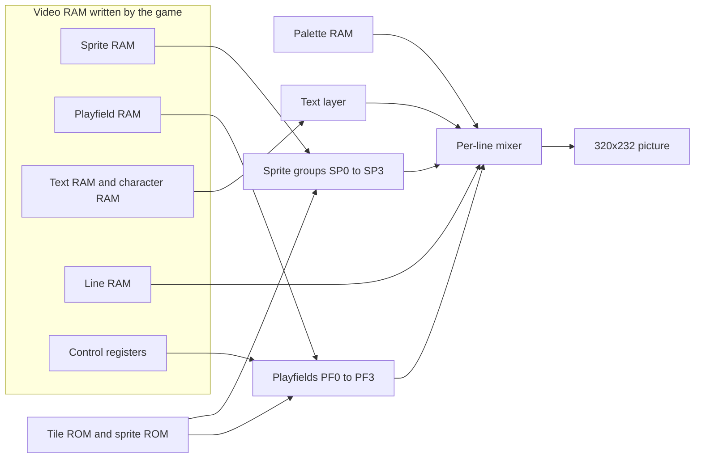

# F3 video hardware for newcomers

**What you will learn:** the parts of the Taito F3 video hardware that the renderers copy: the RAM areas, the four playfields, the text layer, the sprites, the line RAM, the palette, the control registers, zoom and scroll effects, and blending.

This page describes the hardware as the code in `runtime/video.cpp` implements it. The code is the source of truth. Where a statement is about the real chip and not about the code, the page says so.

## The big picture

The TC0630FDP chip (the **FDP**) draws the picture. The game does not send pixels to the chip. The game writes small tables into the video RAM. The chip reads these tables while it scans the screen. The tables describe nine layers:

- four **playfields** (tile maps), called PF0 to PF3;
- four **sprite groups**, called SP0 to SP3;
- one **text layer**.

The chip mixes the nine layers for each screen line. A table in **line RAM** gives each line its own priority, clip window, blend value and scroll values. The chip reads the color of each pixel from the **palette RAM**.



## Address map

The game accesses the video system through the 68020 address space. `Machine` stores each area in a `std::array`. The FDP renderer uses the offsets in the table. `Machine::graphics` holds the area 0x600000 to 0x63ffff, which is 0x40000 bytes.

| Address range | Size | Name in `video.cpp` | Contents |
| --- | --- | --- | --- |
| 0x440000 to 0x447fff | 0x8000 | palette RAM (`Machine::palette`) | 8192 colors of 32 bits each |
| 0x600000 to 0x60ffff | 0x10000 | `OFFS_SPRITERAM` (0x00000) | Two 0x8000-byte banks; each walk reads at most 1024 entries of 16 bytes |
| 0x610000 to 0x61bfff | 0xc000 | `OFFS_PF_RAM` (0x10000) | Playfield tile maps |
| 0x61c000 to 0x61dfff | 0x2000 | `OFFS_TEXTRAM` (0x1c000) | Text map: 64x64 cells, one word each |
| 0x61e000 to 0x61ffff | 0x2000 | `OFFS_CHARRAM` (0x1e000) | Text glyph pixels: 256 glyphs of 32 bytes |
| 0x620000 to 0x62ffff | 0x10000 | `OFFS_LINERAM` (0x20000) | Line RAM |
| 0x630000 to 0x63ffff | 0x10000 | `OFFS_PIVOT_RAM` (0x30000) | Pivot (bitmap) layer pixels |
| 0x660000 to 0x66001f | 0x20 | `Machine::control` | 16 control words |

All multi-byte values in the video RAM are big-endian. The helper `read_be16` in `video.cpp` reads them.

Land Maker uses the **extend mode** of the playfields. The renderer hard-codes this mode: the playfield width mask is `0x3ff`, and the code never reads a mode bit from the control registers. In this mode each playfield is 64x32 tiles and uses 0x2000 bytes. The four playfields use the first 0x8000 bytes of the playfield RAM.

## Palette

The palette RAM has 8192 entries. Each entry is a 32-bit big-endian value. Bits 16 to 23 are red, bits 8 to 15 are green and bits 0 to 7 are blue. The renderer ignores bits 24 to 31. `Video::render_line` and `GameVideo::render` both read these bytes.

Layers use different parts of the palette. A pixel value in a layer buffer is a palette index:

| Layer | Index formula |
| --- | --- |
| Playfield | (palette row x 16) + pen. The pen has up to 6 bits, so the index can reach 8191. |
| Text | (palette x 16) + pen. The pen has 4 bits. |
| Sprite | 0x1000 + (palette byte x 16) + pen. |

The mixer treats color index 0 as "no pixel" in every layer. Playfield and text buffers also keep a flag (bit 4 of the flags byte) that marks a non-transparent pixel.

## The four playfields

A playfield is a map of 16x16-pixel tiles. In extend mode a map has 64 columns and 32 rows, which is 1024x512 pixels. The map wraps in both directions.

Each map cell uses 4 bytes in the playfield RAM. The first word is the **attribute** word. The second word is the **tile code**.

| Attribute bits | Meaning |
| --- | --- |
| 0 to 8 | Palette row. The palette base is the row x 16. |
| 9 | Blend selector. The pixel uses it to choose a blend weight. |
| 10 to 11 | Extra plane select. These bits add the upper two bit planes of the tile. |
| 14 | Flip horizontally. |
| 15 | Flip vertically. |

The tile code selects a tile in the playfield tile ROM. The tile has six bit planes, so a pen has 6 bits (0 to 63). The **pen mask** decides which planes the renderer uses:

```text
pen_mask = ((extra_planes & ~palette_row) << 4) | 0x0f
```

The low four planes are always on. An upper plane requires its extra-plane bit and a clear matching palette-row bit. Masked pen zero is transparent.

`Video::generate_playfield_line` builds one 1024-pixel line for one playfield. It stores a palette index for each pixel and a flags byte. In the flags byte, bit 4 (0x10) marks a non-transparent pixel and bit 0 holds the blend selector.

### Scroll, zoom and column scroll

Three kinds of values move a playfield. The renderer reads them for each line.

1. **Control registers.** Words 0 to 3 of the control block are the X scroll of PF0 to PF3. Words 4 to 7 are the Y scroll. The X value has 6 fraction bits. The Y value has 7 fraction bits. `get_pf_scroll` converts both into 24.8 fixed point (8 fraction bits) values.
2. **Line RAM, per line.** Each line can set an X **zoom** (`x_scale`), a Y **step** (`y_scale`), a **row scroll** (`rowscroll`, an X offset) and a **column scroll** (`colscroll`, a Y offset).
3. **Flip.** The sprite list has a command that flips the whole screen. `Video` stores it in `flipscreen`.

The renderer finds the source tile pixel for screen column `x` on one line like this:

```text
source_x = ((reg_fx_x + (x - H_START) * x_scale) >> 8) + H_START   (masked with 0x3ff)
source_y = ((reg_fx_y >> 8) + colscroll)                           (masked with 0x1ff)
reg_fx_x = reg_sx + rowscroll + 10 * (x_scale - 256)
reg_fx_y = reg_sy, plus y_scale added after each line except line 0
```

A unity zoom is `x_scale` = 256 and `y_scale` = 256. A smaller `x_scale` moves less than one map pixel for each screen pixel, so the map looks larger on that line. The game changes `x_scale` and `rowscroll` per line to draw a trapezoid for the puzzle board.

::: info
The renderer has **no rotation matrix**. It has only the per-line values above. A "rotation-like" effect is a sequence of per-line zoom, row scroll and column scroll values.
:::

The hardware reads two bytes of the zoom word in an unusual way. The high byte of a zoom word gives `x_scale` as 256 minus the byte. The low byte gives `y_scale` as the byte x 2. The Y part of zoom word `i` goes to playfield `{0, 3, 2, 1}[i]`. The code array is named `FIX_Y`. Word 1 therefore sets the Y step of PF3, and word 3 sets the Y step of PF1. The game-data renderer copies this mapping.

## The text layer

The text layer is a map of 8x8 glyphs. The map has 64x64 cells, which is 512x512 pixels. Each cell is one word in the text RAM:

| Bits | Meaning |
| --- | --- |
| 0 to 7 | Glyph number (0 to 255) |
| 8 | Flip horizontally |
| 9 to 14 | Palette number (6 bits) |
| 15 | Flip vertically |

Glyph pixels are in the character RAM. A glyph uses 32 bytes for 8x8 pixels at 4 bits each. The game can change glyphs at run time, for example to fade text. `Video::decode_charram` converts the whole character RAM to one byte per pixel on each frame.

The text layer has its own position register in the control block. In the code the layer is named the **pivot** layer, because it shares its line-RAM entries with the pixel (bitmap) pivot layer. The line-RAM `pivot_control` byte selects which of the two modes the line uses (see below).

### The pixel pivot layer

When bits 5 or 7 of `pivot_control` are set (`pivot_control & 0xa0`), the same layer shows a **bitmap** from the pivot RAM and not the text map. The FDP renderer implements this mode in `generate_pixel_line`. The pivot RAM has 2048 glyphs of 8x8 pixels. Land Maker does not use this mode in the measured runs. The game-data renderer does not implement it. It sends such frames to the FDP renderer.

## Sprites

The sprite RAM holds a list of up to 1024 entries. Each entry has 8 words; the renderer reads 7 of them. The sprite engine draws 16x16 tiles from the sprite ROM.

| Word | Use in `get_sprite_info` |
| --- | --- |
| 0 | Tile code, low 16 bits |
| 1 | Zoom: low byte for X, high byte for Y |
| 2 | X position (12-bit signed) in bits 0 to 11, scroll mode in bits 12 to 15 |
| 3 | Y position (12-bit signed) in bits 0 to 11. Bit 15 marks a **special command** entry. |
| 4 | High byte: flags. Low byte: color (palette) byte. |
| 5 | Bit 0 is bit 16 of the tile code. A special command also uses bit 0 (bank), bit 1 (trails), bits 8 and 9 (extra pen planes) and bit 13 (flip screen). |
| 6 | Bit 15 is a **jump**. Bits 0 to 9 are the jump target. |

Key points:

- The color byte has two parts. The low six bits are the palette. Bits 6 and 7 select the **sprite group** (0 to 3). The group sets the priority and blend settings of the sprite, because the line RAM defines settings for each group, not for each sprite.
- The flags in the high byte of word 4: bit 0 flip X, bit 1 flip Y, bit 2 lock color, bit 3 "multi" (the next entry continues a block), bits 4 and 5 Y block control, bits 6 and 7 X block control.
- The scroll mode in word 2 tells the entry how to combine the entry position with two global scroll values.
- A special command entry sets four state bits. They come from word 5: bit 13 flips the screen, bits 8 and 9 select the extra pen planes, bit 1 turns on **sprite trails** (the sprite plane is not cleared), and bit 0 selects the sprite bank.
- Zoom shrinks the sprite. The scale is 256 minus the zoom byte, so 256 is full size.

[FDP sprites](/developer/runtime/video/fdp-sprites) explains the list walk and the raster step.

### Sprite lag

Land Maker has a **sprite lag** of one frame. The chip draws the sprites that the game built in the previous frame. The oracle copies this: `Video::render_frame` first mixes the frame with the sprite plane from the last call, and then it parses the current sprite RAM into a new plane for the next call. The game-data renderer keeps the same lag. This detail is the most common cause of one-frame errors, so check it first when sprites look early or late.

## Line RAM and per-line effects

The line RAM gives each of the 256 screen lines its own values. This is how the game makes water, fades, a perspective board and wavy lines.

The first 0x4000 bytes hold **latch words**. There are 8 sections of 0x200 bytes each. Section `s` has one 16-bit latch word for each line `y`, at `s * 0x200 + y * 2`. Above 0x4000, each section has four **subsections** (each 0x200 bytes). Each subsection has two banks of 256 words. Bank A is at `y * 2` and bank B is at 0x800 + `y * 2`.

The latch word tells the chip where to read the value for this line:

- If bit `n + 4` of the latch word is set, the value for subsection `n` comes from bank B.
- Otherwise, if bit `n` is set, the value comes from bank A.
- Otherwise the line **keeps the value of the previous line**.

The last rule matters. The renderer keeps one `f3_line_inf` structure across all lines of the frame and `read_line_ram` changes it only for latched entries. A line without a latch reuses the old value.

The section base is `0x4000 + 0x1000 * section`. The sections hold this data:

| Section (offset) | Subsections | Contents |
| --- | --- | --- |
| 0 (0x4000) | 2, 3 | Column scroll of PF2 (subsection 2) and PF3 (subsection 3), low 9 bits. Bits 12 to 15 give bit 8 of the left and right clip values: the PF2 word for clip planes 0 and 1, the PF3 word for clip planes 2 and 3. |
| 1 (0x5000) | 0 to 3 | Low 8 bits of the left (low byte) and right (high byte) values of clip planes 0 to 3 |
| 2 (0x6000) | 0 | Sprite blend mode of groups 0 to 3 (2 bits each), and the `pivot_control` byte in bits 8 to 15 |
| 2 | 1 | Four alpha nibbles, which become the four blend weights |
| 2 | 2 | Mosaic enable bits, the mosaic amount, and the sprite and pivot mosaic enable |
| 2 | 3 | Background palette index |
| 3 (0x7000) | 0 | Pivot enable word |
| 3 | 1 | Mix word of the text/pivot layer |
| 3 | 2 | Sprite mix bits for all four groups and the sprite blend selectors |
| 3 | 3 | Sprite priorities: one nibble per group |
| 4 (0x8000) | 0 to 3 | Zoom word of each playfield |
| 5 (0x9000) | 0 to 3 | Palette add of each playfield (the value is multiplied by 16) |
| 6 (0xa000) | 0 to 3 | Row scroll of each playfield |
| 7 (0xb000) | 0 to 3 | Mix word of each playfield |

### The mix word

Each layer has a 16-bit **mix word** on each line. `mixable::set_mix` in `video.cpp` and `set_mix` in `game_lines.hpp` decode it the same way:

| Bits | Meaning |
| --- | --- |
| 0 to 3 | Priority (0 to 15). A higher number is closer to the viewer. |
| 4 to 7 | Clip invert, one bit per clip plane |
| 8 to 11 | Clip enable, one bit per clip plane |
| 12 | Clip invert mode |
| 13 | Layer enable |
| 14 to 15 | Blend mode |

For playfields and for the text layer, a layer is on when bit 13 is set and the blend mode is not 3. For sprites, a group is on when bit 13 is set and the blend mode is not 0. (The sprite blend mode comes from section 2, subsection 0, and not from the sprite mix word.)

### Clip planes

There are four **clip planes**. Each plane is a pair of left and right columns for each line. A layer can use any combination of the planes. The layer then shows only inside (or, when inverted, outside) those columns. A water surface and a text box both use this feature.

`calc_clip` in `video.cpp` and `clip_ranges` in `game_compositor.cpp` turn the enabled planes into up to 16 column ranges. The code applies the calibration `left - 1` and `right - 2` to the raw values. [FDP mixing](/developer/runtime/video/fdp-mixing) shows the algorithm.

::: warning
The rule that combines several **inverted** planes follows the MAME rule `max(range.left, endpoint)`. Another set of hardware notes proposes a different rule. The code keeps the MAME rule, and the project has not proved it for every case on real hardware. The game uses only the cases that the parity runs cover.
:::

### Mosaic

A line can turn on **mosaic** for each layer. The amount is `16 - nibble` pixels. The renderer repeats the first pixel of each block of that width. The block grid starts at column `x + 68` counted modulo 432 (the code in `video.cpp` writes this as `x - 46 + 114`). The parity runs decode the mosaic state but do not claim that Land Maker uses mosaic animation.

## Blending

Two layers can blend. The mixer keeps two colors for each pixel: a **source** color (the top layer) and a **destination** color (the layer below it). It also keeps a weight for each color.

The line RAM gives four **blend weights**. Each weight is `min(8, 15 - nibble)`, so the range is 0 to 8. The final color is:

```text
color = min(255, (source * source_weight + destination * destination_weight) >> 3)
```

The code applies this formula to each of red, green and blue. Eight is full strength.

The blend mode of a layer chooses how it uses the weights:

| Blend mode | Name and note | Effect |
| --- | --- | --- |
| 0 | Opaque for playfields and text. A sprite group with mode 0 is disabled. | The layer replaces the pixel. It also fills the destination slot. |
| 1 | Normal blend | The layer is the source. The layer below becomes the destination. The weight slot is `2 + selector`. |
| 2 | Reverse blend | The layer is the source. The weight slot is the selector. |
| 3 | Opaque for sprites. A playfield or text layer with mode 3 is disabled. | Same as mode 0. |

The blend selector picks one of two weight slots. A playfield uses tile attribute bit 9. Sprites use per-group line settings. Text uses bit 9 of the full line word, or bit 1 of its `pivot_control` byte.

## Layer order at equal priority

The mixer processes layers from the highest priority to the lowest. If two layers have the same priority, the order is fixed:

```text
text, SP0, PF0, SP3, PF3, SP2, PF2, SP1, PF1
```

Both renderers start from this list and sort it with a stable insertion sort. The sort is stable, so equal priorities keep the order above. This order is an invariant of both renderers. Change it in one renderer and parity fails.

## Related pages

- [FDP renderer](/developer/runtime/video/fdp) for the code that implements these rules.
- [Scene types](/developer/runtime/video/scene) for the same data in the game-data renderer.
- [Glossary](/developer/glossary) for other project terms.

Sources: [video.hpp](https://github.com/ansxor/f3-recomp/blob/main/include/f3rt/video.hpp) and [video.cpp](https://github.com/ansxor/f3-recomp/blob/main/runtime/video.cpp).
