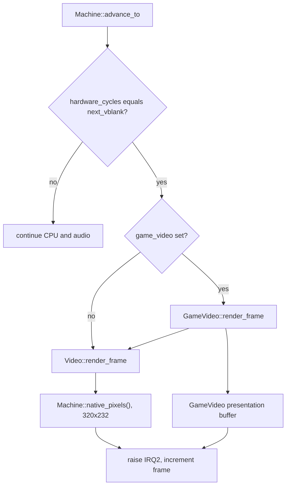

# Video system overview

This section explains both video renderers, their source data, and their native output contract. It also covers diagnostics and optional presentation.

## Two renderers

The runtime has two independent renderers for the Taito F3 picture. Both produce native 320x232 output at vertical blank. `GameVideo` can also produce expanded presentation.

| Renderer | Class | Input | Role |
| --- | --- | --- | --- |
| FDP renderer | `f3rt::Video` | The emulated video RAM that the game wrote: sprite RAM, playfield RAM, text RAM, character RAM, line RAM, pivot RAM, palette RAM and control registers | The internal **oracle**: a MAME-derived TC0630FDP model used as the game-data renderer's reference, not physical-chip verification. |
| Game-data renderer | `f3rt::GameVideo` | The data that the game builds before it writes the hardware RAM: tile-block descriptors, text strings, sprite queues and line-effect tables. The runtime reads this data from the game ROM and the main work RAM. | The **default renderer** of the `landmakr` program. It rebuilds the scene and draws it. It can also draw at a higher resolution with extra border columns. |

The abbreviation **FDP** means the TC0630FDP video chip of the Taito F3 board. The oracle name comes from its job: `GameVideo` must give the same pixels as `Video` for every frame that `GameVideo` supports.

Internal pixel parity and matching sampled MAME output are separate evidence.
Neither proves unexercised chip behavior or support for every F3 game.

::: info
Why two renderers? A recompiled game runs as native code, so the runtime can inspect game data before it writes emulated video RAM. The game-data renderer rerasterizes supported scenes at higher resolutions. The FDP renderer remains the internal reference for comparison and draws unsupported frames.
:::

## Where the renderers run

`Machine::advance_to` renders one frame each time the hardware clock reaches `next_vblank`. The render runs before the runtime raises IRQ2. If `Machine::game_video` is not null, the runtime calls `GameVideo::render_frame`. If it is null, the runtime calls `Video::render_frame` directly.

In `game` mode, `GameVideo::render_frame` calls `Video::render_frame` only when the scene is not supported. Read [GameVideo and frame selection](/developer/runtime/video/game-hle) for the exact rules.

## Mode selection

The frontend selects the renderer with `--video`. The table shows the three user modes and one internal mode.

| Mode | `GameVideoMode` | Who sets it | Output in `Machine::native_pixels()` |
| --- | --- | --- | --- |
| `fdp` | none (`game_video` is null) | `--video fdp` | Oracle picture |
| `game` | `Game` | `--video game` | Game-data picture for supported frames. Oracle picture for other frames. |
| `compare` | `Compare` | `--video compare` | Always the oracle picture. The runtime also checks that the game-data picture is equal on each supported frame. |
| none | `Diagnostic` | The gameplay regression tool | Always the oracle picture. The tool calls `compare_layers` at chosen frames. |

The strict-native `landmakr` program uses `game` by default. With `--allow-fallback`, `landmakr` uses `fdp`, because fallback execution has no producer hooks. The generic `f3rt-run` program always starts with fallback allowed, so it supports only `fdp`. Game-data video needs strict-native `landmakrj`. Read [Presentation](/developer/runtime/video/presentation) for scale, border and filter options and [Compare mode](/developer/runtime/video/compare-mode) for the checking tools. The user view of the same options is in the [video guide](/guide/video).

## Source file map

The table lists every file of the video system and the page that explains it.

| File | Contents | Page |
| --- | --- | --- |
| `include/f3rt/video.hpp`, `runtime/video.cpp` | `Video`: the FDP renderer and its inspection functions | [FDP renderer](/developer/runtime/video/fdp) |
| `include/f3rt/game_video.hpp`, `runtime/game_video.cpp` | `GameVideo`, `GameVideoOptions`, `GameVideoMode`, the C hook `f3_landmakr_video_hook` | [GameVideo](/developer/runtime/video/game-hle) |
| `runtime/game_scene.hpp` | `GameMemory`, `ScenePixel`, `SceneSprite`, `SceneLayer`, `ScenePlayfield`, `SceneClip`, `SceneRow` | [Scene types](/developer/runtime/video/scene) |
| `runtime/game_tiles.hpp`, `runtime/game_tiles.cpp` | `GameTiles`: four playfield tile maps | [Playfield tiles](/developer/runtime/video/tiles) |
| `runtime/game_text.hpp`, `runtime/game_text.cpp` | `GameText`: text map and glyphs | [Text layer](/developer/runtime/video/text) |
| `runtime/game_sprites.hpp`, `runtime/game_sprites.cpp` | `GameSprites`: sprite queues, latch and raster | [Sprites](/developer/runtime/video/sprites) |
| `runtime/game_lines.hpp`, `runtime/game_lines.cpp` | `GameLines`: per-line effects and `SceneRow` generation | [Line effects](/developer/runtime/video/lines) |
| `runtime/game_compositor.hpp`, `runtime/game_compositor.cpp` | `compose_game_scene` | [Compositor](/developer/runtime/video/compositor) |
| `games/landmakrj/config.toml` | The 69 `[[hooks]]` entries | [Producer hooks](/developer/runtime/video/producers) |
| `runtime/state_io.hpp` | `Canonical*` structs that save the video state | [GameVideo](/developer/runtime/video/game-hle) |
| `runtime/check.cpp` | Unit checks for tile, sprite and edge rules | [Extending the renderer](/developer/runtime/video/extending) |
| `tools/gameplay_regression.cpp` | The `--video-diff` harness | [Compare mode](/developer/runtime/video/compare-mode) |

## Key numbers

These constants appear in many places. All come from `include/f3rt/video.hpp` and `runtime/video.cpp`.

| Name | Value | Meaning |
| --- | --- | --- |
| `SCREEN_WIDTH`, `SCREEN_HEIGHT` | 320, 232 | Size of the visible picture |
| `H_TOTAL` | 432 | Width of the scanout space and of the sprite plane |
| `H_START` | 46 | First visible column in scanout space |
| `V_START`, `V_VIS` | 24, 232 | First visible line and number of visible lines |
| Scanout lines | 256 | Lines 0 to 255. The renderer draws lines 24 to 255. |
| `Machine::frame_pixels` | 432 x 262 | Pixel clocks per frame. The pixel clock is 6,671,500 Hz. |

The visible window is columns 46 to 365 and lines 24 to 255 of the scanout space. Most code in this system converts between scanout coordinates and picture coordinates by subtracting 46 and 24.

## Reading order

Read the pages in this order if you are new to the code.

1. [F3 video hardware](/developer/runtime/video/hardware). It explains the modeled memory layout and effects, with the limits of physical-hardware evidence.
2. [FDP renderer](/developer/runtime/video/fdp), then [FDP sprites](/developer/runtime/video/fdp-sprites) and [FDP mixing](/developer/runtime/video/fdp-mixing).
3. [GameVideo](/developer/runtime/video/game-hle), [Producer hooks](/developer/runtime/video/producers) and the per-layer pages.
4. [Presentation](/developer/runtime/video/presentation), [Compare mode](/developer/runtime/video/compare-mode) and [Parity evidence and limits](/developer/runtime/video/parity).
5. [Extending the renderer](/developer/runtime/video/extending) when you are ready to change code.

The long evidence log for the game-data renderer is in [docs/developer/VIDEO-HLE.md](https://github.com/ansxor/f3-recomp/blob/main/docs/developer/VIDEO-HLE.md). The ABI note is in [docs/developer/ABI-CHANGES.md](https://github.com/ansxor/f3-recomp/blob/main/docs/developer/ABI-CHANGES.md). For the surrounding runtime, read [Machine](/developer/runtime/machine) and [Frontend](/developer/runtime/frontend).

Primary sources: [video.cpp](https://github.com/ansxor/f3-recomp/blob/main/runtime/video.cpp), [game_video.cpp](https://github.com/ansxor/f3-recomp/blob/main/runtime/game_video.cpp), and [frontend.cpp](https://github.com/ansxor/f3-recomp/blob/main/runtime/frontend.cpp).
