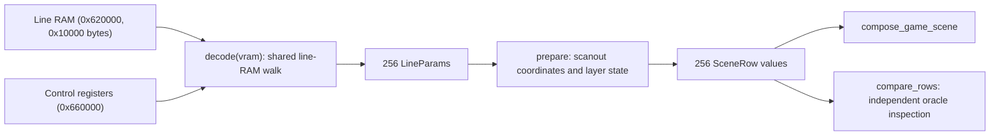

# Line effects: GameLines

`GameLines` decodes the 256 per-scanline parameters from line RAM and the FDP
control registers at VBSTART, then normalizes them into `SceneRow` values.

Sources: [lines.hpp](https://github.com/ansxor/f3-recomp/blob/main/runtime/renderer/game/lines.hpp)
and [lines.cpp](https://github.com/ansxor/f3-recomp/blob/main/runtime/renderer/game/lines.cpp).

## Two representations

The class keeps 256 decoded `LineParams` values and 256 normalized `SceneRow`
values, plus two arrays of eight control words read from video RAM.



The shared `decode` in `runtime/renderer/game/lines.cpp` mirrors `Video::read_line_ram`
in `runtime/renderer/fdp/video.cpp` (the reference renderer), but remains a separate
implementation. Because a subsection is only
present when its latch bit is set, fields carry forward between scanlines;
`decode` walks all 256 lines in order into one persistent `LineParams` scratch
and stores the result per line.

## Public interface

| API | Operation |
| --- | --- |
| `reset()` | Resets line values, rows and control words. |
| `decode(vram)` | Decodes line RAM + control into `LineParams`. |
| `prepare(flipped)` | Normalizes every scanout row from the decoded state. |
| `row(scanout_y)` | Returns `rows_[scanout_y & 255]`. |
| `compare_rows(oracle, frame)` | Prepares rows and compares the visible normalized descriptions. |
| `state_size()`, `save_state`, `load_state` | Save and restore both representations. |

## Decode

`control_0_[0..7]` come from control words 0–7 (PF0..PF3 X then Y scroll);
`control_1_[0..7]` from words 8–15 (pivot and text registers). Line RAM is at
graphics offset `0x20000`.

For each scanline `y`, the decoder resolves each section/subsection through the
latch word at `lineram[section * 0x200 + y * 2]`:

```text
base = 0x4000 + 0x1000 * section + 0x200 * subsection
if latches & (1 << (subsection + 4)): address = base + 0x800 + y * 2
elif latches & (1 << subsection):     address = base + y * 2
else: no write for this scanline (carry the previous line's value)
```

Sections: `4000` column scroll + clip-plane high bits (PF2/PF3), `5000` clip-plane
low bytes, `6000` sprite blend/pivot control/alpha/mosaic/background, `7000`
pivot and sprite mixing/priority, `8000` PF zoom, `9000` PF palette add, `a000` PF
row scroll, `b000` PF mixing. Blend alpha nibble `n` becomes `min(8, 15 - n)`;
the mosaic period is `16 - ((word >> 4) & 15)`; PF scale word `i` gives X step
`256 - high_byte` and Y step `low_byte * 2` on PF `{0,3,2,1}[i]`.

## Producer-state structures

| Type | Stored information |
| --- | --- |
| `LineClip` | Raw signed left and right clip endpoints |
| `LinePivot` | Text/pivot mix word, decoded priority and clipping, blend selector, mosaic enable, pivot control, and pivot enable |
| `LineSprite` | Group mix word, priority, blend mode, clipping, row blend selector, and mosaic enable |
| `LinePlayfield` | Mix settings plus column scroll, X scale, Y step, palette add, and row scroll |
| `LineParams` | Four clips, four blend weights, mosaic period, background, pivot settings, four groups, and four playfields |

Each `set_mix` decodes priority from bits 0–3, clip inversion from 4–7, clip
enable from 8–11, and global clip mode from bit 12. Blend mode comes from bits
14–15. The decode order matters: for sprite groups `6000/0` sets the blend mode,
`7000/2` sets the mix/clip fields while preserving it, and `7000/3` sets the
priority.

## Write log

With `F3RT_VIDEO_WRITE_LOG`, the per-game `observe_game_video_write` watches
`0x620000..0x62ffff` (line RAM) and `0x660000..0x66003f` (control) for lines.
If `pc` is one of the known ranges in `lines_covered_write`
(`games/landmakrj/video/video.cpp`), it returns. Otherwise it calls
`log_unknown_video_write("lines", pc, address,
frame)`. No state is invalidated; the next VBSTART decodes the write. See
[Video write logging](/developer/runtime/video/producers).

## Normalizing rows

`prepare(flipped)` reconstructs PF scroll in 24.8 units, preserving signed word
arithmetic, the PF-specific X calibration and the low-fraction XOR.

For each scanout row:

1. Select producer row `screen_y`, or `255 - screen_y` when flipped.
2. Calibrate clips by left minus one and right minus two.
3. Copy weights, background, mosaic period and layer mix fields.
4. Compute layer enable using the layer-specific disabled mode.
5. Compute text position from the pivot controls.
6. Compute PF origins, phase, steps and palette add.
7. Advance vertical accumulators after every row except row zero.

For PF `i`, the native visible-column-zero origin is:

```text
source_x = register_x + rowscroll + 10 * (x_scale - 256) + (46 << 8)
source_y = ((vertical_accumulator >> 8) + colscroll) & 511
y_fraction = low_byte(vertical_accumulator)
```

`source_y` and `text_y` are before global texture flipping. The normalization
processes blanking rows 0–23; their accumulator updates affect visible row 24.

## Unsupported frames and row comparison

A visible row with `pivot_control & 0xa0` produces `bitmap = true`. `GameVideo`
falls back to the oracle for that frame (`bitmap-pivot`) and logs the reason once.

`compare_rows` prepares with the oracle flip state and checks background, weights,
clips, mosaic, bitmap and all layer mix fields on rows 24–255. It checks text
coordinates only when text is enabled and PF transforms only when that PF is
enabled. The first difference throws with its frame and row.

## Saved state and checks

Snapshots include all decoded `LineParams` and normalized rows. Boolean fields
use explicit byte values. `check_game_line_vram_carry_forward` in
[runtime/check.cpp](https://github.com/ansxor/f3-recomp/blob/main/runtime/check.cpp)
checks that an unlatched scanline inherits the previous line's value.

The full-mask diagnostic invokes row comparison before layer and RGB checks. See
[Compare mode](/developer/runtime/video/compare-mode).
