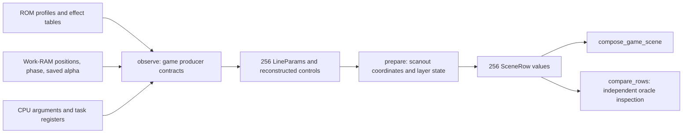

# Line effects: GameLines

`GameLines` reconstructs per-line settings from game variables, ROM tables, and producer registers. It does not read line RAM or control registers.

Sources: [game_lines.hpp](https://github.com/ansxor/f3-recomp/blob/main/runtime/game_lines.hpp) and [game_lines.cpp](https://github.com/ansxor/f3-recomp/blob/main/runtime/game_lines.cpp).

## Two representations

The class keeps 256 producer-state `LineParams` values and 256 normalized `SceneRow` values. It also keeps two arrays of eight control words and a captured game flip word.

These control words are reconstructed values. They are not readbacks of `Machine::control`.



## Public interface

| API | Operation |
| --- | --- |
| `reset()` | Resets line values, rows, controls, flip, and ownership. |
| `observe(memory, cpu)` | Applies a modeled producer operation for `cpu.pc`. |
| `observe_write(pc, address)` | Rejects unknown line-RAM or control writers. |
| `prepare(flipped)` | Normalizes every scanout row from the producer state. |
| `row(scanout_y)` | Returns `rows_[scanout_y & 255]`. |
| `supported()`, `unsupported_pc()` | Return ownership and its recorded failure PC. |
| `compare_rows(oracle, frame)` | Prepares rows and compares the visible normalized descriptions. |
| `state_size()`, `save_state`, `load_state` | Save and restore both representations and control/support state. |

## Producer-state structures

| Type | Stored information |
| --- | --- |
| `LineClip` | Raw signed left and right clip endpoints |
| `LinePivot` | Text/pivot mix word, decoded priority and clipping, blend selector, mosaic enable, pivot control, and pivot enable |
| `LineSprite` | Group mix word, priority, blend mode, clipping, row blend selector, and mosaic enable |
| `LinePlayfield` | Mix settings plus column scroll, X scale, Y step, palette add, and row scroll |
| `LineParams` | Four clips, four blend weights, mosaic period, background, pivot settings, four groups, and four playfields |

A fresh `LineParams` has weights `{8,8,8,8}`, mosaic period 16, and background zero. Playfield X scale starts at 256; Y step starts at zero.

Each `set_mix` decodes priority from bits 0–3, clip inversion from 4–7, clip enable from 8–11, and global clip mode from bit 12. Blend mode comes from bits 14–15.

Sprite producers can update priority and blend mode independently from the stored mix word. This reflects their separate native line-RAM tables.

## Scroll uploader

Hook `0x136e` captures the game's display-register upload operation.

| Source | Meaning |
| --- | --- |
| `0x4000ec` | Control word |
| `0x40013e` | Game flip word |
| `0x400116 + i * 8` | PF `i` 32-bit X position |
| `0x40011a + i * 8` | PF `i` 32-bit Y position |
| `0x4000d8` | Calibration table: PF X/Y pairs, then pivot X/Y |
| `0x400136`, `0x40013a` | Pivot X and Y words |

The uploader negates PF positions when the game flip word is nonzero. X applies a low-word NOT before arithmetic shifting by ten. Y shifts by nine.

Each shifted result adds the signed calibration word with native word arithmetic. Pivot words also add their calibration values. The control word becomes `control_1_[7]`.

Hook `0x10044` captures the boot uploader's `D0.W` for the PF controls and pivot controls. This boot hook alone does not establish complete line ownership.

## Default profile and selectors

Hook `0x5cd8` reads the ROM profile at `0x5d74`. It establishes line ownership and clears the unsupported PC.

The profile affects exactly 232 rows. It starts at row 24 normally and at row 0 when byte `0x40013e` is nonzero. It leaves other rows unchanged.

The profile supplies clipping reset, alpha, mosaic, background, text/pivot settings, sprite settings, and PF scale/palette/row-scroll/mix values.

Alpha nibble `n` becomes `min(8, 15 - n)`. The mosaic period is `16 - ((word >> 4) & 15)`.

PF scale word `i` gives:

```text
X step of PF i = 256 - high_byte
Y step of PF {0,3,2,1}[i] = low_byte * 2
palette add = palette_word * 16
row scroll: rs = rowscroll_word << 2
normalized rowscroll = (rs & 0xffffff00) - (rs & 255)
```

The cross-PF Y mapping is important. PF3's low zoom byte controls PF1's Y step.

Hook `0x5d10` initializes selectors only. It sets pivot control to `0x08` at row 0 normally, or row 255 when the game flip word is nonzero. It does not reload profile values.

## Clear and dim operations

| Hook | Effect |
| --- | --- |
| `0x5a22` | Clears PF0 row scroll on all rows. |
| `0x5a5e` | Clears PF1 row scroll on all rows. |
| `0x5a9a` | Clears PF2 row and column scroll; sets PF2 X/Y steps to 256. |
| `0x5af4` | Clears PF3 row and column scroll; sets PF3 X step and PF1 Y step to 256. |
| `0x8cfba` | Sets 232 alpha rows from constant word `0xbdbd`. |
| `0x8cfe0` | Restores those alpha rows from saved work RAM at `0x41ce26`. |

The dim/restore start row is `u16(0x400140) / 2`. The loop stops at row 256. It does not assume a fixed visible start.

The PF2/PF3 clears do not replace mix or palette-add settings.

## Character-selection effects

| Hook | Rows and operation |
| --- | --- |
| `0x91490` | Twenty label rows: text mix `0x380f`, PF3 mix `0x3800`. Starts at 224 normally or 199 flipped. |
| `0x91506` | Same label settings, starting at 202 normally or 181 flipped. |
| `0x915d2` | Rows 176–251: water alpha, PF3 mix, sprite priority/mode, and pivot control. |
| `0x91834` | Rows 176–251: animated clip plane 3 and PF3 column-scroll reset. |
| `0x9217c` | Rows 24–215: all sprite priorities become 14. |

The water alpha weights are `{5,4,3,4}`, from `0xbcba`. PF3 uses mix `0x380e`. Sprite priorities are `{1,8,13,13}`. Their blend modes are `{3,2,2,3}`.

The clipping amount uses unsigned word arithmetic: `(60 - D7.W) * 6`. Normally plane 3 has left zero and right `amount & 511`.

Flipped clipping uses left `(0x6980 - amount) & 511` and right 511. The producer also clears high bits of clip plane 2 endpoints.

## Attract profiles

These hooks model discrete native producers. They do not interpolate an assumed fade timeline.

| Hook | Semantic update |
| --- | --- |
| `0x98dba` | All 256 rows receive alpha `0xbabc`, or weights `{3,4,5,4}`. |
| `0x99b5a` | Rows 24–248 receive sprite modes from `0xdf`, priorities from `0xdd88`, and pivot control zero. |
| `0x99f86` | Rows 0–247 receive PF2 mix `0x700b`, PF3 mix `0xb00d`, and weights `{0,4,8,4}`. Rows 1–248 receive sprite priorities `0xcc88`, mode 3, and pivot control zero. |
| `0x9a252`, `0x9a2f6` | Rows 0–247 decode alpha nibbles from task register `D2`. |
| `0x9a28a` | Rows 0–247 receive PF1 mix `0x700b`, PF3 mix `0x300d`, and weights `{0,4,8,4}`. |
| `0x9a6e6`, `0x9acbe` | Rows 0–247 receive PF2 mix `0x700c`. |
| `0x9ad3e` | Rows 0–247 receive PF2 mix `0x300c`. |
| `0x9a8de` | Rows 0–247 receive sprite priorities from `0xee88`. |

## Puzzle-board geometry

Hook `0x9d66a` sets PF2 mix `0x3005` on all rows. It then expands a run-length palette gradient from ROM table `0x9d6a8`.

It continues into the same zoom computation as hook `0x9d72a`. That computation centers the trapezoid around row 152 normally, or row 128 flipped.

The normal loop updates symmetric rows 151 downward and 152 upward. The zoom accumulator adds two per iteration. The X step is `256 - (accumulator & 255)`.

The code keeps eight-bit wrap in blanking rows. PF2 Y step remains 256 on rows written by this operation.

For every row, the producer derives centering row scroll from division and remainder:

```text
zoom = 256 - x_scale
product = (zoom + 1) * 0xac
division = product / 256
remainder = product % 256
word = (((division + 0x48) << 6) & 0xffc0) | ((-remainder) & 0x3f)
```

The usual row-scroll conversion then turns that word into a 24.8 offset.

Hook `0x9d7b6` runs after the task wakes from its frame yield. It reads phase `u16(A5 - 0x6f6) & 127`.

Normally PF2 column scroll is `511 - phase` above row 152 and `phase` below it. Flipped values use `phase` above row 128 and `510 - phase` below it.

The original lower-half loop has no end check. In normal orientation it continues into PF3 rows 0–47. The scene reproduces those writes and their clip-endpoint high-bit clearing.

## Selection wave

Hook `0x9ecb0` reads the low-byte phase at `A5 - 0x6f6`. Each successive row adds two to this phase, modulo 256.

The signed byte indexes the ROM sine table around `0x1c84`. The producer applies native low-word negation, a long shift, and a word swap before row-scroll conversion.

This order preserves the fractional phase. A direct floating-point sine formula would not be an equivalent producer.

## Normalizing rows

`prepare(flipped)` first reconstructs PF scroll in 24.8 units. It preserves signed word arithmetic, the PF-specific X calibration, and the low-fraction XOR.

For each scanout row:

1. Select producer row `screen_y`, or `255 - screen_y` when flipped.
2. Calibrate clips by left minus one and right minus two.
3. Copy weights, background, mosaic period, and layer mix fields.
4. Compute layer enable using the layer-specific disabled mode.
5. Compute text position from reconstructed pivot controls.
6. Compute PF origins, phase, steps, and palette add.
7. Advance vertical accumulators after every row except row zero.

For PF `i`, the native visible-column-zero origin is:

```text
source_x = register_x + rowscroll + 10 * (x_scale - 256) + (46 << 8)
source_y = ((vertical_accumulator >> 8) + colscroll) & 511
y_fraction = low_byte(vertical_accumulator)
```

`source_y` and `text_y` are before global texture flipping. The sampler applies that flip later.

The normalization processes blanking rows 0–23. Their accumulator updates affect visible row 24. Rows zero and one use the same initial vertical accumulator.

## Unsupported frames and row comparison

The guard watches `0x620000..0x62ffff` and `0x660000..0x66003f`. `Machine` currently forwards only mapped control writes through `0x66001f`.

Any unmodeled writer invalidates the component. The 29 covered ranges correspond to the modeled upload loops.

Ending hooks `0xfe620`, `0xfefe6`, and `0xff0fa` explicitly invalidate line ownership. Known profile initialization at `0x5cd8` restores it.

A visible row with `pivot_control & 0xa0` produces `bitmap = true`. `GameVideo` rejects the whole frame because bitmap geometry is not reconstructed.

`compare_rows` prepares with the oracle flip state. It checks background, weights, clips, mosaic, bitmap, and all layer mix fields on rows 24–255.

It checks text coordinates only when text is enabled. It checks PF transforms and palette add only when that PF is enabled. The first difference throws with its frame and row.

## Saved state and evidence

Snapshots include all raw `LineParams`, normalized rows, both control arrays, the captured flip word, support, and the unsupported PC. Boolean fields use explicit byte values.

The full-mask diagnostic invokes row comparison before layer and RGB checks. See [Compare mode](/developer/runtime/video/compare-mode).

The missing PF3-to-PF1 Y mapping caused the first row failure. A hook before the column-scroll task wake caused another failure. The [evidence log](https://github.com/ansxor/f3-recomp/blob/main/docs/developer/VIDEO-HLE.md) records both corrections.
