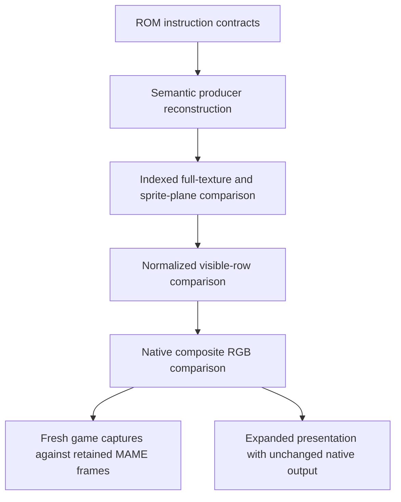

# Parity evidence and limits

The game renderer has exact native parity in the retained normal-orientation scenarios. This evidence does not claim complete game or physical-chip coverage.

All measured results on this page come from [docs/VIDEO-HLE.md](https://github.com/ansxor/f3-recomp/blob/main/docs/VIDEO-HLE.md). This documentation task does not rerun those scenarios.

## Evidence boundary

The target is Japan 2.01J, `landmakrj`. Program addresses are specific to that ROM revision. Generated C, ROMs, and capture artifacts remain untracked.

The independent oracle is `runtime/video.cpp`. Game producers read program ROM and main work RAM. They cannot read FDP geometry.

Shared decoded ROM textures and palette colors are assets. They do not supply scene positions, map cells, sprite records, or line settings.

The evidence has distinct levels:

## Source-layer milestones

| Scenario | Domain | Recorded result |
| --- | --- | --- |
| Seeds 5, 6, 7; 3600 frames; PF0 | 26 complete 1024x512 samples per seed | 13,631,488 indexed pixels per seed; zero mismatches |
| Seed 5; 6000 frames; mask 15 | All four PF maps, 46 samples each | 24,117,248 indexed pixels per PF; zero mismatches |
| Seeds 5, 6, 7; 6000 frames; text | 46 complete 512x512 samples per seed | 12,058,624 indexed pixels per seed; zero mismatches |
| Seed 5; 6000 frames; sprite groups | 46 native visible-plane samples per group | 3,415,040 indexed pixels per group; zero mismatches |
| Seed 5; 40,000 frames; text-only milestone | 329 complete text samples | 86,245,376 indexed pixels; zero mismatches |

These source checks include off-screen PF/text cells. Visible indexed pixels must match palette and flags, not only RGB.

Sprite samples compare the visible plane prepared for the next frame. They preserve the oracle's one-frame lag.

## Complete native scene results

| Scenario | Samples and comparison | Recorded result |
| --- | --- | --- |
| Seed 5; 6000 frames; full mask | 46 source-layer and row samples, followed by native RGB | 3,415,040 composite pixels; zero mismatches |
| No-input attract through frame 3480; frontend compare | Every supported frame | 3249 frames, 241,205,760 RGB pixels; zero mismatches |
| Seeds 5, 6, 7; 40,000 frames each; full mask | 329 samples per seed | 24,424,960 composite pixels per seed; zero mismatches |
| Seed 5; every frame 600–4000; full mask | 3401 complete samples | 252,490,240 composite pixels; zero mismatches |

The extended full-mask runs also compare 172,490,752 indexed texels per PF, per seed. Each sprite group compares 24,424,960 pixels. Text compares 86,245,376 texels.

The continuous seed-5 run compares 1,783,103,488 texels per PF, 252,490,240 pixels per sprite group, and 891,551,744 text texels.

Recorded CPU fallback is zero in these runs. Renderer fallback is separate.

### Startup fallback

The 6000-frame full-mask run reconstructs 5769 frames and delegates 231 frames to the oracle. The last fallback is frame 418.

The recorded startup causes are line initialization/POST for 229 frames, incomplete glyph initialization for one frame, and sprite POST for one frame.

The 40,000-frame seeded runs retain the same 231 startup renderer fallbacks. This is evidence for those input sequences, not a universal startup guarantee.

### Recorded final CRCs

| Scenario | Native CRC |
| --- | --- |
| No-input attract, frame 3480 | `0xb490d7d9` |
| Seed 5, frame 40,000 | `0x1101a39b` |
| Seed 6, frame 40,000 | `0x54a2ed76` |
| Seed 7, frame 40,000 | `0xe9a0299a` |

## Independent capture compatibility

Fresh oracle attract captures compare exactly with 25 retained MAME frames. The comparison covers 1,856,000 RGB pixels, with zero mismatches and zero maximum channel error.

Fresh `--video game` attract captures also match all 25 retained frames. All samples occur after the last startup fallback.

Both modes record native CRC `0xb490d7d9` at frame 3480. They execute 49,866,062 native blocks with zero CPU fallback.

This capture evidence checks the retained oracle independently from the new compositor. It does not establish unmeasured physical-chip effects.

## Corrections exposed by comparison

| Failure | Cause and retained correction |
| --- | --- |
| PF0 unknown writer at frame 1320, PC `0x9ec66` | Missing selection side-strip producer; added semantic fill hook. |
| PF1 unaligned destination at frame 1560 | Printed disassembly omitted the indexed `*4` scale; raw instruction bytes determine mirrored destination adjustment. |
| 545 sprite-group pixels at frame 1080 | Scaled compiler uploads integer tile origins; fractional intermediate origins were incorrect. |
| PF1 row mismatch at frame 600 | Missing cross-PF Y mapping: PF3 zoom low byte controls PF1 Y step. |
| PF2 row mismatch at frame 1440 | Missing upper-half column scroll and a hook before the task wake. |
| Top-edge sprite leak at frame 3404; two composite pixels at frame 21960 | Nominal fixed-point cull must occur before the `+255` vertical raster phase. |

These fixes follow producer or oracle behavior. They do not special-case frame numbers or pixel coordinates.

Permanent checks retain tile reversal, sprite quantization, and the top-edge cull. Runtime parity then checks their real consumer-visible effect.

## Fallback transition evidence

A two-machine smoke compares strict-native FDP and game rendering through 2400 frames. It injects an unknown PF0 writer at frame 2392.

Both native images remain equal across all frames. Exactly the final eight frames use reported producer `0x222220` fallback.

This proves entry into fallback after sustained game rendering. The oracle sprite latch stays current while game composition is active.

## Expanded presentation evidence

| Recorded scenario | Result |
| --- | --- |
| Scale 1 and scale 2, border 48, through 2400 seeded frames | 178,176,000 exact native RGB pixels per run; equal PC, cycles, and D/A registers; zero CPU fallback |
| Scale 2, border 48 | 5,450,015 output pixels differ from nearest-enlarged native RGB across the run |
| Cocoa/Metal, scale 2, border 48, frame 1920 | 832x464 internal image on a 1248x696 surface; both filters visually inspected |
| Nearest versus linear surfaces | 172,330 RGB surface pixels differ; both runs retain native CRC `0x3fadf226` |
| Scale 3 and scale 4, border 160, through 1500 seeded frames | 1920x696 and 2560x928 internal output; 111,360,000 exact native RGB pixels per run |
| Final Cocoa/Metal game frontend, scale 2, border 48, linear, frame 3480 | Visually inspected surface; native CRC `0xb490d7d9` |

The differing expanded pixels demonstrate rerasterization, not added source-art detail. Native dumps and CRCs remain 320x232.

The source log also records CLI rejection of invalid scale, border, filter, and FDP enhancements. Read [Presentation](/developer/runtime/video/presentation) for the current code contract.

## Supported features in measured runs

The retained normal-orientation runs exercise:

- all four wrapping 64x32 playfields;
- tile flips, palette XOR, and blend selectors;
- ROM sprite grids and fixed/scaled master objects;
- programmable text and glyph fades;
- per-line priorities and alpha profiles;
- selection-water clipping;
- PF0 sine row scroll;
- board perspective X zoom, Y step, palette gradient, and column scroll;
- sprite extra pen planes.

Mosaic state is decoded and compared. No nontrivial mosaic animation is claimed as exercised.

## Unsupported scene cases

| Case | Current behavior |
| --- | --- |
| Incomplete initial ownership or POST | Oracle frame until known initialization establishes ownership |
| Ending transitions at `0xfe620`, `0xfefe6`, `0xff0fa` | Explicit line invalidation; oracle until known profile reset |
| Bitmap pivot | Whole-frame `bitmap-pivot` fallback |
| Global screen flip | Whole-frame `flipped-screen` fallback, despite decoded command and descriptor fields |
| Retained sprite framebuffer | Whole-frame `sprite-trails` fallback |
| Unknown producer, invalid descriptor source, or unaligned PF destination | Component invalidation; no hardware-value readback |
| Sprite grid above 32x32 or batch above 1024 | Component rejection, not accepted truncation |

Expanded unsupported frames show the exact integer-scaled oracle image in the center with black added columns. They do not invent geometry.

## Evidence conflicts

An older graphics note reverses packed PF flip-bit names. The game's dispatch table and both renderers use bit 30 for horizontal and bit 31 for vertical reversal.

Inverted clipping remains a separate uncertainty. Pinned MAME and the retained baseline use `max(range.left, endpoint)` when combining inverted planes.

Work-in-progress hardware notes propose a different bitmask/union model. Exercised water/selection profiles do not prove every multi-plane combination on physical hardware.

The die-note archive was inaccessible during the source investigation. No unread die-page claim supplies evidence here.

## Using this evidence

Choose a comparison domain that matches the change. A source-texture pass does not prove line transforms or final mixing.

Check renderer fallback counts alongside mismatches. Use all nine mask bits when a change affects clipping, priority, alpha, scroll, or composition.

Keep the oracle independent. Read [Extending the renderer](/developer/runtime/video/extending) before adding another producer.
