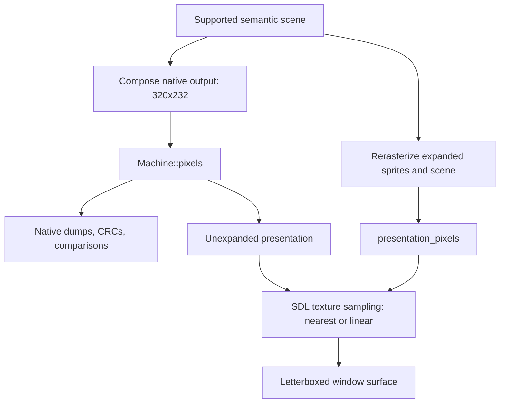

# Presentation: scale, border, and filter

The game renderer separates native output from optional presentation output. Native captures remain 320x232. Enhanced output rerasterizes supported scene geometry.

Sources: [game_video.hpp](https://github.com/ansxor/f3-recomp/blob/main/include/f3rt/game_video.hpp), [game_video.cpp](https://github.com/ansxor/f3-recomp/blob/main/runtime/game_video.cpp), and [frontend.cpp](https://github.com/ansxor/f3-recomp/blob/main/runtime/frontend.cpp).

## Options and dimensions

| Option | Default | Meaning |
| --- | --- | --- |
| `--video-scale 1..4` | 1 | Integer internal rendering scale |
| `--video-border 0..160` | 0 | Additional native scene columns on each side |
| `--video-filter nearest\|linear` | `nearest` | SDL sampling of the completed presentation texture |
| `--video-backend cpu\|gpu` | `cpu` | CPU expanded raster or SDL3 GPU presentation |

`GameVideoOptions` holds scale and border. Filtering belongs to the frontend, not this structure.

```text
width = (320 + 2 * border) * scale
height = 232 * scale
expanded = scale != 1 || border != 0
```

| Scale | Border | Internal image |
| --- | --- | --- |
| 1 | 0 | 320x232 |
| 1 | 48 | 416x232 |
| 2 | 48 | 832x464 |
| 3 | 160 | 1920x696 |
| 4 | 160 | 2560x928 |

Border 48 gives approximately a 16:9 viewport. The original game logic, HUD positions, and source art remain unchanged.

The border shows existing off-screen scene data. Map wrapping and empty cells can therefore appear. It does not generate new artwork or widen game play.

## Mode constraints

Enhancements require `--video game` or `--video compare`. Game-data modes require strict-native `landmakrj`.

The frontend rejects scale zero, scale above four, border above 160, and an unknown filter. It rejects expanded output or linear filtering in `fdp` mode.

The strict-native `landmakr` executable selects `game` unless the user selects another mode. With `--allow-fallback`, its default remains `fdp`.

Netplay adds a separate restriction: `game` video at scale 1 and border 0. The current netplay validation does not require the nearest filter.

## Native and presentation outputs



`Machine::pixels` is always a 320x232 array. In supported `game` frames it holds game-composed native pixels. In `compare` it holds oracle pixels.

`GameVideo::presentation()` returns `Machine::pixels` when options are not expanded. Otherwise it returns the separate presentation buffer.

The constructor allocates expanded ARGB and indexed-sprite buffers once. Each contains `width * height` entries. Native buffers remain available alongside them.

The expanded sprite plane follows the same latch timing as the native plane. It is prepared after the current frame for the next frame.

GPU mode captures a host-only scanout snapshot before the next sprite latch.
It uploads semantic cells/glyphs, palette, normalized rows and the rendered
sprite list; ROM pens are uploaded once. An indexed sprite pass precedes a
per-output-sample fragment compositor. The CPU still makes native pixels.
Expanded CPU presentation is materialized lazily for `presentation()`/save,
so canonical snapshots remain byte-compatible. GPU caches/resources are not
machine state. See [GPU design](https://github.com/ansxor/f3-recomp/blob/main/docs/GPU-VIDEO.md).

## What rerasterization changes

The compositor combines native fixed-point phase with each output subpixel before sampling the playfield texture. It preserves fractional X and Y positions and source steps.

`GameSprites::raster` evaluates sprite texel coverage at the expanded scale. It does not enlarge the completed native sprite image.

Text uses the original programmable 8x8 glyphs. Text rows repeat across expanded subrows. Tile and sprite source textures also remain the original ROM artwork.

A 2x output can differ from nearest enlargement of the native RGB frame. It samples geometry at additional positions. It does not create higher-detail texture data.

Mosaic periods remain native scene widths. Clip boundaries scale with output dimensions. Palette lookup and blending use the same integer rules at either resolution.

## Unsupported frames

An unsupported scene uses `Video::render_frame` for its native output. Expanded presentation then:

1. Fills the entire buffer with opaque black.
2. Copies the exact oracle image into the center.
3. Repeats each native pixel `scale` times horizontally and vertically.
4. Leaves `border * scale` black columns on each side.

This path does not extrapolate unsupported ending, bitmap, flipped-screen, or trails geometry. Native oracle pixels remain exact.

The fallback image uses integer enlargement before SDL filtering. A linear SDL filter can still soften its displayed edges.

## Compare mode presentation

Frontend `compare` checks native game RGB against oracle RGB on every supported frame. It does not compare the expanded output with a higher-resolution oracle.

With expanded options, the displayed supported image is the game presentation buffer. Without expanded options, the displayed image is the native oracle buffer.

Unsupported frames use the centered oracle fallback at either scale. Read [Compare mode](/developer/runtime/video/compare-mode) for the diagnostic distinction.

## SDL surface

The frontend creates a resizable window with initial size `(320 + 2 * border) * 3` by 696. This initial window size does not depend on internal scale.

The CPU backend creates an ARGB8888 streaming texture and uses SDL letterbox
presentation; each advanced frame uploads `presentation()` with pitch `width*4`.
The GPU backend renders the internal-resolution texture directly with SDL3
GPU, then blits/letterboxes it to the swapchain with nearest or linear filtering.
Normal GPU presentation has no expanded RGB upload or readback.

## Captures and CRCs

| Output | Pixel source | Dimensions |
| --- | --- | --- |
| `--dump-dir`: `rendered.argb` and `rendered.bmp` | `Machine::pixels` | Always 320x232 |
| Frontend `frame_crc` | Raw native pixel array | Always 320x232 |
| Frontend `--surface FILE` | CPU `SDL_RenderReadPixels`; GPU fenced texture readback | CPU window surface; GPU internal-resolution image |
| Gameplay regression `--surface FILE` | `write_bmp(m.pixels)` | Always 320x232 |

The same option name has different capture semantics across backends/programs.
CPU frontend captures include actual window mapping/filtering; GPU captures
retain the internal-resolution compositor image. Frontend capture requires
a window and finite `--frames`; native dumps/CRC always retain CPU pixels.

Native dumps also contain palette, graphics, controls, main RAM, shared RAM, and CPU state. See [capture_io.hpp](https://github.com/ansxor/f3-recomp/blob/main/runtime/capture_io.hpp).

## Example commands

These commands describe usage. They are not new verification results from this documentation task.

```sh
./build/landmakr --video game --video-scale 2 --video-border 48 --video-filter nearest
./build/landmakr --video compare --video-scale 2 --video-border 48 --frames 3480
./build/landmakr --video game --video-scale 2 --video-border 48 --video-filter linear \
  --frames 1920 --surface build/game-wide.bmp
```

The source evidence log records native equality, distinct rerasterized pixels, and inspected Cocoa/Metal surfaces. Read [Parity evidence](/developer/runtime/video/parity) for scope and limits.
