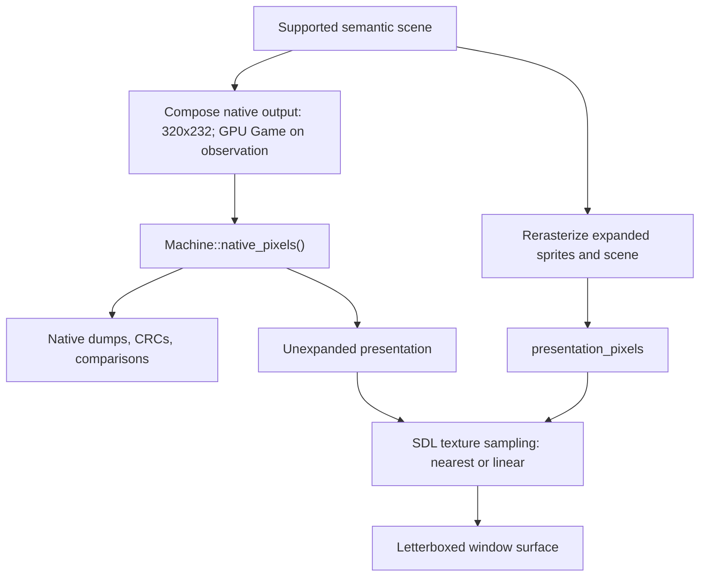

# Presentation: scale, border, and filter

The game renderer separates native output from optional presentation output. Native captures remain 320x232. Enhanced output rerasterizes supported scene geometry.

Sources: [game_video.hpp](https://github.com/ansxor/f3-recomp/blob/main/include/f3rt/game_video.hpp), [video.cpp](https://github.com/ansxor/f3-recomp/blob/main/runtime/renderer/game/video.cpp), and [frontend.cpp](https://github.com/ansxor/f3-recomp/blob/main/runtime/frontend.cpp).

## Options and dimensions

| Option | Default | Meaning |
| --- | --- | --- |
| `--video-scale 1..4\|auto\|auto-integer` | 1 | Fixed integer scale, GPU ceil-fit/aspect blit, or GPU floor-fit/exact nearest blit |
| `--video-border 0..160` | 0 | Additional native scene columns on each side |
| `--video-filter nearest\|linear` | `nearest` | SDL sampling of the completed presentation texture |
| `--video-backend cpu\|gpu` | `cpu` | CPU expanded raster or SDL3 GPU presentation |
| `--video-interp off\|linear\|fit` | `off` | Validated per-field GPU sampling on all four playfields |
| `--video-interp-fields none\|geometry\|palette\|geometry,palette` | `geometry` | Independent geometry and same-pen RGB bank blending; alpha stays native/discrete |
| `--postprocess off\|crt\|user` | `off` | GPU-only final image transform; native pixels/checksums and menu are unchanged |
| `--user-shader FILE` | none | Metal source entry `f3_postprocess` or Vulkan SPIR-V entry `main` |

`GameVideoOptions` holds scale and border. Filtering belongs to the frontend, not this structure.

```text
width = (320 + 2 * border) * scale
height = 232 * scale
expanded = scale != 1 || border != 0
```

| Scale | Border | Internal image |
| --- | --- | --- |
| 1 | 0 | 320x232 |
| 1 | 48 | 416x232 |
| 2 | 48 | 832x464 |
| 3 | 160 | 1920x696 |
| 4 | 160 | 2560x928 |

Border 48 gives approximately a 16:9 viewport. The original game logic, HUD positions, and source art remain unchanged.

The border shows existing off-screen scene data. Map wrapping and empty cells can therefore appear. It does not generate new artwork or widen game play.

## Mode constraints

Enhancements require `--video game` or `--video compare`. Game-data modes require strict-native `landmakrj`.

The frontend rejects numeric scale zero/above four, border above 160, and an unknown filter. Auto modes require GPU; GPU requires game/compare. FDP rejects expanded output or linear filtering.

The strict-native `landmakr` executable selects `game` unless the user selects another mode. With `--allow-fallback`, its default remains `fdp`.

Netplay permits independent presentation geometry, including auto modes. Full local rollback snapshots retain each client's presentation; canonical handoff and network CRCs omit expanded buffers. Audio/video simulation compatibility still belongs to identity.

## Window-following GPU scale

Fit uses `SDL_GetWindowSizeInPixels`, never point dimensions. Automatic windows
request `SDL_WINDOW_HIGH_PIXEL_DENSITY`; fixed windows retain their previous
flags. Native width is `320 + 2*border`. Auto-integer floor-fits, clamps 1–4,
and blits its internal texture 1:1, nearest, centered on black. If the window is
below 1x, source cropping keeps the selected scale exact. Auto ceil-fits and
uses the existing aspect-preserving nearest/linear blit. The cap is intentionally
4 after measured 5–8x costs; see the [GPU evidence log](https://github.com/ansxor/f3-recomp/blob/main/docs/developer/GPU-VIDEO.md).

Pixel geometry is polled after native audio enqueue and before GPU draw.
Changes debounce for 100ms quiet or 250ms maximum pending time. Unchanged scale
does no resource work; the swapchain viewport still follows every pixel resize.
`GpuVideo::set_scale` replaces only sprite/surface textures and any existing
diagnostic readback storage. SDL deferred release avoids a GPU-idle wait.
Assets, upload/storage buffers, device and both precompiled interpolation/off
pipelines survive; tile pen masks are prepared even when startup scale is 1.

`GameVideo::set_gpu_scale` selects host reference geometry independently of
constructor-fixed canonical buffers. The fixed canonical and selected diagnostic
sprite planes share decoded scene data; diagnostics allocate only when used and
resize only on scale changes. Snapshot bytes/size and native trail retention
never change. Trails remain native oracle output across a transition: no history
clear or scale-change glitch is introduced. Headless does not change scale.


## Native and presentation outputs



`Machine::native_pixels()` returns a const reference to the 320x232 native array.
In supported GPU `game` frames, the first observation materializes the retained
scanout through the exact CPU compositor. Unobserved supported predecessors may
be discarded; unsupported successors preserve their retained game composite.
Captured maps, glyphs, palette, rows and the current sprite plane isolate the
result from later live writes and the next latch. CPU presentation stays eager.
In `compare`, the accessor returns oracle pixels.

`GameVideo::presentation()` returns `Machine::native_pixels()` when options are not expanded. Otherwise it returns the separate presentation buffer.

The constructor allocates expanded ARGB and indexed-sprite buffers once. Each contains `width * height` entries. Native buffers remain available alongside them.

The expanded sprite plane follows the same latch timing as the native plane. It is prepared after the current frame for the next frame.

GPU mode captures a host-only scanout snapshot before the next sprite latch.
It uploads semantic cells/glyphs, palette, normalized rows and the rendered
sprite list; ROM pens are uploaded once. An indexed sprite pass precedes a
per-output-sample fragment compositor. The CPU still makes native pixels.
Expanded CPU presentation is materialized lazily for `presentation()`/save,
so canonical snapshots remain byte-compatible. GPU caches/resources are not
machine state. See [GPU design](https://github.com/ansxor/f3-recomp/blob/main/docs/developer/GPU-VIDEO.md).

## ImGui postprocess and live controls

F1 → Video applies GPU scale/filtering live; CPU scale, renderer/model, border and interpolation are restart preferences. Save preferences explicitly; CLI overrides loaded values.

The final GPU postprocess pass offers Off (default), CRT and User. CPU leaves the preference inactive. F1 → Shaders loads/reloads a user file; a failed reload retains the last valid shader. The pass transforms presentation/captures, not native rendering, simulation, canonical CRCs or ImGui.

Metal accepts `.metal` source with entry `f3_postprocess`, source texture/sampler index 0 and a float4 width/height/scale/elapsed-seconds uniform. Vulkan accepts `.spv` entry `main`; GLSL examples use sampled image set 2/binding 0 and uniform set 3/binding 0. Examples live at `runtime/renderer/shaders/user_transform.metal` and `user_transform.frag`; compile the latter offline before loading it. [Shader commands](/guide/video#f1-shaders-and-live-controls) and the [complete ABI/evidence](https://github.com/ansxor/f3-recomp/blob/main/docs/developer/IMGUI-NETPLAY.md) give the supported interface and limits.


## What rerasterization changes

The compositor combines native fixed-point phase with each output subpixel before sampling the playfield texture. It preserves fractional X and Y positions and source steps.

`GameSprites::raster` evaluates sprite texel coverage at the expanded scale. It does not enlarge the completed native sprite image.
Both zoom axes and mirrored texel selection use the original sprite descriptor.
GPU texel boundaries multiply by the internal scale before fixed-point
rounding, matching this CPU path. Unscaled sprites gain no extra texture
detail; submitted positions are integer native pixels and descriptors contain
no rotation matrix. There is no additional sprite interpolation flag.

Text uses the original programmable 8x8 glyphs. Text rows repeat across expanded subrows. Tile and sprite source textures also remain the original ROM artwork.

A 2x output can differ from nearest enlargement of the native RGB frame. It samples geometry at additional positions. It does not create higher-detail texture data.

Mosaic periods remain native scene widths. Clip boundaries scale with output dimensions. Palette lookup and blending use the same integer rules at either resolution.

### Opt-in line interpolation

The off pipeline retains all integer rules above. A separate shader variant
uses per-playfield/per-field valid runs, including PF0's sampled wave and both
valid PF2 scale/centering halves. No fixed layer, water band or analytic sine is
required. Disabled, zero, garbage, bitmap and mosaic rows cannot be endpoints
or derivative samples. Controls, clip/alpha changes and column-phase jumps
split runs; field-specific source/zoom limits preserve discrete jumps.

Linear mode uses the next measured value. Fit uses shape-preserving local
cubic increments anchored at the current raw value, not an absolute fitted
curve. Both preserve every native subrow-zero sample and unflagged row exactly.
Four valid neighbors are required; run endpoints remain raw. Per-layer logs
report accepted source/zoom/vertical/palette row counts and rejection reasons.

Geometry is the default field set. Separately selected palette blending uses
the same pen in compatible banks only, checked against actual ROM tile pens
over an endpoint-bounded footprint including border; unsafe RGB jumps remain
discrete without disabling valid geometry. Blended RGB can be absent from the
native palette. Alpha, clip, mosaic, priority and column offsets stay discrete:
the survey found held blocks/jumps, not smooth per-line ramps.

Only the encoded upload gains appended per-field metadata (typed `InterpolationCoefficients`
written by `encode()`); the `CapturedFrame` and CPU buffers do not change. Sprite ROM sampling already runs on the selected
output grid in off/linear/fit; these line modes do not change sprite coverage.

Boundary measurements, false-positive limits, guard fixtures, captures and
timings: [GPU design](https://github.com/ansxor/f3-recomp/blob/main/docs/developer/GPU-VIDEO.md).


## Unsupported frames

An unsupported scene uses `Video::render_frame` for its native output. Expanded presentation then:

1. Fills the entire buffer with opaque black.
2. Copies the exact oracle image into the center.
3. Repeats each native pixel `scale` times horizontally and vertically.
4. Leaves `border * scale` black columns on each side.

This path does not extrapolate unsupported ending, bitmap, flipped-screen, or trails geometry. Native oracle pixels remain exact.

The fallback image uses integer enlargement before SDL filtering. A linear SDL filter can still soften its displayed edges.

## Compare mode presentation

Frontend `compare` checks native game RGB against oracle RGB on every supported frame. It does not compare the expanded output with a higher-resolution oracle.

With expanded options, the displayed supported image is the game presentation buffer. Without expanded options, the displayed image is the native oracle buffer.

Unsupported frames use the centered oracle fallback at either scale. Read [Compare mode](/developer/runtime/video/compare-mode) for the diagnostic distinction.

## SDL surface

The frontend creates a resizable window with initial size `(320 + 2 * border) * 3` by 696. This initial window size does not depend on internal scale.

The CPU backend creates an ARGB8888 streaming texture and uses SDL letterbox
presentation; each advanced frame uploads `presentation()` with pitch `width*4`.
The GPU backend renders the internal-resolution texture directly with SDL3
GPU, then blits/letterboxes it to the swapchain with nearest or linear filtering.
Normal GPU presentation has no expanded RGB upload or readback.

## Captures and CRCs

| Output | Pixel source | Dimensions |
| --- | --- | --- |
| `--dump-dir`: `rendered.argb` and `rendered.bmp` | `Machine::native_pixels()` | Always 320x232 |
| Frontend `frame_crc` | Raw native pixel array | Always 320x232 |
| Frontend `--surface FILE` | CPU `SDL_RenderReadPixels`; GPU fenced texture readback | CPU window surface; GPU internal-resolution image |
| Gameplay regression `--surface FILE` | `write_bmp(m.native_pixels())` | Always 320x232 |

The same option name has different capture semantics across backends/programs.
CPU frontend captures include actual window mapping/filtering; GPU captures
retain the internal-resolution image with active postprocess. `--surface` requires
a window and finite `--frames`; F12 independently writes a PNG into the preferences sibling `screenshots/` directory. Native dumps/CRC retain CPU pixels; captures do not include the menu overlay.

Native dumps also contain palette, graphics, controls, main RAM, shared RAM, and CPU state. See [capture_io.hpp](https://github.com/ansxor/f3-recomp/blob/main/runtime/capture_io.hpp).

## Example commands

These commands illustrate presentation options; recorded verification is linked above.

```sh
./build/landmakr --video game --video-scale 2 --video-border 48 --video-filter nearest
./build/landmakr --video compare --video-scale 2 --video-border 48 --frames 3480
./build/landmakr --video game --video-scale 2 --video-border 48 --video-filter linear \
  --frames 1920 --surface build/game-wide.bmp
```

The source evidence log records native equality, distinct rerasterized pixels, and inspected Cocoa/Metal surfaces. Read [Parity evidence](/developer/runtime/video/parity) for scope and limits.
