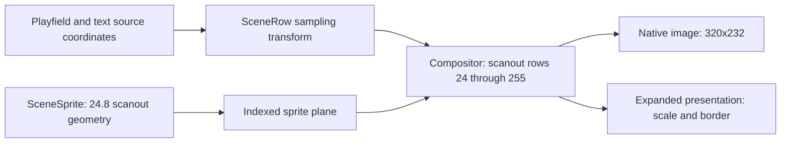

# Scene types and coordinate systems

The game renderer uses semantic values, not a second image of FDP RAM. This page defines the shared types and coordinate rules.

Source: [runtime/renderer/game/scene.hpp](https://github.com/ansxor/f3-recomp/blob/main/runtime/renderer/game/scene.hpp). The oracle also uses `SceneRow` for diagnostic inspection.

## Data boundary: VideoRam

`VideoRam` is a read-only big-endian view of FDP video RAM at VBSTART:

| Field | Operation |
| --- | --- |
| `graphics` | 0x40000 bytes at 0x600000 (sprites, playfield maps, text map, glyph RAM, line RAM, pivot RAM) |
| `control` | 0x20 bytes at 0x660000 (PF0..PF3 X/Y scroll, then pivot/text registers) |
| `frame` | `Machine::frame + 1`, diagnostics only |
| `u16(offset)` | Big-endian word at a `graphics` offset |
| `control_u16(index)` | Big-endian control word 0..15 |

Video RAM is the source of truth. The decoders read it directly; a store from an
unknown PC never invalidates a component, it is only logged with
`--discovery-log`. See
[Video write logging](/developer/runtime/video/producers).

### Component lifecycle concepts

`runtime/renderer/game/scene.hpp` defines two C++20 concepts that describe what a layer component must provide. `SceneSource` requires `reset()` and `decode(const VideoRam &)`; the component is rebuilt from video RAM at VBSTART. `Snapshotable` requires `state_size()`, `save_state(StateWriter &)` and `load_state(StateReader &)`; it is for state that is serialized into machine snapshots. `GameTiles` and `GameText` satisfy `SceneSource` only, because video RAM fully determines them. `GameSprites` and `GameLines` satisfy both. Each component header ends with a `static_assert` of its conformance, and `GameVideo` resets, decodes and serializes its components through concept-constrained helpers in the order tiles, text, sprites, lines (snapshots: sprites, then lines).

A new component must satisfy `SceneSource`, and also `Snapshotable` if it holds state that cannot be derived from video RAM. Add it to `sources()` (and `stateful()` when applicable) in `runtime/renderer/game/video.cpp`; the snapshot field order is part of the save format.

## Coordinate domains

| Domain | Size or format | Use |
| --- | --- | --- |
| Scanout coordinates | 432 columns, 256 rows | Sprite plane, clip windows, and normalized rows |
| Native visible image | 320x232 | Columns 46–365 and rows 24–255 of scanout |
| Playfield source texture | 1024x512 | Four wrapping 64x32 maps of 16x16 tiles |
| Text source texture | 512x512 | A wrapping 64x64 map of 8x8 glyphs |
| Fixed-point geometry | 24.8 | Integer position plus eight fraction bits |
| Expanded output | `(320 + 2 * border) * scale` by `232 * scale` | Optional presentation image |

At native scale, visible image position `(x, y)` corresponds to scanout position `(x + 46, y + 24)`.

A border extends the horizontal scanout interval to `[46 - border, 366 + border)`. It does not add vertical rows. Scene source coordinates remain native units. See [Presentation](/developer/runtime/video/presentation).

## ScenePixel

`ScenePixel` contains `uint16_t palette` and `uint8_t flags`. Both fields default to zero.

- Flag bit 4, `0x10`, marks a nontransparent texel.
- Flag bit 0 holds the playfield blend selector.
- `palette` is an indexed color, not RGB.

Transparent texture pixels can carry unused palette values. Diagnostic comparison ignores those values when both pixels are transparent. Visible pixels must match both the palette index and all flag bits.

The sprite plane uses a separate packed `uint16_t` value. Zero means transparent. A visible value is `0x1000 + (palette_byte << 4) + pen`. Bits 10–11 identify the sprite group.

## SceneSprite

| Field | Type and initial value | Meaning |
| --- | --- | --- |
| `x`, `y` | `int32_t`, zero | 24.8 coordinates in scanout space |
| `scale_x`, `scale_y` | `uint16_t`, 256 | Fixed-point step per source texel; 256 means one native pixel |
| `tile` | `uint32_t`, zero | Sprite ROM tile code |
| `palette` | `uint8_t`, zero | Palette byte, including the group bits |
| `flip_x`, `flip_y` | `bool`, false | Per-tile texel reversal |

A tile contains 16x16 texels. Its nominal width is `16 * scale_x / 256` native pixels. The raster applies native sampling phases after the geometric cull.

Decoded descriptors already carry scanout-space 24.8 positions. The latch does not add an origin; it only mirrors the descriptors when screen flip is active. See [Sprites](/developer/runtime/video/sprites).

## SceneLayer

Every playfield, sprite group, and text layer has a `SceneLayer`.

| Field | Meaning |
| --- | --- |
| `priority` | Priority from 0 through 15 |
| `blend_mode` | Two-bit mode: opaque, normal blend, reverse blend, or disabled, depending on layer kind |
| `clip_enabled` | Four-bit mask of selected clip planes |
| `clip_inverted` | Four-bit per-plane inversion mask |
| `clip_inverse` | Global clip mode; a false value swaps the normal and inverted plane sets |
| `enabled` | Final layer-enable decision after mix-word decoding |
| `blend_select` | Row selector for text or sprites; playfields use the texel flag instead |
| `mosaic` | Enables horizontal repeated sampling for this layer |

All fields initially equal zero or false. The structure does not determine enable rules itself. `GameLines::prepare` computes them.

Playfields and text require mix-word bit 13 and a mode other than 3. Sprite groups require bit 13 and a mode other than 0.

## ScenePlayfield

`ScenePlayfield` contains a `SceneLayer` and the sampling transform for one source map.

| Field | Meaning |
| --- | --- |
| `source_x` | 24.8 source coordinate at native visible column zero |
| `source_y` | Integer source row, before global screen flipping |
| `x_step` | 24.8 source step per native horizontal output pixel; starts at 256 |
| `y_step` | 24.8 source step per native output row; starts at 256 |
| `y_fraction` | Low eight bits of the native vertical accumulator |
| `palette_add` | Per-row addition to a visible indexed color |

At native scale, horizontal sampling uses `floor((source_x + x * x_step) / 256)`. The compositor uses mathematical floor for negative coordinates.

Expanded output combines the native phase with each output subpixel before division. `y_fraction` and `y_step` let it sample subrows without enlarging the finished native RGB image.

## SceneClip

`SceneClip` contains signed 16-bit `left` and `right` endpoints. Both start at zero. The interval is half-open in scanout coordinates.

The endpoints already contain the oracle calibration: raw left minus one and raw right minus two. The compositor must not apply this calibration again.

## SceneRow

| Field | Meaning |
| --- | --- |
| `playfields[4]` | Four `ScenePlayfield` transforms and layer settings |
| `sprites[4]` | Four sprite-group `SceneLayer` settings |
| `text` | Text `SceneLayer` settings |
| `clips[4]` | Four calibrated clip intervals |
| `blend[4]` | Saturated weights from 0 through 8 |
| `background` | Background palette index |
| `text_x`, `text_y` | Text texture position at native visible column zero, before global flip |
| `mosaic_period` | Horizontal sampling period; initially 16 |
| `bitmap` | True when the pivot selects bitmap geometry |

`GameLines` holds 256 rows. `row(scanout_y)` masks its index with 255. The compositor draws rows 24 through 255.

The oracle stores the same description when scene inspection is enabled. This common diagnostic format does not share rendering logic or hardware geometry with the game renderer.

### Layer identifiers

`LayerId` names the nine scene layers: `Pf0`..`Pf3` are 0..3, `Sp0`..`Sp3` are 4..7, and `Text` is 8. `kind(id)` returns a `LayerKind` (`Playfield`, `Sprite` or `Text`), `sub_index(id)` gives the index within that kind, and `sprite_layer(plane_value)` extracts the sprite layer from bits 10-11 of an indexed sprite-plane value. `SceneRow::layer(id)` returns the `SceneLayer` for any identifier.

`layer_info` holds each layer's name, indexed-domain size and report domain string. `layer_bit(id)` is the layer's bit in a layer mask, and `all_layers` (511) selects all nine. Public signatures still take a plain `unsigned layer_mask`. `scrolled_layers` lists the five layers with scroll geometry: the four playfields and text.

The numeric values are fixed. They are encoded into the GPU scene words (the row order list and the layer blocks, offsets in `runtime/renderer/gpu/scene_layout.h`, shared by the encoder and the shaders), mirrored by `LAYER_*` constants in `runtime/renderer/shaders/scene.glsl`, and exposed by the `--video-layer-mask` option. Change the enum, the shader constants and the GPU layout together or not at all.

## Persistence and ownership

The scene structures are C++ values, not a wire format. Snapshot code packs their fields into `CanonicalScene*` structures in `runtime/state_io.hpp`.

`GameLines` saves its decoded line parameters and normalized rows. `GameSprites`
saves staging, submitted, and current descriptors plus the command flags.
Playfield tiles and text are derived from the serialized video RAM and rebuilt by
`decode` at VBSTART, so `GameTiles` and `GameText` save nothing; `load_state`
restores the composited pixels (see [ABI changes](/developer/abi-changes)).

The compositor owns no persistent scene state. `GameVideo` owns the native and expanded output buffers. Read [GameVideo](/developer/runtime/video/game-hle) for the complete snapshot order.
