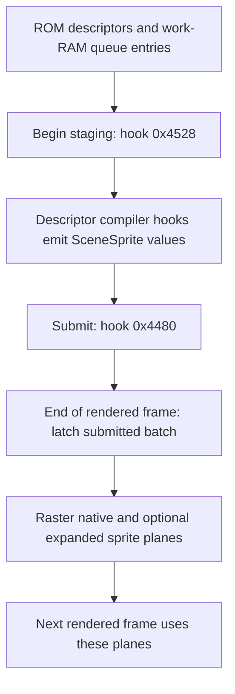

# Sprites: GameSprites

`GameSprites` captures the game's sprite descriptors before the native code writes FDP records. It preserves tile geometry and the one-frame sprite lag.

Sources: [game_sprites.hpp](https://github.com/ansxor/f3-recomp/blob/main/runtime/game_sprites.hpp) and [game_sprites.cpp](https://github.com/ansxor/f3-recomp/blob/main/runtime/game_sprites.cpp).

## Three descriptor batches

The class holds three arrays, each with capacity for 1024 `SceneSprite` values.

| Batch | Role |
| --- | --- |
| `staging_sprites_` | Descriptors collected during the active game compiler pass |
| `submitted_sprites_` | Completed batch copied by the submit hook |
| `current_sprites_` | Latched geometry used to prepare the next sprite plane |

Each batch has a separate count. The class also holds pending global scroll, flip, pen-mask, and trails registers. Current command fields belong to the latched batch.



`GameVideo::render_frame` composes with the existing plane first. It calls `latch_sprites` only after the current output is complete.

A submit does not display the queue immediately. This order matches the oracle's lag. Layer diagnostics inspect the plane for the next frame, not the sprite pixels already mixed into the current image.

## Public interface

| API | Operation |
| --- | --- |
| `reset()` | Clears counts and command state; support becomes false. |
| `observe(memory, cpu)` | Handles a producer hook selected by `cpu.pc`. |
| `observe_write(pc, address)` | Rejects unmodeled writers in `0x600000..0x60ffff`. |
| `latch()` | Copies submitted descriptors and applies global scroll, origin, and flip. |
| `raster(assets, output, options)` | Draws current descriptors into an indexed sprite plane. |
| `sprites()` | Returns a read-only span of current descriptors. |
| `flipped()`, `pen_mask()`, `trails()` | Return the current latched command fields. |
| `supported()`, `unsupported_pc()` | Return ownership status and the recorded producer PC. |
| `state_size()`, `save_state`, `load_state` | Serialize all three batches and command/support state. |

The asset span comes from `Video::sprite_tiles()`. Geometry comes only from `GameMemory` and CPU registers.

## Game queue format

The evidence log identifies these queue bases:

```text
0x408cf0  0x408870  0x408630  0x408510
0x4083f0  0x408360  0x408120  0x407ee0
```

The native compiler visits queues 4–7, the master-object list, then queues 0–3. `GameSprites` observes the compiler calls in that order. It does not walk FDP sprite RAM.

Each queue entry contains 18 bytes:

| Offset | Value |
| --- | --- |
| `+0` | Graphics descriptor pointer |
| `+4` | Zoom long |
| `+8`, `+10` | X and Y coordinate words |
| `+12` | Palette word |
| `+14`, `+16` | Horizontal and vertical flip words |

At compiler hooks `0x4688` and `0x46c0`, `A4` points to entry offset `+4`. `A0` follows the descriptor header. `D7` contains that header.

## Initialization and command hooks

| PC | Captured effect |
| --- | --- |
| `0x41d0` | Establishes sprite ownership; clears all counts and the unsupported PC. |
| `0x43b0` | Reads signed 12-bit scroll words at `0x407a16` and `0x407a1a`. |
| `0x43e0` | Reads the command at `0x407a1e`. |
| `0x4528` | Starts a batch by clearing the staging count. |
| `0x4480` | Copies staging descriptors into the submitted batch, then clears staging. |

Command bit 13 selects global screen flip. Bits 8–9 select extra pen planes. The pen mask is `(((command >> 8) & 3) << 4) | 15`. Bit 1 selects sprite trails.

The descriptor code retains these fields. `GameVideo` nevertheless falls back for flipped-screen and sprite-trails frames. Complete scanout for those cases is outside the measured game-renderer contract.

## Descriptor compiler contracts

### Single tile: 0x4688

`A0` selects an attribute-XOR word and a tile-code word. Tile code zero emits nothing.

`A4+1` is Y zoom, and `A4+3` is X zoom. The steps are `256 - zoom`. Coordinate words at `A4+4/+6` are signed 12-bit values.

The palette comes from `A4+8`. Flip bits come from words at `A4+10/+12`. The compiler XORs the combined palette/flip attribute with the descriptor attribute.

### Queue grid: 0x46c0

The upper word of `D7` is rows minus one. Its lower word is columns minus one. Both dimensions must be from 1 through 32.

Tile entries are column-major packed longs: attribute XOR in the high word and tile code in the low word. Zero tile codes emit nothing.

An unscaled grid places tiles 16 native pixels apart. The queue's flip words reverse placement and texel orientation.

For a scaled grid:

```text
zoom_x = zoom_long & 255
zoom_y = (zoom_long >> 16) & 255
raster_scale_x = 256 - (zoom_x & 0xf0)
raster_scale_y = 256 - zoom_y
```

Placement uses all eight X zoom bits. Tile width uses only the high four X zoom bits. These are distinct values.

The compiler seeds a half-pixel accumulator for tile placement. It then uploads integer coordinate words. `GameSprites` quantizes each tile origin to that integer result, including signed 12-bit wrapping.

Do not retain intermediate fractional tile origins. These tiles are independent records, not an FDP chained block.

### Master-object helpers

| Hook | Inputs and placement |
| --- | --- |
| `0xa8f38` | `A0` contains rows-minus-one and columns-minus-one words, then column-major entries. Positions come from `D1.W/D2.W`. Attributes XOR with `D3.W`. Bit 8 reverses horizontal grid placement. |
| `0xa8f84` | Attribute XOR at `A0+4`; codes at `+6/+10/+14`. Places tiles at `(x+5,y)`, `(x,y+16)`, and `(x+16,y+16)`. |
| `0xa90f4` | Codes at `A0+6/+10/+14/+18`. Places a column-major 2x2 block. Palette and flips come from `D3.W`. |
| `0xa913c` | Scaled grid header and entries at `A0`; object fields at `A3`; position from `D1.W/D2.W`; palette from `D3`. |

The three-tile and four-tile helpers check their first code before expanding the block. `emit_sprite` also ignores any zero code.

The scaled master helper reads X zoom at `A3+0x10` and Y zoom at `A3+0x12`. The low two bits of the word at `A3+0x12` supply flips.

It adds center offsets `(columns * zoom_x + 8) / 32` and `(rows * zoom_y + 8) / 16`. The placement fraction is the high byte of `A5.W`.

It applies the same integer-origin quantization and X raster mask as the scaled queue grid. The [evidence log](https://github.com/ansxor/f3-recomp/blob/main/docs/VIDEO-HLE.md) records the ROM trace behind these rules.

## Latch transform

Normal orientation uses scanout origin `(46,24)`. Flipped orientation uses `(146,0)`. `latch()` adds the pending global scroll to that origin.

For normal orientation, each current position is the submitted position plus this offset. For flipped orientation:

```text
current_x = (512 << 8) - scale_x * 16 - total_x
current_y = (256 << 8) - scale_y * 16 - total_y
```

The latch also inverts both tile flip flags. These decoded formulas do not imply supported flipped-screen composition.

## Raster rules

The native plane has 432x256 entries. Only the visible crop is drawn. Expanded planes use the requested output dimensions and shifted horizontal origin.

1. Clear the output unless the latched command enables trails.
2. Return if the decoded asset span is empty.
3. Visit current descriptors in reverse order.
4. Cull the nominal fixed-point rectangle before texel rounding.
5. Sample 16x16 source texels with the tile flips and pen mask.
6. Write a nonzero pen only if the destination entry is still zero.

The reverse traversal and empty-only write mean later descriptors in the stored list win overlapping pixels. An earlier descriptor cannot replace an existing entry.

This is what both implementations execute. The oracle source comment says earlier sprites have priority, but that comment conflicts with its empty-only write.

Horizontal sampling uses a `+128` fixed-point phase. Normal vertical sampling uses `+255`. The expanded raster scales geometry before applying these phases.

A horizontal texel with identical rounded start and end is skipped. Vertical coverage uses at least one output row per source row. Later source rows can meet an already written row.

The geometric cull is essential. A sprite whose bottom ends exactly at scanout row 24 must not leak a rounded texel into the image.

A visible indexed value is `0x1000 + (palette << 4) + pen`. The compositor selects its group from bits 10–11.

## Rejection and recovery

Invalid dimensions, an unsupported memory read, or more than 1024 emitted sprites invalidate the component. The code records the producer PC instead of accepting a truncated scene.

Unknown sprite-RAM writers also invalidate support. Covered store ranges are listed in [Producer hooks](/developer/runtime/video/producers).

A valid submit establishes support only when `unsupported_pc_` is zero. An earlier unmodeled writer therefore stays invalid until hook `0x41d0` establishes ownership again.

## Saved state and checks

Snapshots save all 1024 slots in each batch, three counts, current command fields, pending registers, support, and the unsupported PC. `load_state` caps restored counts at 1024.

`check_game_sprite_descriptors` checks a mirrored scaled 3x3 descriptor. It checks integer tile origins separately from raster width.

`check_game_sprite_top_edge` checks exact-top clipping and an adjacent partially visible sprite. These checks live in [runtime/check.cpp](https://github.com/ansxor/f3-recomp/blob/main/runtime/check.cpp).

Full sprite parity compares all four groups in the native visible crop. See [Compare mode](/developer/runtime/video/compare-mode) and [Parity evidence](/developer/runtime/video/parity).
