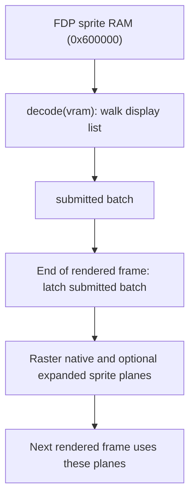

# Sprites: GameSprites

`GameSprites` decodes the hardware sprite display list from video RAM at VBSTART.
It preserves tile geometry and the one-frame sprite lag.

Sources: [game_sprites.hpp](https://github.com/ansxor/f3-recomp/blob/main/runtime/game_sprites.hpp),
[game_sprites.cpp](https://github.com/ansxor/f3-recomp/blob/main/runtime/game_sprites.cpp)
and [games/landmakrj/video/video.cpp](https://github.com/ansxor/f3-recomp/blob/main/games/landmakrj/video/video.cpp).

## Three descriptor batches

The class holds three arrays, each with capacity for 1024 `SceneSprite` values.

| Batch | Role |
| --- | --- |
| `staging_sprites_` | Decode scratch |
| `submitted_sprites_` | The list decoded at this VBSTART |
| `current_sprites_` | Latched geometry used to prepare the next sprite plane |

The class also holds pending global flip, pen-mask, trails and bank flags. Current
command fields belong to the latched batch.



`GameVideo::render_frame` composes with the existing plane first. It calls
`latch_sprites` only after the current output is complete. A decoded list is not
displayed immediately; this order matches the oracle's lag. Layer diagnostics
inspect the plane for the next frame.

## Public interface

| API | Operation |
| --- | --- |
| `reset()` | Clears counts and command state. |
| `decode(vram)` | Walks the sprite display list and fills the submission. |
| `latch()` | Copies submitted descriptors; mirrors them only for flipscreen. |
| `raster(assets, output, options)` | Draws current descriptors into an indexed sprite plane. |
| `sprites()` | Returns a read-only span of current descriptors. |
| `flipped()`, `pen_mask()`, `trails()` | Return the current latched command fields. |
| `state_size()`, `save_state`, `load_state` | Serialize all three batches and the command state. |

The asset span comes from `Video::sprite_tiles()`.

## Display-list walk

`decode` calls `decode_sprite_list` (`runtime/video_decode.cpp`), which is shared
with `Video::get_sprite_info`:

- 1024 entries of 16 bytes (words `w0`..`w6` at +0..+12);
- word 3 bit 15 is the command: word 5 carries screen flip (bit 13), extra pen
  planes (bits 8–9), trails (bit 1) and bank select (bit 0);
- word 6 bit 15 is a list jump (`& 0x3ff`), otherwise the walk continues;
- `spritecont = w4 >> 8`: bit 4 locks the color, bits 6–7 / 4–5 select the X/Y
  block control, bit 3 chains, bits 0–1 are flips;
- word 2 bits 12–15 is the scroll mode; the low 12 bits are the position, with
  global/subglobal latches inside the list;
- word 1 is the zoom (`scale = 256 - zoom`); `w0 | ((w5 & 1) << 16)` is the tile;
- entries outside the scanout crop are culled.

Positions, zoom and flips therefore come from video RAM, not from work-RAM scroll
mirrors. The command flags persist across frames (bank selection in particular).

## Latch transform

Decoded positions are already in scanout space as 24.8 coordinates. `latch()`
does **not** add an origin; it only mirrors the submission for flipscreen:

```text
current_x = (512 << 8) - scale_x * 16 - decoded_x
current_y = (256 << 8) - scale_y * 16 - decoded_y
```

and both tile flip flags invert. Normal orientation copies the descriptors
unchanged.

## Raster rules

The native plane has 432x256 entries. Only the visible crop is drawn. Expanded
planes use the requested output dimensions and shifted horizontal origin.

1. Clear the output unless the latched command enables trails.
2. Return if the decoded asset span is empty.
3. Visit current descriptors in reverse order.
4. Cull the nominal fixed-point rectangle before texel rounding.
5. Sample 16x16 source texels with the tile flips and pen mask.
6. Write a nonzero pen only if the destination entry is still zero.

The reverse traversal and empty-only write mean later descriptors in the stored
list win overlapping pixels.

Horizontal sampling uses a `+128` fixed-point phase. Normal vertical sampling uses
`+255`. Expanded raster scales geometry before applying these phases. A horizontal
texel with identical rounded start and end is skipped. The geometric cull is
essential: a sprite whose bottom ends exactly at scanout row 24 must not leak a
rounded texel into the image.

A visible indexed value is `0x1000 + (palette << 4) + pen`. The compositor selects
its group from bits 10–11.

## Fallbacks

`flipped()` and `trails()` remain genuine unsupported features: `GameVideo` falls
back to the FDP oracle for those frames and logs the reason once. See
[GameVideo](/developer/runtime/video/game-hle).

## Saved state and checks

Snapshots save all 1024 slots in each batch, three counts, the current command
fields, the pending registers and the bank flag. `load_state` caps restored counts
at 1024.

`check_game_sprite_vram_block_chaining` builds a two-entry display list and checks
block-chained positions on both axes. It lives in
[runtime/check.cpp](https://github.com/ansxor/f3-recomp/blob/main/runtime/check.cpp).

Full sprite parity compares all four groups in the native visible crop. See
[Compare mode](/developer/runtime/video/compare-mode) and
[Parity evidence](/developer/runtime/video/parity).
