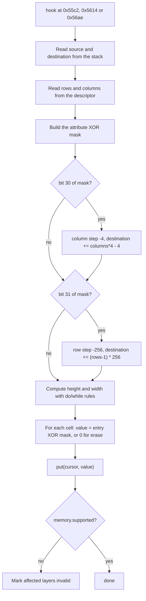

# Playfield tiles: GameTiles

**What you will learn:** how `GameTiles` keeps the four playfield maps, how it decodes a tile-block descriptor from the game, which edge cases it copies from the 68020 code of the game, and how it samples a pixel.

The files are `runtime/game_tiles.hpp` and `runtime/game_tiles.cpp`.

## What the class holds

`GameTiles` stores four maps of 2048 `Cell` values each (64 columns x 32 rows). A `Cell` is a decoded form of one 4-byte map entry. It is **not** a copy of the video RAM bytes.

| `Cell` field | Type | Meaning |
| --- | --- | --- |
| `tile` | `uint16_t` | Tile code (low 16 bits of the entry) |
| `palette` | `uint16_t` | `(attribute & 0x1ff) * 16`, the palette base |
| `pen_mask` | `uint8_t` | `(((attribute >> 10) & 3 & ~attribute) << 4) \| 15` |
| `flip_x`, `flip_y`, `blend` | `bool` | Attribute bits 14, 15 and 9 |

Other members:

| Member | Meaning |
| --- | --- |
| `maps_` | `std::array<std::array<Cell, 2048>, 4>` |
| `valid_[4]` | True when the scene owns the layer |
| `unsupported_[4]` | Recorded unknown store or unsupported hook PC; descriptor failures can replace it |

The pen mask expression `& ~attribute` uses the whole attribute. The mask therefore turns off an extra plane when the matching low bit of the palette row is set (bits 0 and 1). This is the same rule as `Video::generate_playfield_line`.

## Public functions

| Function | What it does |
| --- | --- |
| `reset()` | Clears all maps. All layers become invalid with `unsupported_` 0. |
| `observe(GameMemory&, const f3_cpu&)` | Handles a hook at `cpu.pc`. Ignores other PCs. |
| `observe_write(pc, address)` | Write guard for 0x610000 to 0x617fff. |
| `supported(layer)` | Returns `valid_[layer]`. |
| `unsupported_pc(layer)` | Returns `unsupported_[layer]`. |
| `playfield_pixel(layer, x, y, flipped, tiles)` | Returns a `ScenePixel` for texture position (x, y). |
| `state_size()`, `save_state(writer)`, `load_state(reader)` | Snapshot. The size is `sizeof(CanonicalGameTileCell) * 4 * 2048 + 4 * (1 + sizeof(uint32_t))`. |

The private functions are `clear(layer)` (empty the map, set `valid_` true, clear `unsupported_`) and `put(destination, value, pc)`.

## The destination is a logical address

The game's helper routines get a destination pointer that points into the playfield RAM:

```text
destination = 0x610000 + layer * 0x2000 + row * 0x100 + column * 4
```

`GameTiles` **never reads** this address. It uses it only to find the layer and the cell. `put` ignores a destination outside 0x610000 to 0x617fff. If `destination & 3` is not 0, `put` marks the layer invalid with the hook PC and returns that layer bit. This catches a pointer that is not cell-aligned. (This check found a real error in the first PF1 comparison at frame 1560.)

`put` decodes the 32-bit value: attributes in the high word and the tile code in the low word.

## Hooks

| PC | Action |
| --- | --- |
| 0x5a22, 0x5a5e, 0x5a9a, 0x5af4 | `clear(0)` to `clear(3)`: empty one map and mark it owned |
| 0x9bcea | `clear` for all four layers |
| 0x9ec4e | Write the selection-screen side strips: for the tile `0x0c800000 \| D0.W`, fill a 4 by 15 rectangle at `0x610050` and another at `0x6100f0` (rows 256 bytes apart, columns 4 bytes apart) |
| 0x55c2 | Copy a descriptor with a palette word and an attribute XOR |
| 0x5614 | Copy a descriptor with an attribute XOR |
| 0x56ae | Erase a rectangle described by a descriptor header |

### Descriptor copy and erase

For 0x55c2, 0x5614 and 0x56ae the arguments are on the stack at `A7` (before `LINK`):

| Offset | 0x55c2 | 0x5614 | 0x56ae |
| --- | --- | --- | --- |
| `+4` | Source descriptor pointer | Source descriptor pointer | Source descriptor pointer |
| `+8` | Destination address | Destination address | Destination address |
| `+12` | Palette word (low 9 bits used) | High word of a long: attribute XOR | Not used |
| `+14` | High word of a long: attribute XOR | Not used | Not used |

The descriptor has two words, `rows` and `columns`, followed by `rows * columns` 32-bit entries in row-major order. Each entry has attributes in the high word and the tile code in the low word.

The steps of `observe`:



**The attribute XOR mask.** For 0x55c2 the mask is the long at `A7+14` with its high word changed: bits 0 to 8 of the high word are replaced by the palette word (`A7+12`, low 9 bits). The palette word **replaces the palette bits of the mask**. It does not replace the palette of the source cell. Each source entry is then XORed with the mask. For 0x5614 the mask is the high word of the long at `A7+12`. For 0x56ae the mask is 0 and the written value is 0.

**Mirroring.** If the mask has bit 30 set, the copy writes columns right to left. If it has bit 31 set, the copy writes rows bottom to top. The destination pointer moves to the far edge first. XOR with the same bits also flips each tile, so the whole block is mirrored.

The game table at 0x565e sends the case "bit 30 only" to a helper with a negative **column** step (horizontal mirror), and "bit 31 only" to a helper with a negative **row** step (vertical mirror). The implementation follows the game. The oracle agrees: `Video::generate_playfield_line` reads attribute bit 14 (bit 30 of the 32-bit entry) as horizontal flip and bit 15 (bit 31) as vertical flip. An older hardware note (`graphics-structs.txt`) names the two bits the other way. The project follows the game code and the oracle.

::: warning
In the helpers at 0x5680 and 0x56a0 the bytes `43f1 14fc` mean `LEA -4(A1,D1.W*4),A1`. A disassembler may print the operand without the `*4` scale. The code uses `columns * 4`. Check the raw instruction bytes, not only the printed text.
:::

**Loop counts.** The copy helpers use a `do/while` loop with `SUBQ.W` and a signed `BGT` test. The erase helper tests the count before it writes. The code reproduces the difference:

| Case | Copy | Erase |
| --- | --- | --- |
| Count is 0 | Runs 1 time | Runs 0 times |
| Count above 0x8000 (negative word) | Runs 1 time | Runs 0 times |
| Count from 1 to 0x8000 | Runs `count` times | Runs `count` times |

**Sources outside ROM and work RAM.** `GameMemory` sets `supported` to false when the descriptor or any entry lies outside program ROM and work RAM. After the loop, `observe` marks every layer that the copy touched as invalid, with the hook PC. The code never "guesses" a value.

## Pixel sampling

`playfield_pixel(layer, x, y, flipped, tiles)`:

1. Wrap: `x &= 1023` and `y &= 511`.
2. If the screen is flipped, use `x = 1023 - x` and `y = 511 - y`.
3. The cell is `maps_[layer][(y / 16) * 64 + x / 16]`.
4. The texel position inside the tile is `(x & 15)` and `(y & 15)`, each XORed with 15 for a flip.
5. The pen is `tiles[(tile & 0x7fff) * 256 + ty * 16 + tx] & pen_mask`. The `tiles` span is `Video::playfield_tiles()`.
6. Return `palette = cell.palette + pen` and `flags = (pen ? 0x10 : 0) | blend`.

This sampler always reads the selected tile, including code zero. The oracle can skip a whole source row when its code-usage count is zero.

## Unit check

`check_game_tile_descriptors` in `runtime/check.cpp` tests these rules with a fixture of three tiles:

- A three-column descriptor with a palette XOR and the horizontal-reverse bit reverses the order of the cells and the texels, and XORs the palette.
- The cell next to the rectangle is not painted.
- An `observe_write` from an unknown PC (0x1234) invalidates the layer and stores the PC.
- The clear hook 0x5a5e restores ownership and removes old tiles.

## Invariants

- Keep the destination as a logical address. Never read FDP RAM.
- Keep the do/while versus pre-test difference.
- A new tile producer needs two changes: a hook that updates `maps_`, and its store PCs in the `observe_write` list. Without the second change the guard marks the layer invalid on the first call.

Sources: [game_tiles.hpp](https://github.com/ansxor/f3-recomp/blob/main/runtime/game_tiles.hpp) and [game_tiles.cpp](https://github.com/ansxor/f3-recomp/blob/main/runtime/game_tiles.cpp).
