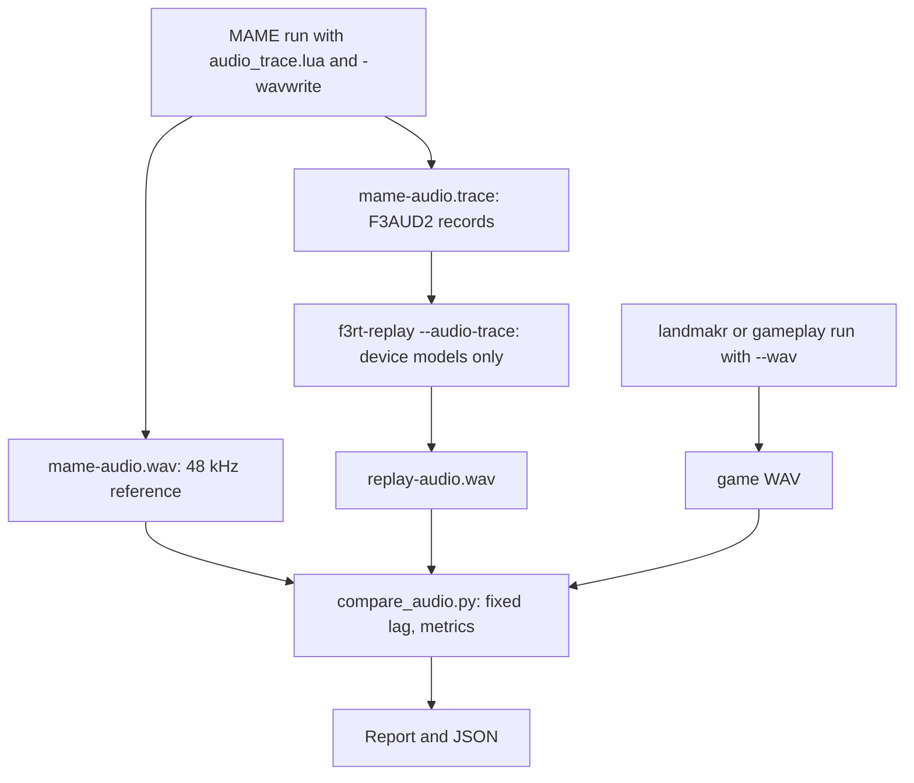

# Audio comparison with MAME

This page explains how the project compares audio with MAME.
You will learn how `f3rt-replay` replays a trace of device writes.
You will also learn how `tools/compare_audio.py` measures waveform differences without fitting gain or time.

## Why audio needs metrics, not byte equality

MAME writes its WAV at 48 kHz. The project OTIS model produces a stream at an integer rate of 29761 Hz with 32 voices. Each side resamples in a different way. The waveforms therefore cannot be byte-equal even when the device math is correct.

The project uses two comparisons to separate the causes.

| Comparison | Input | Isolates |
| --- | --- | --- |
| Device replay | A MAME audio trace of sound-bus writes. The replay drives the real device models. No CPU runs. | The ES5505 (OTIS), ES5510 (ESP) and volume device models. |
| Game audio | The WAV from a native game run, against the MAME WAV. | The whole path: main CPU timing, sound CPU, DUART, devices. |

A good device replay with a poor game-audio result points to CPU or scheduler timing. A poor device replay points to a device model.



## Step 1: record the MAME trace

Use `tools/mame/audio_trace.lua`. See [MAME oracle and captures](/developer/testing/mame) for the command and the trace format (`F3AUD2`). The command writes a trace file and a WAV file.

## Step 2: replay the trace

```sh
build/f3rt-replay --rom-dir /path/to/roms/landmakr \
  --audio-trace build/mame-audio.trace --output build/replay-audio.wav
```

`replay_audio()` in `runtime/replay.cpp` does this:

1. It checks the 8-byte header `F3AUD2` and loads the sample ROM into a new `f3rt::Audio` object.
2. For each 16-byte record it advances the device clock up to the record time. It moves in steps of at most 16000 ticks (16 MHz) and renders the PCM for each step. A record with an earlier time than the previous one is an error.
3. It applies the record:
   - Address `0xffffffff` ends the replay.
   - Address `0xfffffffe` calls `Audio::reset_board()`.
   - A mask of `0xffff` calls `write16()`. Other masks call `write8()` for each byte lane that the mask selects.
4. It prints `audio_writes`, `frames`, `sample_rate` and `peak`.

The replay does not run the main CPU or the sound CPU. It tests only the device models. It does not prove that the game is correct (`tools/mame/README.md`).

A trace without an end record is rejected as truncated.

## Step 3: compare the WAV files

`tools/compare_audio.py` needs NumPy and SciPy. The program reads two 16-bit stereo WAV files. It resamples the candidate to the rate of the reference with `scipy.signal.resample_poly`.

```sh
PYTHONPATH=build/python python3 tools/compare_audio.py \
  build/mame-audio.wav build/replay-audio.wav \
  --start 18 --end 54 --json build/audio-comparison.json
```

### How the program works

1. **Load.** `load()` rejects any file that is not PCM16 stereo.
2. **Resample.** The candidate goes to the rate of the reference.
3. **Choose the lag.** With `--lag SECONDS`, the program uses that fixed value. Otherwise it takes a window of `--window` seconds (default 2) that starts at `--start`. It picks the channel with the larger reference energy. It cross-correlates the candidate and the reference in that window with `scipy.signal.correlate` and takes the best lag within `--max-lag` seconds (default 0.25). A silent calibration window is an error.
4. **Apply one lag.** The program uses this one lag for the whole interval. It does not fit the gain. It does not warp time.
5. **Measure.** It computes the metrics for the whole interval and for each window of `--window` seconds.

A negative lag means that the candidate plays earlier than the reference.

### Metrics

Each channel has its own value.

| Metric | Meaning |
| --- | --- |
| `frames` | Number of sample frames compared. |
| `reference_rms`, `candidate_rms` | Root mean square level of each signal. |
| `error_rms` | Root mean square of the difference, in PCM units (LSB). |
| `maximum_error` | Largest absolute difference. |
| `within_one_lsb_percent` | Share of samples that differ by at most 1. |
| `correlation` | Normalized dot product of the two signals. |
| `snr_db` | 10 times log10 of reference energy divided by error energy. |

The JSON report also holds the two sample rates, the peaks, `lag_samples`, `lag_seconds`, the compared interval, the resampling method and the per-window metrics.

### Options

| Option | Default | Meaning |
| --- | --- | --- |
| `--start S` | 18.0 | Start of the compared interval, in seconds. Also the start of the calibration window. |
| `--end S` | end of the shorter file | End of the interval. |
| `--window S` | 2.0 | Window length for calibration and for the per-window metrics. |
| `--max-lag S` | 0.25 | Largest lag that the search accepts. |
| `--lag S` | search | Use this fixed lag in seconds. |
| `--json FILE` | none | Write the full report. |

::: warning
The metrics are evidence. They are not an automatic pass or fail result. The program always exits with 0 if the files are valid. You must read the numbers.
:::

## What the numbers mean in this project

These values come from the repository notes. They show typical results. They are not thresholds that the tool enforces.

- **Device replay at the native rate.** For device-math comparison, record a second MAME baseline with `-samplerate 29761`. Then MAME does not resample and the replay uses the same rate. Over seconds 18 to 54, both channels correlated at 0.999978 after a one-sample latency correction. The RMS error was about 1.3 LSB and the channel peaks were equal (1239 and 1264). Source: `tools/mame/README.md` and `docs/developer/DECISIONS.md`.
- **Whole-game audio.** For a 3,600-frame native attract run, `docs/developer/DECISIONS.md` records a lag of −1 sample over seconds 20 to 54, correlation 0.9957 and 0.9952, and RMS error 18.7 and 19.5 LSB. The notes state that this is a compatibility baseline. It is not waveform equality with MAME or with the real board.

Earlier runs in `docs/developer/DECISIONS.md` show how the metric tracks fixes: a timing bug in the sound CPU lowered the correlation to about 0.84, and later fixes raised it step by step.

## Related gates

The recompiled sound driver is compared with the interpreted driver by exact bus-record equality, not by metrics. See [Sound traces and sound tools](/developer/testing/sound-tools).

The `runtime-audio` test also checks audio behavior (mixer scaling, sample-clock drift over ten seconds, board reset). See [Unit checks](/developer/testing/unit-checks).

## Limits

- The MAME WAV contains MAME resampling. Use `-samplerate 29761` for device math.
- One fixed lag hides a drifting clock only if the drift is small. Read the per-window metrics to see drift.
- Correlation near 1 does not mean equal output. Read `error_rms` and the peaks too.
