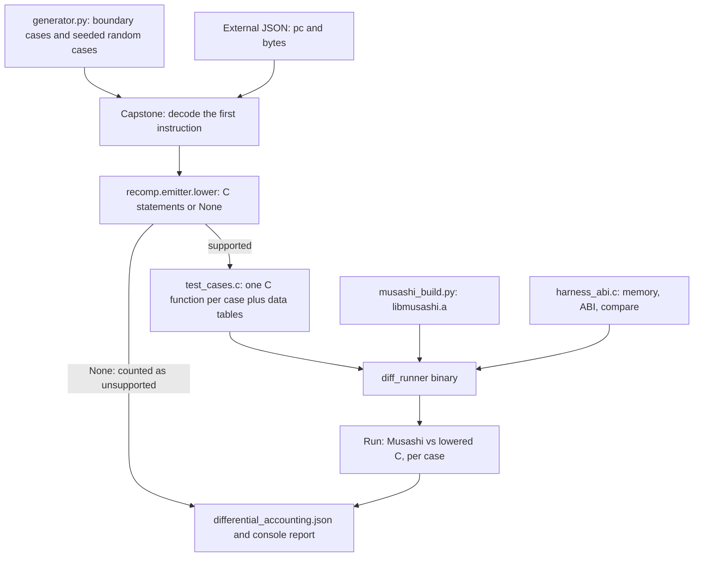

# Differential instruction harness

This page explains the instruction tests in `tools/differential/`.
You will learn how the harness creates cases, emits C and compares execution with Musashi.
You will also learn how to reproduce a failure.

## What the harness proves

The recompiler turns each 68EC020 instruction into C statements. The function `lower()` in `recomp/emitter.py` does this. A mistake in one instruction can break the game in a way that is hard to find.

The harness checks `lower()` one instruction at a time. For each test case it does these steps:

1. It runs the original instruction bytes in Musashi, one instruction.
2. It runs the C statements from `lower()` on a `f3_cpu` structure.
3. It compares CPU state, cycle counts, ordered bus writes and the memory that either execution touched.

The harness needs no ROM and no game data. It needs Python 3.11 or newer, Capstone 5.0.9, and a C compiler (`clang` by default, or the compiler in the `CC` variable).

## Files

| File | Job |
| --- | --- |
| `tools/differential/__main__.py` | Command-line entry. Parses the options and calls `run_differential()`. |
| `tools/differential/run.py` | Script wrapper. Adds the repository root to `sys.path` and calls `main()`. |
| `tools/differential/generator.py` | Makes the test cases (`RawTestCase`). |
| `tools/differential/runner.py` | Decodes cases, lowers them, writes the C test program, compiles it, runs it. |
| `tools/differential/musashi_build.py` | Builds a reference copy of Musashi into the output directory. |
| `tools/differential/harness_abi.h` and `harness_abi.c` | C side. Fake memory, Musashi callbacks, the runtime ABI functions, state comparison. |
| `tools/differential/export_cycles.py` | Writes `recomp/68020_cycles.csv` from the generated Musashi opcode table. |

## Data flow



## Step by step

`run_differential()` in `runner.py` runs these steps in order.

1. **Find and build Musashi.** `find_musashi_source()` looks for `m68k.h` in the `--musashi` path, then in `runtime/third_party/musashi`. `build_musashi()` compiles `m68kmake`, generates `m68kops.c`, compiles `m68kcpu.c`, `m68kops.c` and `softfloat/softfloat.c` with `-DM68K_INSTRUCTION_HOOK=1`, and archives them into `<output>/musashi/libmusashi.a`. It rebuilds only if a source file is newer than the library.
2. **Start Capstone.** `_get_capstone_disassembler()` opens a Capstone M68K 020 big-endian decoder with details on.
3. **Import the emitter.** The runner imports `lower` from `recomp.emitter`. It must run from the repository root so that this import works.
4. **Generate cases.** The runner always adds all boundary cases from `generate_boundary_cases()`. It adds `max(0, cases - boundary_count)` random cases from `generate_random_cases()`. It adds external cases if `--instructions` is set.
5. **Decode and lower.** For each case the runner decodes the bytes. It keeps the first `instruction_count` instructions. It calls `lower()` for each one. If every call returns statements, the case is *supported*. If any call returns `None`, the case is *unsupported*.
6. **Write `test_cases.c`.** For each supported case the runner writes a C function `recomp_case_NNNN(f3_cpu *cpu)`. The function holds the statements from `lower()`. Each instruction sits in its own `{ ... }` block. The function ends with `f3_cc_flush(cpu)`, which turns the lazy condition codes into real flags. The runner also writes the memory and code byte tables and an array of `TestCase` structures.
7. **Compile.** The runner compiles `test_cases.c`, `harness_abi.c` and `libmusashi.a` with `-O1 -g -Wall -Wextra -Werror -fsanitize=undefined -fno-sanitize-recover=undefined`. A compiler warning or an undefined behavior in the generated C fails the test.
8. **Run.** The runner starts `diff_runner`. Its exit code is the result.

With `--compile-only` the runner stops after step 7.

## How the cases are made

`generator.py` defines the safe memory layout for all cases. A case starts with these defaults.

| Name | Value | Use |
| --- | --- | --- |
| `TEST_PC` | `0x00010000` | Address of the instruction |
| `TEST_SP` | `0x00028000` | A7 |
| `TEST_A0` to `TEST_A6` | `0x30000`, `0x32000`, ... `0x3C000` (step `0x2000`) | Address registers that point into safe memory |

A `RawTestCase` has these fields: `id`, `name`, `code_bytes`, `initial_pc`, `initial_d`, `initial_a`, `initial_sr`, `initial_mem` (a list of `MemInitItem`), `is_boundary`, `boundary_kind`, `seed` and `instruction_count`. A case with `instruction_count` greater than one runs a short instruction sequence (used for lazy-flag and control-register tests).

### Boundary cases

`generate_boundary_cases()` makes targeted cases. The count is about 1,579 when measured on the current generator. This number changes when the generator changes. Each case has a `boundary_kind` label.

| `boundary_kind` | What the cases test |
| --- | --- |
| `sticky_z` | ADDX, SUBX and NEGX leave Z unchanged when the result is zero. Byte, word and long sizes. |
| `shift_count` | Register shifts and rotates (LSL, LSR, ASL, ASR, ROL, ROR, ROXL, ROXR) with counts 0, 1, 8, 16, 31, 32, 33, 63 and 64. |
| `shift_imm` | Immediate shifts and the fixed-cost immediate rotates of the EC020. |
| `branch_byte`, `branch_word`, `branch_long` | All 16 branch conditions with 8-bit, 16-bit and 32-bit displacements. BRA and BSR run taken only. The 14 other conditions run taken and not taken. |
| `movea_sign` | MOVEA.W sign extension, and MOVEA.L. |
| `ext_sign` | EXT.W, EXT.L and EXTB.L. |
| `postinc_a7_byte`, `predec_a7_byte`, `postinc_a0_byte` | Byte accesses move A7 by 2 and other address registers by 1. |
| `arith_flags` | ADD, SUB and CMP at zero, carry, borrow and signed-overflow edges. |
| `brief_ea`, `full_ea` | 68020 brief and full extension words with scale 1, 2, 4 and 8. |
| `bitfield` | BFEXTU, BFEXTS, BFTST and BFSET. |
| `mul_div` | Word multiply and divide. |
| `bit_ops` | BTST, BSET, BCLR and BCHG with a register bit number. |
| `control_register` | MOVEC round trips for the control registers 0, 1, 2 and 0x800 to 0x804. Two instructions per case. |
| `lazy_flag_transition` | Condition codes stay correct across MOVE and CMP, and when the SR is read. Multi-instruction cases. |
| `operand_aliasing` | The largest group. It covers aliased operands and many rare forms. |

The `operand_aliasing` group (1,313 cases) uses a helper named `add_case()`. It covers these areas:

- Operands that alias the stack, such as `PEA` and `JSR` with an A7 target.
- TAS, MOVE to and from SR, CCR and USP, and privilege violations.
- MOVEM with the base register in the list, empty masks and PC-relative addressing.
- DBcc counters, scaled index wrap, and full-format extension words with negative displacements.
- Long and 64-bit MUL and DIV, divide by zero, and bitfields with many offsets and widths (all eight operations, register and memory).
- RTE with frame formats 0 to 3, TRAP #0 to #15 in user and supervisor mode, and TRAPcc, TRAPV, illegal, BKPT and an absent coprocessor.
- BCD (ABCD, SBCD, NBCD, PACK, UNPK), CHK and CHK2, CMP2, MOVEP, CAS, CAS2 and MOVES.

### Random cases

`generate_random_cases(count, seed, start_id)` makes deterministic random cases. A master `random.Random(seed)` makes a per-case seed. Each case then uses its own generator.

A case picks one family from this list: `move_dn`, `moveq`, `add_sub`, `logical`, `swap_ext`, `clr_tst`, `lea_pea`, `exg`, `shift`, `cmp`, `bit_op`. It fills D0 to D7 with random values. With probability 0.4 it replaces one register with an edge value (0, 1, 0xFF, 0x80, 0x7FFF, 0x8000, 0x7FFFFFFF, 0x80000000 or 0xFFFFFFFF). It picks the SR from `0x0000`, `0x0004`, `0x0008`, `0x0001`, `0x0002`, `0x0010` and `0x001F`.

The case seed is stored in the `seed` field and printed on failure. The same `--seed` and `--cases` always give the same list.

### External cases

`load_external_instructions()` reads a JSON file. The file is a list of objects. Each object has `pc` (integer), `bytes` (hex string) and an optional `name`. Each object becomes one case with zero D registers, safe address registers and SR 0. The repository has no script that writes this file, so you must make it yourself.

## The C side: `harness_abi.c`

The generated C code calls the runtime ABI (`f3_read8`, `f3_write32`, `f3_exception`, `f3_set_sr`). The real implementations live in `runtime/cpu_abi.cpp` and need a full `Machine`. The harness supplies its own small versions, so that the test links without the runtime.

### Fake memory: `DiffEnv`

`DiffEnv` models the 24-bit address bus of the 68EC020. It has 256 pages of 64 KiB (`DIFF_NUM_PAGES`, `DIFF_PAGE_SIZE`). A page is allocated when the first write touches it. The environment keeps a list of touched pages so that `diff_env_reset()` clears only those pages.

Every write also goes into an ordered log of `MemWrite` records (`address`, `value`, `size`). The log holds at most `MAX_WRITES_PER_CASE`, which is 512.

There are two separate `DiffEnv` objects: one for the Musashi run and one for the lowered-C run. They never share memory.

### Musashi stepping

`diff_musashi_setup()` starts Musashi once:

1. `m68k_init()` and `m68k_set_cpu_type(M68K_CPU_TYPE_68EC020)`.
2. It sets an instruction hook (`musashi_instr_hook`). The hook counts instructions and calls `m68k_end_timeslice()` on the second one. Thus `m68k_execute(1)` executes exactly one instruction.
3. It writes reset vectors (SP `0x00028000`, PC `0x00010000`) and a NOP, pulses reset, and drains the reset cycles.
4. It runs a smoke test: one NOP must advance the PC to `0x00010002`. If not, the program stops with a fatal message.
5. It saves a pristine context with `m68k_get_context()`.

`diff_musashi_run_case()` restores the pristine context for each case.
It writes memory and instruction bytes, then sets SR, the D and A registers, and PC.
It steps `instruction_count` times. After each step, it checks that exactly one instruction ran.
It adds the return value of `m68k_execute(1)` to `env->cycles`.

### Lowered-C stepping

`diff_recomp_run_case()` clears an `f3_cpu` and copies the initial registers.
It sets `dispatch_deadline` to `UINT64_MAX`, so no runtime deadline stops the generated code.
It sets `cpu->runtime` to the `DiffEnv` and calls the generated function.

The harness version of `f3_exception()` builds the 68020 exception frame (format 0 or format 2 for vectors 5, 6, 7 and 9) and adds cycles from a table. The harness version of `f3_set_sr()` swaps the user, interrupt and master stack pointers like the runtime does. `f3_reset_devices()` exits with an error, because the RESET instruction needs the real runtime. The harness does not generate RESET cases.

### What `diff_compare_states()` compares

| Item | Rule |
| --- | --- |
| D0 to D7 | Exact equal. |
| A0 to A7 | Exact equal. |
| PC | Exact equal. |
| Cycles | The Musashi cycle sum must equal `cpu->cycles` after `f3_cc_flush()`. This checks the timing tables in `recomp/timing.py`. |
| SR | Compared with the mask `0xf71f`: T1, T0, S, M, the interrupt mask and X, N, Z, V, C. The report names each flag that differs. |
| Memory writes | The ordered write logs must have the same count. Each write must have the same address, size and value. |
| Memory contents | For every page that either side touched, all bytes must be equal. The report shows the first differing byte. |

The report for a failed case shows the case id, mnemonic, operands, the case seed, the initial PC and SR, and one line per difference. The run stops after 30 failures.

## Unsupported cases

`lower()` returns `None` when it cannot lower an instruction.
The game build emits a call to `f3_fallback` for that instruction.
Strict-native execution rejects this path. Diagnostic execution uses the interpreter.
The harness cannot count interpreter execution as a native pass.

The harness therefore does not count such a case as a pass. It does this:

- It adds the mnemonic to the `Unsupported / Fallback Mnemonics` list.
- It writes the details (id, name, bytes, reason) to `differential_accounting.json`.
- It leaves the case out of the pass count.

Capstone does not decode every byte sequence. The runner counts these cases under `<decode_failed>`.

`--filter` works differently. A case whose first mnemonic does not contain the filter text is dropped. It is neither supported nor unsupported. It still counts in `Total candidate cases generated`.

`differential_accounting.json` has these keys: `total_cases`, `supported_count`, `unsupported_count`, `supported_by_mnemonic`, `unsupported_by_mnemonic` and `unsupported_details`.

If no case is supported, the runner prints a warning and exits with 1.

## Command-line options

| Option | Default | Meaning |
| --- | --- | --- |
| `--musashi PATH` | search | Musashi source directory that holds `m68k.h`. The search looks in `runtime/third_party/musashi`. |
| `--output DIR` | `build/differential` | Output folder for `test_cases.c`, `diff_runner`, `musashi/` and the report. |
| `--cases N` | 500 | Total number of cases. All boundary cases always run. Random cases fill the rest. With a value below the boundary count, no random case runs. |
| `--seed N` | 42 | Seed for the random cases. |
| `--instructions FILE` | none | JSON file with external cases. |
| `--filter TEXT` | none | Keep only cases whose first mnemonic contains `TEXT` (case-insensitive). Example: `add`, `move`, `bf`. |
| `--compile-only` | off | Build `diff_runner` but do not run it. |
| `-v`, `--verbose` | off | Print the steps and the compiler command. |

Exit codes: 0 means all cases passed. 1 means a case failed, the compile failed, or no case was supported. 2 means an input error (for example a missing Musashi path or a missing `recomp` package).

## How to run

```sh
uv run python tools/differential/run.py \
  --musashi runtime/third_party/musashi \
  --output build/differential --cases 5000
```

The same command works as `uv run python -m tools.differential` from the repository root. Dependencies are managed via `uv`.

The retained run in `docs/developer/DECISIONS.md` records 5,000 deterministic cases with 5,000 passes and no unsupported case. This is evidence for that recorded build and case set, not a current execution result.

## How to reproduce and fix a failure

1. Copy the `Seed`, the case name and the mnemonic from the report.
2. Run again with `--filter` set to the mnemonic and the same `--seed` and `--cases`. The failing case id stays the same.
3. Open `<output>/test_cases.c`. Find `recomp_case_NNNN`. The function shows the exact C statements.
4. Compare the statements with the Musashi behavior for the instruction. The difference list tells you which register, flag or write is wrong.
5. Fix `recomp/emitter.py`, `recomp/cpu_ops.h`, `recomp/bitfield.h` or `recomp/timing.py`.
6. Run the full command again. See [Code emission](/developer/recompiler/emission) and [Flags, timing and deadlines](/developer/recompiler/flags-and-timing) for how these files work.

To add a case, add a call to `add_case()` in `generate_boundary_cases()`. Give it the instruction bytes in hex, the registers, the SR and the memory. Choose the case so that it covers one rule that a past bug broke.

## The Musashi copy and the cycle table

The harness builds Musashi from `runtime/third_party/musashi`. This is the same copy that the runtime interpreter uses. The repository keeps MAME-compatible fixes in this copy. Examples from `README.md`: C is cleared on word DIV overflow with a nonzero divisor, EC020 MOVEM stores cost three cycles per register, rotates have no count surcharge, and `TRAP #n` takes 24 cycles. Both sides of the comparison use these rules for timing.

`export_cycles.py` writes `recomp/68020_cycles.csv`. It reads the opcode descriptors in `m68kops.c` that `musashi_build.py` generated. Run it this way:

```sh
python3 tools/differential/export_cycles.py build/differential/musashi/m68kops.c
```

The script writes the file `recomp/68020_cycles.csv` by default. `recomp/timing.py` reads this file. See [Flags, timing and deadlines](/developer/recompiler/flags-and-timing).

## Limits

- The harness checks one instruction, or a short sequence, in a fixed memory map. It does not check control flow between blocks or the discovery of code.
- It does not run RESET or STOP, because these need the device model.
- The harness version of the runtime ABI is a copy. A bug in `runtime/cpu_abi.cpp` is not found here. the CPU runtime tests and gameplay gates cover it (see [Unit checks](/developer/testing/unit-checks)).
- Both sides agree with each other, not with the real chip. Musashi is the accepted model. Where MAME differs from Musashi, the team patches Musashi and records the reason in `docs/developer/DECISIONS.md`.
