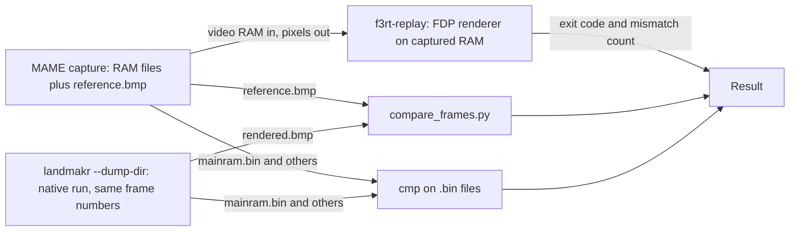

# Frame comparison

This page explains how the project compares pictures and RAM with MAME.
You will learn how `tools/compare_frames.py` measures differences and how `f3rt-replay` renders captures.
The procedures also cover comparisons with a native game run.

## Three ways to compare frames

| Method | What runs | What it checks |
| --- | --- | --- |
| `f3rt-replay --captures` | Only the FDP renderer. It reads MAME video RAM from a capture. | The renderer draws the same picture as MAME from the same video RAM. |
| `landmakr --dump-dir` then `compare_frames.py` | The full native game. | The whole machine (CPU, scheduler, video) gives the MAME picture at sampled frames. |
| `cmp` on the dump files | The full native game. | Main RAM, palette RAM, video RAM and shared RAM equal the MAME RAM. |

The three methods have different failure meanings. The first method isolates the video chip model. The second and third methods test the whole program. Run the first method first. If it passes and the second fails, the cause is in CPU execution or timing, not in the renderer.



## `f3rt-replay` video mode

`runtime/replay.cpp` builds the program `f3rt-replay`. This program is always built. It has two modes. This page covers the video mode. The audio mode is in [Audio comparison](/developer/testing/audio-compare).

```sh
build/f3rt-replay --rom-dir /path/to/roms/landmakr \
  --captures captures/landmakrj_attract --output build/replay-frames
```

The option `--captures` takes a folder with `frame_*` subfolders, or one frame folder. The program needs the ROM directory to decode the sprite and tile ROMs for the renderer (`Video::load_roms`).

For each frame folder the program does these steps:

1. It reads `palette.bin`, `graphics.bin`, `control.bin`, `spriteram_active.bin` and `reference.argb`. `read_exact()` rejects a file of the wrong size.
2. It resets the `Video` object and calls `set_active_spriteram()` with the lagged sprite list. This reproduces the one-frame sprite lag of MAME.
3. It calls `render_frame()` and gets 320 by 232 pixels.
4. It writes `rendered.argb` and `rendered.bmp` into `<output>/<frame name>/`.
5. It compares each pixel with the reference. A pixel differs if any of the three color channels differs. It prints the mismatch count, the maximum channel error and the mean channel error.

At the end it prints `frames=N total_mismatched_pixels=M`. The exit code is 0 if M is 0, 1 if M is greater than 0, and 2 on a usage or file error.

The compare is exact. There is no tolerance option. `tools/mame/README.md` records 25 captures (frames 600 to 3480, step 120) with zero RGB mismatches over all 1,856,000 pixels.

## Dump a native run

The frontend writes frame folders with several files that also appear in MAME captures.
Use `--dump-dir`, `--dump-start` and `--dump-every`.

```sh
build/landmakr --headless --frames 3480 --unthrottled --no-audio \
  --dump-dir build/captures/native --dump-start 600 --dump-every 120
```

The frontend writes a dump when `frame >= dump_start` and `(frame - dump_start) % dump_every == 0`.
The folder name starts with `frame_`. The frame number has at least four digits.

`dump_machine()` in `runtime/capture_io.hpp` writes these files:

| File | Content |
| --- | --- |
| `palette.bin`, `graphics.bin`, `control.bin`, `mainram.bin`, `shared.bin` | Same address ranges as the MAME files. |
| `rendered.argb`, `rendered.bmp` | The 320 by 232 frame buffer. |
| `cpu.json` | `frame`, `cycles`, `pc`, `sr`, `d[8]`, `a[8]`. |

These dumps are not complete replay inputs.
They omit `spriteram_active.bin` and `reference.argb`, which `f3rt-replay` requires.
Use `compare_frames.py` to compare native dumps with MAME captures.
Do not reconstruct the active sprite list from current graphics RAM. MAME uses the buffered list from the preceding frame.

Choose the video path with `--video`. `fdp` uses the hardware-RAM renderer. `game` uses the game-data renderer (the default for `landmakr`). `compare` renders both and stops on any RGB difference for a supported frame. See the [command-line reference](/reference/cli).

::: tip
The option `--fallback-report FILE` writes a TSV with the columns `pc` and `count`. Each row is an address that the interpreter ran, and how often. Use it with `--allow-fallback` on `f3rt-run` to find code that the recompiler does not cover. The strict `landmakr` program does not allow fallback.
:::

## `compare_frames.py`

`tools/compare_frames.py` is a Python program that uses only the standard library. It compares two pictures or two folders of pictures.

```sh
# one frame
python3 tools/compare_frames.py \
  captures/landmakrj_attract/frame_0600/reference.bmp \
  build/captures/native/frame_0600/rendered.bmp --diff build/diff_0600.bmp

# two folders, matched by frame number
python3 tools/compare_frames.py captures/landmakrj_attract/ build/captures/native/ \
  --diff-dir build/diffs/
```

### Input formats

| Format | Detail |
| --- | --- |
| BMP | 24-bit or 32-bit, top-down or bottom-up. Compression 0 or 3 only. `read_bmp()` converts it to top-down RGB. |
| Raw (`.argb`, `.bgra`, `.rgba`, `.raw`) | The size must be 320 by 232 (or 320 by 224) with 4 or 3 bytes per pixel. `--format` gives the byte order. The default is `bgra`, which is the little-endian output of MAME. `--width` and `--height` change the default size. |

### Folder matching

`find_frame_files()` builds a map from frame number to file. For a subfolder it looks for the first existing name in this list: `reference.bmp`, `f3rt.bmp`, `rendered.bmp`, `reference.argb`, `frame.bmp`. A MAME capture folder gives `reference.bmp`. A native dump folder gives `rendered.bmp`. The frame number is the digits in the folder name. A plain file such as `frame_0600.bmp` also works.

`compare_directories()` compares the frames that exist in both folders. If there are no common frames, it stops with an error. A frame with different dimensions gets a warning and is skipped.

### Metrics

For each frame, `compare_rgb()` computes:

| Metric | Meaning |
| --- | --- |
| `exact_matches`, `exact_pct` | Pixels with all channels equal. |
| `tolerance_matches` | Pixels whose largest channel error is at most `--tolerance`. |
| `mismatches` | Pixels with a largest channel error above `--tolerance`. |
| `max_error` and per-channel maximum | Largest absolute channel difference. |
| `mae` | Mean absolute error over all channels. |
| `rmse`, `psnr_db` | Root mean square error and peak signal to noise ratio (`inf` for equal pictures). |
| `error_distribution` | Counts of pixels in these bins of the largest channel error: 0, 1-2, 3-7, 8-15, 16-31, 32+. |

The diff picture is a BMP. Equal pixels show as dark gray. Different pixels show in red tones, amplified by `--diff-amp` (default 8). In folder mode the program writes `diff_NNNN.bmp` only for frames with mismatches, unless you pass `--diff-all`.

### Options

| Option | Default | Meaning |
| --- | --- | --- |
| `--width`, `--height` | 320, 232 | Size for raw buffers. |
| `--format` | `bgra` | Raw byte order: `bgra`, `argb`, `rgba`, `rgb` or `bgr`. |
| `--tolerance N` | 0 | A pixel counts as a mismatch only above this channel error. |
| `--max-error-allowed N` | 0 | The run fails if the largest error in any frame is above `N`. |
| `--diff FILE` | none | Diff BMP (single-frame mode). |
| `--diff-dir DIR` | none | Folder for diff BMPs (folder mode). |
| `--diff-all` | off | Write a diff BMP for every frame. |
| `--diff-amp N` | 8 | Amplification of the diff picture. |
| `--json` | off | Print the metrics as JSON. |
| `--quiet` | off | Print nothing. Use only the exit code. |

### Exit codes

The exit code is 0 when the pictures pass, 1 when they differ, and 2 on an error (a missing file, a size mismatch in single mode, a bad BMP).

A run fails when `mismatches` is greater than 0 or `max_error` is greater than `--max-error-allowed`. Note the second rule. If you set `--tolerance 2` but leave `--max-error-allowed` at 0, a picture with a largest error of 1 or 2 still fails. Set both options together if you want a tolerant check.

## Compare RAM

Compare each RAM file between the MAME folder and the native folder with `cmp`.

```sh
for f in mainram palette graphics control shared; do
  cmp captures/landmakrj_attract/frame_0600/$f.bin build/captures/native/frame_0600/$f.bin
done
```

`docs/developer/DECISIONS.md` records these results for a 3,600-frame cold boot: all 131,072 main-RAM bytes equal MAME at frame 600. For later sampled frames, the RNG seed at `$400826` equals MAME, but the notes also say that idle RNG iterations can diverge in later frames when the timing differs. Treat byte equality at later frames as a strong signal, not as a required result.

## Native versus interpreter

The Musashi interpreter and the recompiled code must give the same picture and the same audio. Run both and compare the outputs.

1. Run `f3rt-run` without `--translated`. This uses the interpreter for the main CPU.
2. Run `landmakr` or `f3rt-run --translated` with the same frame count.
3. Compare the dump folders with `compare_frames.py`. Compare the WAV files with `cmp`.

`docs/developer/DECISIONS.md` records byte-identical native and interpreter WAV files for a 3,600-frame attract run. See [Sound tools](/developer/testing/sound-tools).

## Typical failure causes

| Symptom | Likely cause |
| --- | --- |
| `f3rt-replay` shows mismatches | A bug in `runtime/renderer/fdp/video.cpp`. The CPU is not involved. |
| Native frames differ by a small shift of animation | A timing error. Check IRQ timing, `dispatch_deadline` and instruction cycle costs. See [Flags, timing and deadlines](/developer/recompiler/flags-and-timing). |
| Native frames differ everywhere after some frame | Code ran wrongly. Run the [gameplay regression](/developer/testing/gameplay-regression) to find a fallback. |
| Pictures match but `cmp` fails on `mainram.bin` | A timing difference that does not yet show on screen. Compare `cpu.json` and the RNG seed. |
| The frame number is off by one | Use format-2 captures. See the two-callback rule in [MAME oracle and captures](/developer/testing/mame). |

## Limits

- The comparison covers only the sampled frames. A frame between two samples can differ.
- A match with MAME shows agreement with MAME. It does not show agreement with real hardware.
- `compare_frames.py` is slow for many frames. It is pure Python and loops over every pixel.
