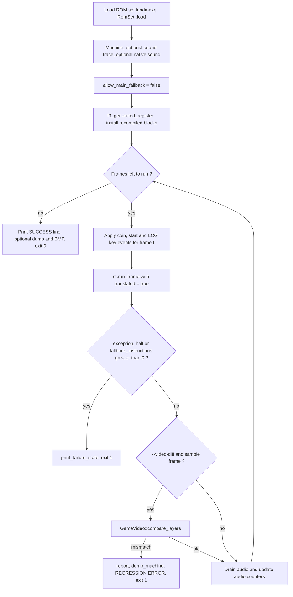

# Seeded gameplay regression

This page explains the seeded gameplay test and its input schedule.
The source files are `tools/gameplay_regression.cpp`, `tools/gameplay_inputs.hpp` and `tools/run_gameplay_regression.py`.
You will learn how to interpret execution failures and compare the game-data renderer with the FDP renderer.

## What the test does

The test cold-boots the real machine and runs it for a fixed number of frames. A pseudo-random input script presses the coin, start and direction keys. The test uses the recompiled main program with the interpreter fallback turned off.

The test has two goals:

- **Find missing native code.** If the machine needs an instruction that the recompiler did not lower, the test stops at once. The failure shows the seed, the frame and the CPU state.
- **Keep runs reproducible.** The same seed always makes the same input script. A run that fails once fails again.

The test is a regression gate. It does not compare the picture or the sound with an oracle by default. It checks that a long run completes without a CPU halt, an execution error or a fallback. The optional `--video-diff` flag adds a picture comparison (see below).

::: warning
A passing seed is a sample of gameplay. It is not a proof that every game state works. `docs/developer/DECISIONS.md` states the same limit.
:::

## Files and targets

| File | Job |
| --- | --- |
| `tools/gameplay_regression.cpp` | The executable `f3rt-gameplay-regression`. Runs one seed. |
| `tools/gameplay_inputs.hpp` | `f3rt::test::ScheduleConfig` (the schedule constants) and `GameplaySchedule` (the input generator). |
| `tools/run_gameplay_regression.py` | Runs the executable for many seeds and collects failures. |

`CMakeLists.txt` builds the executable when `F3_GENERATED_DIR` is set (this happens when you pass `F3_ROM_DIR`). It links `f3rt`, `f3_recompiled` and, when the sound program exists, `f3_sound_recompiled`. If you configured with `F3_ROM_DIR`, the build also defines `F3RT_DEFAULT_ROM_DIR` so that `--rom-dir` is optional.

```sh
cmake -S . -B build -G Ninja -DCMAKE_BUILD_TYPE=Release -DF3_ROM_DIR=/path/to/roms/landmakr
cmake --build build --target f3rt-gameplay-regression -j 4
```

## The input schedule

The harness uses the constants in `ScheduleConfig`. The regression uses the single-player form (`versus = false`).

| Event | Frames | Detail |
| --- | --- | --- |
| P1 coin | Press at frame 700, release at frame 720 | `p1_coin_frame = 700`, `p1_coin_duration = 20`. The coin line is active low: the harness clears bit `0x10` of `system_inputs` to press. |
| P1 start pulse | Frames 800 to 2399 | Press when the frame number is a multiple of 90. Release when the remainder after division by 90 is 5. The first press is at frame 810 and the last at frame 2340. |
| Button mashing | From frame 1200, every 6 frames | One random key changes state at each step (see below). |

`ScheduleConfig` has more fields for the versus form (`p2_coin_frame = 740`, `p2_coin_duration = 20`, `p2_start_offset = 45`). The netplay oracle uses them. See [Netplay oracle](/developer/testing/netplay-oracle).

### The random key generator

The generator is a 64-bit linear congruential generator (LCG).

```cpp
rng = seed;                       // the initial state is the seed itself
// at every mashing step:
rng = rng * 6364136223846793005ULL + 1442695040888963407ULL;
key = keys[(rng >> 33) % 7];      // UP, DOWN, LEFT, RIGHT, Z, X, C
down = ((rng >> 20) & 1) != 0;    // press or release this key
```

Only the chosen key changes. All other keys keep their last state. A key can stay pressed for many steps.

The seven keys map to the machine inputs as follows. The directions use input port 1 and the buttons use input port 0.

| Key | Call |
| --- | --- |
| Up, Down, Left, Right | `set_input(1, 1 / 2 / 4 / 8, pressed)` |
| Z, X, C | `set_input(0, 1 / 2 / 4, pressed)` |
| Start | `set_input(0, 0x1000, pressed)` |
| Coin | clear or set bit `0x10` in `system_inputs` |

`Machine::set_input()` clears the bit when a key is pressed, because the F3 inputs are active low.

`tools/gameplay_inputs.hpp` also defines `GameplaySchedule`. This class makes the same schedule as 16-bit input words. A word has bits 0 to 3 for the directions, bits 4 to 6 for the buttons, bit 7 for start and bit 8 for coin. The netplay oracle uses this class. `gameplay_regression.cpp` includes the header for the constants and writes the same logic inline. A comment in the header says that the start timing must match the original `f % period` code.

## Per-frame flow



## What the test rejects

The test exits with code 1 and prints a failure when any of these happens:

| Condition | Where it is detected |
| --- | --- |
| `run_frame()` throws an exception. With `allow_main_fallback` off, a request for the interpreter throws an error that names the PC. | `try/catch` around `m.run_frame(true)` |
| `run_frame()` returns false, or `m.cpu.halted` is set. | After `run_frame()` |
| `m.fallback_instructions` is greater than zero. | After `run_frame()` |
| Recompiled blocks fail to register (`f3_generated_register` returns false). | Before the loop |
| A bad option, a missing ROM directory, or `--set` other than `landmakrj`. | Option parsing |
| A video mismatch or an unsupported video producer (with `--video-diff`). | `compare_layers()` |

The test does not check the audio. It counts samples and the peak level and prints them. A silent run does not fail.

### Failure output

`print_failure_state()` prints a block like this to standard error:

```text
REGRESSION FAILURE: Fallback instruction executed under strict native mode
  seed: 5
  frame: 1320
  pc: 0x...
  sound_pc: 0x...
  sr: 0x...  halted: 0  stopped: 0
  cycles: ...  native_blocks: ...  fallback_instructions: ...
  registers:  d0..d7 and a0..a7
  stack dump (a7=...): eight long words
```

Setup errors and video mismatches print `REGRESSION ERROR: <message>`. Both forms use exit code 1.

### Success output

A passing run prints one line:

```text
SUCCESS set=landmakrj seed=5 frames=6000 pc=0x... sound_pc=0x... sound_driver=oracle
  frame_crc=0x... cycles=... native_blocks=... fallback_instructions=0
  audio_frames=... audio_peak=... nonzero_samples=... fps=...
```

(The real output is on one line.) `frame_crc` is the CRC-32 of the 320 by 232 ARGB frame buffer after the last frame. Use it as a fingerprint: the same binary, ROM and seed must give the same value. `native_blocks` counts executed recompiled blocks. `fallback_instructions` must be 0.

## Executable options

| Option | Default | Meaning |
| --- | --- | --- |
| `--rom-dir DIR` | `F3RT_DEFAULT_ROM_DIR` if compiled in | ROM directory. |
| `--set SET` | `landmakrj` | ROM set. Only `landmakrj` is accepted. |
| `--seed N` | 12345, or the `SEED` environment variable | Seed for the key generator. The option wins over the variable. |
| `--frames N` | 40000 | Frames to run. Must be positive. |
| `--dump-dir DIR` | none | Write a state dump (see below). |
| `--surface BMP`, `--capture-surface BMP` | none | Write the last frame as a 320 by 232 BMP. |
| `--sound-trace FILE` | none | Record sound bus events. See [Sound tools](/developer/testing/sound-tools). |
| `--sound-driver MODE` | `oracle` | `oracle` runs the interpreted sound driver. `native` runs the recompiled driver. `native` needs a build with a generated sound program. |
| `--wav FILE` | none | Write all audio to a WAV file. |
| `--video-diff` | off | Compare the game-data renderer with the FDP renderer. |
| `--video-layer-mask N` | 511 | Select the layers to compare. Hexadecimal input works. |
| `--video-diff-every N` | 120 | Sample interval in frames. |
| `--help`, `-h` | | Print the help text. |

Note that the default sound driver of this executable is `oracle`. The `landmakr` game executable uses `native` by default when it has the generated sound program.

## The Python runner

`run_gameplay_regression.py` runs the executable once per seed. It does not stop at the first failure. It prints the failed seeds at the end.

| Option | Default | Meaning |
| --- | --- | --- |
| `--binary PATH` | `build/f3rt-gameplay-regression` | Executable. Use this for an isolated build. |
| `--rom-dir DIR` | none | Passed to the executable. |
| `--seeds N...` | 1 to 8 | List of seeds. Each must fit in 64 bits. |
| `--frames N` | 40000 | Frames per seed. |
| `--dump-captures-dir DIR` | none | Make the executable write `seed_N.bmp` (through `--surface`) for each seed. |
| `--video-diff` | off | Pass `--video-diff` to the executable. |
| `--video-layer-mask N` | 511 | Must be 1 to 511. |
| `--video-diff-every N` | 120 | Must be positive. |

The script prints `seeds=N failures=[...] elapsed_seconds=...` and exits 1 if any seed failed. The runner has no option for `--dump-dir`, `--sound-driver`, `--sound-trace` or `--wav`. Call the executable directly to use them.

```sh
python3 tools/run_gameplay_regression.py --rom-dir /path/to/roms/landmakr \
  --frames 40000 --seeds 1 2 3 4 5 6 7 8
```

Seeds 1 to 16 with 40,000 frames each are recorded as passing with zero fallback in `docs/developer/DECISIONS.md`. Two concurrent eight-seed batches took about 1,920 seconds each (also in `docs/developer/DECISIONS.md`). Plan for long runs.

## Video comparison: `--video-diff`

`--video-diff` creates a `GameVideo` in `Diagnostic` mode. The machine still produces the FDP picture. The game-data renderer runs next to it and observes the same writes. At each sample frame the test calls `GameVideo::compare_layers(frame, mask)`.

Samples start at frame 600. A frame is a sample when `frame >= 600` and `(frame - 600) % interval == 0`. The default interval is 120.

### Layer mask

`--video-layer-mask` is a bit mask with nine bits.

| Bits | Layers | Compare domain |
| --- | --- | --- |
| 0 to 3 | Playfields `pf0` to `pf3` | 1024 by 512 indexed texture |
| 4 to 7 | Sprite priority planes `sp0` to `sp3` | 320 by 232 sprite plane (the plane for the next frame) |
| 8 | Text layer `text` | 512 by 512 indexed texture |

The default value 511 selects all nine layers. With 511 only, `compare_layers()` also does two more checks. It compares the row descriptions of the visible rows 24 to 255 (`GameLines::compare_rows`, which covers background, mosaic, bitmap, blend, clip and text attributes). It also compares the final 320 by 232 RGB frame (`compare_composite`). A smaller mask skips both checks.

The run needs `interval > 0` and a nonzero mask that uses only bits 0 to 8. Otherwise the executable stops with an error.

### What counts as a difference

The function `differs()` in `runtime/game_video.cpp` decides. A pixel is *visible* when flag bit `0x10` is set.

- If one side is visible and the other is not, the pixels differ.
- If both are visible, the palette index and all flags must be equal.
- If both are transparent, the pixels are equal. The unused palette index does not matter.

This rule is stricter than an RGB comparison for visible pixels. It compares palette index and blend flags, not colors.

### What the test rejects

- An **unsupported producer**. The game renderer tracks which ROM routine wrote each layer. If a routine is not modeled, the layer is marked unsupported. The comparison then fails with `Game <layer> unsupported producer at frame N PC 0x...`. The test does not count this as a match.
- **Pixel mismatches**. The error shows the layer, the frame, the count, the first differing pixel and both values. For sprite layers it also lists nearby sprite descriptors.
- A **row or composite mismatch** (with mask 511).

### Report lines

At the end of the run, `GameVideo::report()` prints one line per compared layer.

```text
VIDEO layer=pf0 domain=1024x512-indexed-texture sampled_frames=46 compared_pixels=24117248 pixel_mismatches=0
VIDEO layer=composite domain=320x232-RGB sampled_frames=46 compared_pixels=3415040 pixel_mismatches=0
VIDEO game_frames=... oracle_fallback_frames=...
VIDEO fallback=<component> producer_pc=0x... frames=... first=... last=...
```

The `fallback` lines list the components for which the game renderer gave up on some frames and the FDP picture was used.

`docs/developer/VIDEO-HLE.md` records measured results. Example: seed 5 with 6,000 frames compares 46 samples per layer with zero mismatches (24,117,248 indexed pixels per playfield). See [Game-data video HLE](/developer/runtime/video/game-hle) for how the renderer works.

```sh
build/f3rt-gameplay-regression --seed 5 --frames 6000 --video-diff \
  --video-layer-mask 15 --dump-dir build/video-fail
```

### Dump of the first mismatch

With `--dump-dir DIR`, the executable writes a dump at the failing frame when a video comparison fails. It also writes a dump at the end of a passing run. `dump_machine()` in `runtime/capture_io.hpp` writes the folder `DIR/frame_NNNN/` with these files: `palette.bin`, `graphics.bin`, `control.bin`, `mainram.bin`, `shared.bin`, `rendered.argb`, `rendered.bmp` and `cpu.json`.

These file names match the MAME capture files. You can compare a dump with a MAME capture of the same frame. See [MAME oracle and captures](/developer/testing/mame).

## Other uses of the schedule

The schedule is also the input source for the sound and netplay gates:

- The native-versus-interpreted sound comparison runs the same seed twice with `--sound-trace`. See [Sound tools](/developer/testing/sound-tools).
- The netplay oracle runs `GameplaySchedule` with `versus = true`. See [Netplay oracle](/developer/testing/netplay-oracle).

## Limits

- The test samples the game. It does not enumerate states.
- Without `--video-diff` the test does not look at the picture. A wrong picture can pass.
- The ROM set must be `landmakrj`. The recompiled blocks belong to this set only.
- The default sound driver is the interpreted one. Pass `--sound-driver native` to test the recompiled driver in the same run.
