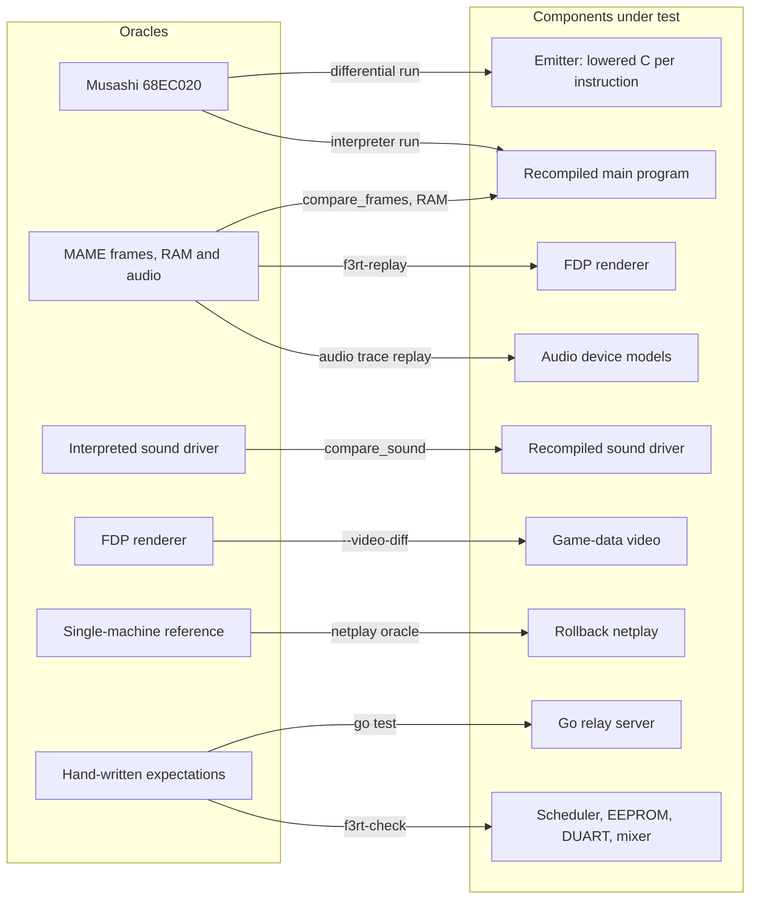
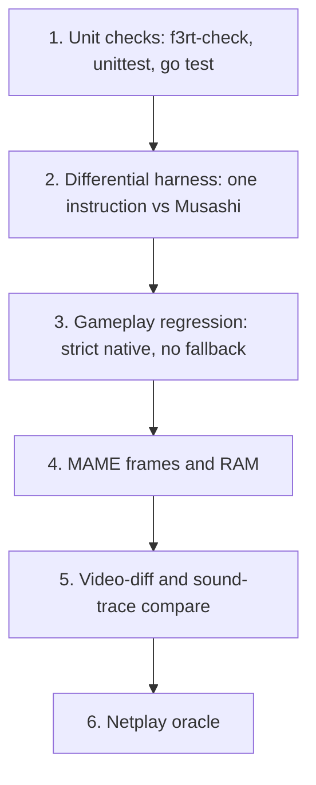

# Testing and verification strategy

This section explains how the project checks its code against references. You will learn which reference checks each component.
You will also learn how to run each check and interpret its limits.

## Why this project tests against oracles

The project compares game behavior with independent reference implementations.
The game ROM, MAME captures and instruction tests provide different kinds of evidence.
No single reference proves all hardware behavior.

An **oracle** is a reference implementation. The new code is the **candidate**.
A test runs both with the same input and compares their outputs.
A difference needs investigation. Either implementation can contain a fault.

This method is **differential testing**. It has two rules:

- The oracle must be independent. It must not share the code that the test checks.
- The comparison must be strict. The tools in this repository do not use fitted offsets, fuzzy time warps or hidden tolerances unless the tool says so.

::: info
Most gates in this section need the Land Maker ROM files. The ROMs are not in the repository. The repository has no automatic test run: the only workflow in `.github/workflows` builds this documentation site. You run every gate yourself.
:::

## Which oracle checks which component

Each check compares a specific component with a reference. Some components need more than one reference.

| Candidate (new code) | Oracle (trusted reference) | Compared data |
| --- | --- | --- |
| Lowered C for one 68EC020 instruction | Musashi 68EC020 core | D0-D7, A0-A7, PC, SR, cycles, bus writes, memory |
| Whole recompiled main program | MAME frames and RAM, and the Musashi interpreter | RGB pixels, main RAM, WAV output |
| FDP video renderer (`runtime/video.cpp`) | MAME frames | RGB pixels from captured video RAM |
| Game-data video (`--video game`) | The FDP renderer | Indexed layer pixels and final RGB |
| Recompiled sound driver (`--sound-driver native`) | Interpreted sound driver (`--sound-driver oracle`) | Every sound-bus record, then the WAV bytes |
| ES5505, ES5510, MB87078 device models | MAME audio write trace | PCM waveform metrics |
| Rollback netplay | A single machine that runs the same inputs | State CRC, frame CRC, PCM CRC |
| Relay server (Go) | Go unit tests with a real UDP socket | Protocol and room behavior |
| Device models, scheduler, EEPROM | Hand-written expected values in `runtime/check.cpp` | Cycle counts, IRQ order, register values |

The diagram shows the same relations. Arrows point from the oracle to the candidate it checks.



Two oracles appear on both sides of the diagram. The FDP renderer is a candidate for MAME and an oracle for the game-data video. The Musashi core is the oracle for the emitter and also the engine of the interpreter. The repository vendors one copy of Musashi in `runtime/third_party/musashi` and keeps MAME-compatible fixes in it (see [differential testing](/developer/testing/differential)).

## The gates

A **gate** is one test that you run before you accept a change. The table lists every gate, what it proves, and what it does not prove.

| Gate | Proves | Does not prove |
| --- | --- | --- |
| [Differential harness](/developer/testing/differential) | Each lowered instruction gives the same registers, flags, cycles and bus writes as Musashi, for the generated cases. | Control flow between blocks. Discovery coverage. RESET and STOP. Device behavior. Correct timing of the whole machine. |
| [Python unit tests](/developer/testing/unit-checks) | Discovery rules and block deadline code work on small synthetic ROMs. The sound trace decoder rejects bad input. | Anything about the real ROM. |
| [`f3rt-check`](/developer/testing/unit-checks) | Device models, scheduler, EEPROM, DUART, mixer and exception timing match hand-written expectations. | Whole-game behavior. |
| [Seeded gameplay regression](/developer/testing/gameplay-regression) | A cold boot plus a seeded input script runs for N frames with zero interpreter fallback, no CPU halt and no execution error. | That every game state works. Output correctness (it checks only that the run completes). |
| Gameplay regression with `--video-diff` | The game-data renderer equals the FDP renderer on sampled frames. | Equality with real hardware. Frames that fall back to the FDP renderer. |
| [MAME frame comparison](/developer/testing/frame-compare) | Native frames equal MAME frames on the sampled frames. Main RAM equals MAME RAM at frame 600. | Frames between samples. RAM equality after frame 600. |
| [`f3rt-replay` video mode](/developer/testing/frame-compare) | The FDP renderer draws the same picture as MAME from the same video RAM. | CPU behavior. |
| [Audio trace replay](/developer/testing/audio-compare) | The sound device models produce a waveform that correlates with MAME for the same writes. | Exact waveform equality. Game-level sound timing. |
| [Sound trace comparison](/developer/testing/sound-tools) | The recompiled sound driver issues exactly the same bus records, at the same times, as the interpreted driver. | Equality with MAME. |
| [Netplay oracle](/developer/testing/netplay-oracle) | Rollback clients with real UDP loss end in the same state as a single machine. | That the emulation itself is correct. |
| `go test -race ./...` in `netplay/server` | Relay rules for rooms, identity, spoofing and malformed packets. | Client behavior. |

::: warning
A passing netplay oracle proves that two clients agree with a reference. It does not prove that the reference is right. The MAME and gameplay gates remain independent checks.
:::

## Which gate to run for a change

Use this table to choose gates. Run every gate in the row.

| You changed | Run these gates |
| --- | --- |
| `recomp/emitter.py`, `recomp/cpu_ops.h`, `recomp/bitfield.h` | Differential harness, Python unit tests, gameplay regression, MAME frame comparison |
| `recomp/timing.py`, `recomp/*_cycles.csv` | Differential harness (it compares cycles), `f3rt-check`, MAME frame comparison |
| `recomp/discovery.py`, `recomp/generate.py`, `games/*/config.toml` | Python unit tests, gameplay regression (it rejects any fallback), MAME frame comparison |
| `runtime/machine.cpp`, `runtime/cpu_abi.cpp`, `runtime/interpreter.cpp` | `f3rt-check`, gameplay regression, MAME frame comparison, sound trace comparison |
| `runtime/video.cpp` | `f3rt-replay` video mode, MAME frame comparison |
| `runtime/game_*.cpp` | `f3rt-check`, gameplay regression with `--video-diff`, MAME frame comparison |
| `runtime/audio.cpp`, `runtime/third_party/audio/*` | `f3rt-check`, audio trace replay, sound trace comparison |
| `tools/compile_sound.py`, `runtime/sound_native.cpp` | Sound trace comparison and WAV comparison |
| `runtime/netplay*.cpp`, `runtime/state_io.*`, snapshot code | Netplay oracle (snapshot suite first), gameplay regression |
| `netplay/server/*.go` | `go test -race ./...`, netplay oracle suites that use the server |
| Any change to deterministic state | Netplay oracle: every field of the state must stay in the snapshot |

## Which gates need ROMs

| Gate | Needs ROM files | Needs MAME binary | Needs other tools |
| --- | --- | --- | --- |
| Differential harness | No | No | Python 3.11+, Capstone 5.0.9, a C compiler |
| Python unit tests | No | No | Python, Capstone, a C compiler |
| `f3rt-check` / `ctest` | No | No | CMake build with `BUILD_TESTING` on |
| `go test` in `netplay/server` | No | No | Go 1.22+ |
| Gameplay regression | Yes | No | Build with `F3_ROM_DIR` |
| `f3rt-sound-extract` | Yes | No | Build with `F3_ROM_DIR` |
| Sound trace comparison | Yes (to make traces) | No | Python |
| Netplay oracle | Yes | No | Build with `F3_ROM_DIR`, Go server binary |
| MAME capture | Yes | Yes | Python, the staged ROM zip |
| `compare_frames.py` | The captures come from ROMs | Only to make the reference | Python only |
| `compare_audio.py` | The WAV files come from ROMs | Only to make the reference | Python, NumPy, SciPy |
| `f3rt-replay` | Yes | Captures come from MAME | Build of `f3rt-replay` |

The four gates in the first four rows can run without any game data. Use them first. They are the only gates that a contributor without ROMs can run.

## How to run each gate

All commands run from the repository root. Pages in this section explain each command in detail.

### Gates without ROMs

```sh
# Python unit tests (needs Capstone on PYTHONPATH)
PYTHONPATH=build/python python3 -m unittest discover -s tools -p 'test_*.py'

# Instruction-level differential harness
PYTHONPATH=build/python python3 tools/differential/run.py \
  --musashi runtime/third_party/musashi --output build/differential --cases 5000

# Device and scheduler checks
cmake -S . -B build -DF3RT_SDL=OFF
cmake --build build --target f3rt-check
ctest --test-dir build --output-on-failure

# Relay server tests
(cd netplay/server && go test -race ./...)
```

### Gates with ROMs

Configure the build with the ROM directory. The build then generates the recompiled main program and sound driver.

```sh
cmake -S . -B build -G Ninja -DCMAKE_BUILD_TYPE=Release -DF3_ROM_DIR=/path/to/roms/landmakr
cmake --build build --target f3rt-gameplay-regression f3rt-netplay-oracle f3rt-sound-extract -j 4

# Seeded gameplay regression, eight seeds
python3 tools/run_gameplay_regression.py --rom-dir /path/to/roms/landmakr \
  --frames 40000 --seeds 1 2 3 4 5 6 7 8

# Same run with the game-data renderer compared with the FDP oracle
python3 tools/run_gameplay_regression.py --rom-dir /path/to/roms/landmakr \
  --frames 6000 --seeds 5 --video-diff

# Netplay: relay server, then the suites
(cd netplay/server && go build -o ../../build/netplay-server .)
python3 tools/run_netplay_oracle.py --suite snapshot --frames 6000 --seeds 1 2 3 5
```

### Gates with MAME

```sh
python3 tools/mame/stage_roms.py
./tools/mame/run_capture.sh --start-frame 600 --count 25 --step 120
python3 tools/compare_frames.py captures/landmakrj_attract/ build/captures/native/
```

See [MAME oracle and captures](/developer/testing/mame) and [frame comparison](/developer/testing/frame-compare) for the full steps.

## How the gates build on each other

Start with isolated checks. Then run the relevant whole-machine checks.
If a whole-machine check fails, use the isolated checks to narrow the cause.



Instruction tests identify errors in individual lowerings. Gameplay tests identify missing code paths and execution failures.
MAME comparisons expose output differences, including timing errors.
Netplay tests expose missing snapshot state and errors during replay.

## Evidence in the repository

The repository keeps long evidence notes. These pages summarize them and give the source of each number.

- [`NOTES.md`](https://github.com/ansxor/f3-recomp/blob/main/NOTES.md) records each investigation and its result.
- [`STATUS.md`](https://github.com/ansxor/f3-recomp/blob/main/STATUS.md) records the acceptance runs of the netplay phase.
- [`docs/NETPLAY.md`](https://github.com/ansxor/f3-recomp/blob/main/docs/NETPLAY.md), [`docs/VIDEO-HLE.md`](https://github.com/ansxor/f3-recomp/blob/main/docs/VIDEO-HLE.md) and [`docs/SOUND-DRIVER.md`](https://github.com/ansxor/f3-recomp/blob/main/docs/SOUND-DRIVER.md) record the per-subsystem results.

Example results, as recorded in `NOTES.md`: 5,000 of 5,000 differential cases pass with no unsupported case. A 3,600-frame cold boot executes with zero interpreter fallback. All 25 sampled frames, 600 to 3480 in steps of 120, equal MAME with zero differing pixels (1,856,000 pixels). All 131,072 main-RAM bytes equal MAME at frame 600.

## Pages in this section

- [Differential instruction harness](/developer/testing/differential)
- [Seeded gameplay regression](/developer/testing/gameplay-regression)
- [MAME oracle and captures](/developer/testing/mame)
- [Frame comparison](/developer/testing/frame-compare)
- [Audio comparison](/developer/testing/audio-compare)
- [Sound traces and sound tools](/developer/testing/sound-tools)
- [Unit checks](/developer/testing/unit-checks)
- [Netplay oracle](/developer/testing/netplay-oracle)
