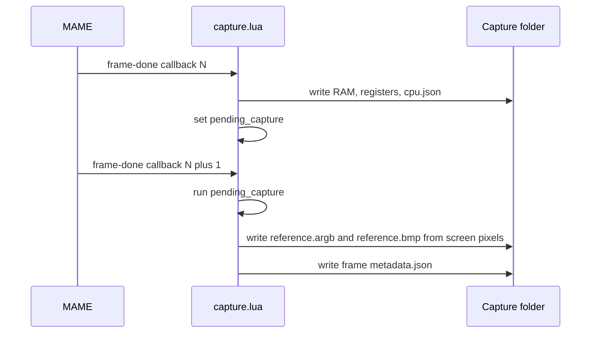

# MAME oracle and captures

This page explains the capture tools in `tools/mame/`.
The Lua scripts record reference data. The shell script starts MAME, and the staging script prepares ROM files.
You will learn the format-2 capture protocol and why it uses two MAME callbacks.

## Why MAME is an oracle

MAME is an independent emulator of the Taito F3 board. The project uses it as a reference for three kinds of data:

- **Frames.** The picture that MAME draws on screen.
- **RAM.** The video RAM, palette RAM, main RAM and shared RAM at known frames.
- **Audio.** The sound-ROM bus writes and the final WAV that MAME produces.

MAME is a reference, not the truth. The team ranks the evidence in this order: ROM behavior and observed output, primary hardware evidence, work-in-progress notes, and then emulator source. `NOTES.md` records each place where the project and MAME differ.

The scripts in `tools/mame/` do not contain ROM data. The captures do contain game data. Keep them under the ignored folder `captures/` or `build/`.

## Files

| File | Job |
| --- | --- |
| `tools/mame/stage_roms.py` | Checks the ROM files against MAME CRCs and makes a zip that MAME accepts. |
| `tools/mame/run_capture.sh` | Starts MAME with the capture script and checks the output. |
| `tools/mame/capture.lua` | MAME script. Writes the per-frame capture folders. |
| `tools/mame/audio_trace.lua` | MAME script. Writes a binary trace of the sound-bus writes. |
| `tools/mame/README.md` | The original notes. |

## The MAME binary

The scripts need a MAME build for the Taito F3 driver. `tools/mame/README.md` names the binary that the project used:

- Source revision `cfc4760a3be9c5a79846b19b6a573cb38459fa7e` (a clean tree).
- Binary SHA-256 `156ffb34020580bc05d9ae0854b72e0f7f7168b1b1f466127d5d0c2f3610b91e`.
- Expected warnings: the undumped `palce16v8q-d77-15.ic21`, and a missing-parent message for `spcinvdj`. Neither stops the capture.

The default path in `run_capture.sh` is `/Users/darien/Workspace/f3-stuff/tools/mame-baseline/f3`. This path is specific to the machine of the original author. Pass `--mame PATH` or set `MAME_BIN` on your machine. If the file is missing, the script also tries `.../mame-baseline/mamef3`, then `f3` and `mame` on the `PATH`.

## Step 1: stage the ROMs

MAME reads ROMs from a zip named after the game (`landmakrj.zip`). The ROM files that the project uses are a Japan set. Two sound ROMs are short, and the board PLD files come from another set.

`stage_roms.py` solves these problems:

1. It finds the ROM files in a directory or a zip. It tries the paths in `DEFAULT_SEARCH_PATHS` unless you pass `--source`.
2. It checks every file against the `EXPECTED_ROMS` table: the file name, size and CRC-32 that MAME expects. The table covers 4 program ROMs (`e61-13.20`, `e61-12.19`, `e61-11.18`, `e61-10.17`), 3 sprite ROMs, 3 tile ROMs, 2 sound CPU ROMs, 3 sample ROMs and 4 board PLD files.
3. The sound CPU ROMs `e61-14.32` and `e61-15.33` are 128 KiB (0x20000 bytes) in the dumps. MAME expects 256 KiB (0x40000 bytes). The script appends 0x20000 bytes of `0xFF` and checks that the CRCs become `18961bbb` and `2c64557a`.
4. The four PLD files (`pal16l8a-d77-09.ic14`, `pal16l8a-d77-10.ic28`, `palce16v8q-d77-11.ic37`, `palce16v8q-d77-12.ic48`) are the same on all F3 boards. The script takes them from the `--board-source` set. The default is a `puchicar` folder on the author's machine. Pass your own path.
5. If any file is missing or wrong, it prints `[MISSING]`, `[MISMATCH]` or `[ERROR]` and exits with 1.

| Option | Default | Meaning |
| --- | --- | --- |
| `--source PATH` | search | Directory or zip with the Land Maker ROM files. |
| `--board-source PATH` | author's `puchicar` path | Directory or zip with the F3 board PLD files. |
| `--out-zip FILE` | `tools/mame/staged_roms/landmakrj.zip` | Output zip. |
| `--out-dir DIR` | none | Also write the files to a folder. |
| `--check-only` | off | Verify the CRCs. Write nothing. |

```sh
python3 tools/mame/stage_roms.py --source /path/to/roms/landmakr \
  --board-source /path/to/roms/puchicar
```

The output zip is ignored by Git (`*.zip` is in `.gitignore`).

## Step 2: capture frames

`run_capture.sh` stages the ROMs if the zip is missing, starts MAME with `capture.lua`, and checks the result.

```sh
./tools/mame/run_capture.sh --start-frame 600 --count 25 --step 120 \
  --outdir captures/landmakrj_attract
```

| Option | Default | Meaning |
| --- | --- | --- |
| `--mame PATH` | author's path, or `MAME_BIN` | MAME executable. |
| `--rompath PATH` | staged folder, then two author paths | MAME ROM search path. |
| `--outdir DIR` | `captures/landmakrj_attract` | Output folder. |
| `--start-frame N` | 300 | First frame to capture. |
| `--count N` | 10 | Number of frames to capture. |
| `--step N` | 1 | Frames between captures. |
| `--wav FILE` | `<outdir>/attract.wav` | Audio output (`-wavwrite`). |
| `--throttle` | off | Run at real speed. The default is `-nothrottle`. |
| `--stage-only` | off | Stage the ROMs and stop. |
| `--dry-run` | off | Print the MAME command and stop. |

The script runs MAME as `f3 landmakrj -rompath ... -autoboot_script tools/mame/capture.lua -autoboot_delay 0 -wavwrite WAV -video none -nothrottle`. It passes the settings to the Lua script in environment variables:

| Variable | Meaning | Default in the Lua script |
| --- | --- | --- |
| `F3_CAPTURE_DIR` | Output folder | `captures/landmakrj_attract` |
| `F3_CAPTURE_START` | First frame | 300 |
| `F3_CAPTURE_COUNT` | Number of captures | 10 |
| `F3_CAPTURE_STEP` | Step in frames | 1 |
| `F3_CAPTURE_EXIT` | `0` keeps MAME open after the last capture | exit when done |

At the end the script checks for `metadata.json` and counts the `frame_*` folders. It exits with 1 if `metadata.json` is missing.

::: tip
The cold-boot self-test of the game is visible for the first few hundred frames. Start at frame 600 or later for parity work.
:::

## The capture protocol (format version 2)

A capture is a folder with one subfolder per captured frame.

```text
captures/landmakrj_attract/
  metadata.json            global metadata
  attract.wav              audio from -wavwrite
  frame_0600/
    metadata.json          frame metadata
    control.bin            0x20 bytes: write-only scroll registers
    palette.bin            0x8000 bytes: palette RAM
    graphics.bin           0x40000 bytes: video RAM
    mainram.bin            0x20000 bytes: main RAM
    shared.bin             0x800 bytes: shared RAM (0xc00000 to 0xc007ff)
    spriteram_active.bin   0x10000 bytes: sprite RAM that MAME drew
    reference.argb         320 x 232 x 4 bytes of pixels
    reference.bmp          the same picture as a BMP
    cpu.json               main CPU registers
    soundram.bin           0x10000 bytes: sound CPU RAM
    sound_cpu.json         sound CPU PC and SR
  frame_0720/ ...
```

The `*.bin` files hold big-endian data as it appears in the 68020 address space.

| File | Source address | Notes |
| --- | --- | --- |
| `control.bin` | `0x660000` to `0x66001f` | Registers that the CPU only writes. The script rebuilds them from a write tap. |
| `palette.bin` | `0x440000` to `0x447fff` | 8192 entries of 32 bits. |
| `graphics.bin` | `0x600000` to `0x63ffff` | Sprite RAM, playfield RAM, text RAM, character RAM, line RAM and pivot RAM. |
| `mainram.bin` | `0x400000` to `0x41ffff` | 131,072 bytes. |
| `shared.bin` | `0xc00000` to `0xc007ff` | Dual-port RAM with the sound CPU. |
| `spriteram_active.bin` | `0x600000` to `0x60ffff` of the previous frame | See the sprite lag below. |
| `cpu.json` | CPU state | `pc`, `sr`, `d[8]`, `a[8]`. |
| `soundram.bin`, `sound_cpu.json` | `:taito_en:audiocpu` | Written only if the device exists. |

The global `metadata.json` holds `format_version` (2), `pixel_delay_frames` (1), `game` (`landmakrj`), the visible size (320 by 232), the visible area (`min_x` 46, `max_x` 365, `min_y` 24, `max_y` 255), `sprite_lag` (1), the sizes of the files, `total_frames_captured` and the list of frames. The frame `metadata.json` holds `frame_index`, `reference_callback_frame`, the size, the pixel format (`ARGB32_LE_BGRA`), the file names and `control_regs_hex`.

### The two-callback rule

MAME calls the Lua function registered with `emu.register_frame_done` once per frame. At the call for frame N, MAME has already swapped its bitmap. `screen:pixels()` therefore returns the picture of the previous completed frame.

The capture script handles this in two steps:

1. At callback N it reads all RAM and the registers. It saves the files and sets `pending_capture`.
2. At callback N+1 it runs `pending_capture`. It reads `screen:pixels()` and writes `reference.argb` and `reference.bmp`.

The result is that state N is paired with the pixels that MAME drew from state N. The frame `metadata.json` records both numbers: `frame_index` is N and `reference_callback_frame` is N+1.



::: warning
Captures of version 1 paired the current RAM with the previous picture. Do not use them for parity work. The consecutive-frame check in `tools/mame/README.md` shows the one-callback delay.
:::

### Sprite lag

MAME draws Land Maker with one frame of sprite buffering. The picture of frame N uses the palette, playfield, text and line RAM of frame N, but the sprites of frame N minus 1. The script keeps `prev_spriteram` and writes it as `spriteram_active.bin`. A renderer that wants to reproduce the picture must load this file as the active sprite list. `f3rt-replay` does this (see [Frame comparison](/developer/testing/frame-compare)).

### Control registers

The scroll registers at `0x660000` to `0x66001f` are write-only. The script cannot read them. It installs a write tap with `space:install_write_tap()` and stores each written byte in the table `ctrl_regs`. The tap uses the byte mask of each write, so partial writes are kept correctly.

MAME removes all taps on a soft reset. The script registers `emu.add_machine_reset_notifier(install_control_tap)` to put the tap back. A global flag `f3rt_capture_started` makes sure that a second autoboot does not register a second capture callback.

## Audio trace: `audio_trace.lua`

The audio trace records the writes that the sound CPU makes to the sound devices. It does not depend on the main CPU timing. A replay can feed the writes into the project device models. See [Audio comparison](/developer/testing/audio-compare).

```sh
F3_AUDIO_TRACE=build/mame-audio.trace \
  f3 landmakrj -rompath tools/mame/staged_roms \
  -autoboot_script tools/mame/audio_trace.lua -autoboot_delay 0 \
  -wavwrite build/mame-audio.wav -video none -nothrottle \
  -noautoframeskip -frameskip 0 -skip_gameinfo \
  -nvram_directory build/mame-nvram-audio-trace \
  -cfg_directory build/mame-cfg-audio-trace -seconds_to_run 62
```

Use a new NVRAM folder and a new config folder so that the game starts from a cold boot. The script reads the output path from `F3_AUDIO_TRACE` and stops with an error if it is not set.

The trace file has this format (`F3AUD2`):

| Part | Size | Content |
| --- | --- | --- |
| Header | 8 bytes | `F3AUD2` and two zero bytes |
| Record | 16 bytes, little-endian | Timestamp (64 bits, 16 MHz ticks), address (32 bits), data (16 bits), byte-lane mask (16 bits) |

The script installs a write tap on the sound CPU program space from `0x200000` to `0x340003`. The timestamp is `floor(emu.time() * 16000000 + 0.5)`. Two special addresses mark events:

- `0xfffffffe` is a whole-board reset. The script writes one at the start and at every machine reset. It then reinstalls the tap.
- `0xffffffff` ends the trace. A machine stop notifier writes it and closes the file.

Version 1 traces had no reset records. Record them again.

## What MAME captures are used for

| Use | Tool | Page |
| --- | --- | --- |
| Compare native frames with `reference.bmp` | `tools/compare_frames.py` | [Frame comparison](/developer/testing/frame-compare) |
| Compare main RAM, palette and video RAM | `cmp` on the `.bin` files | [Frame comparison](/developer/testing/frame-compare) |
| Check the FDP renderer from captured RAM | `f3rt-replay --captures` | [Frame comparison](/developer/testing/frame-compare) |
| Check the audio device models | `f3rt-replay --audio-trace` and `tools/compare_audio.py` | [Audio comparison](/developer/testing/audio-compare) |

## Limits

- The capture script and the staging script contain paths of the original machine. You must pass your own paths.
- A MAME capture validates the renderer output. It does not prove that native game execution is correct or that MAME equals real hardware (`tools/mame/README.md`).
- The reference binary is a custom build for the F3 driver. A different MAME version can behave differently. Compare the version first.
