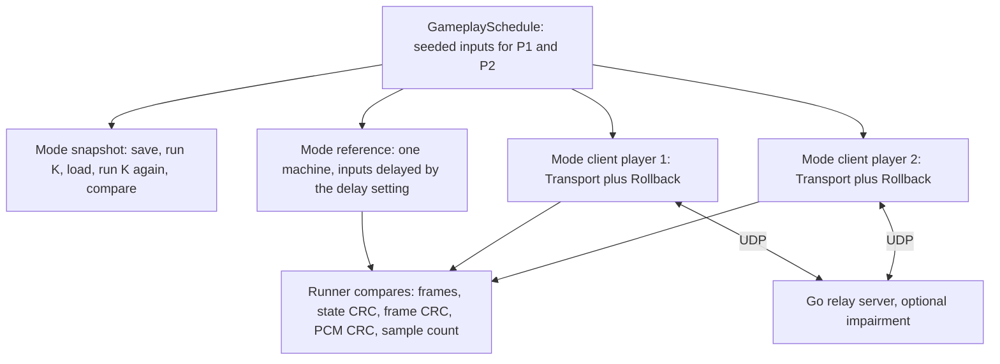

# Netplay oracle

This page explains how the project checks rollback netplay.
`tools/netplay_oracle.cpp` implements `f3rt-netplay-oracle`. `tools/run_netplay_oracle.py` runs the suites.
You will learn how to run each suite and interpret its limits.

How netplay works is in [How netplay works](/developer/netplay/). This page covers only the verification of it. The full evidence and the measured numbers are in [`docs/NETPLAY.md`](https://github.com/ansxor/f3-recomp/blob/main/docs/NETPLAY.md).

## The idea

Rollback netplay runs the game on two computers. Each computer predicts the inputs of the other player. When a prediction is wrong, the computer loads an old snapshot and runs the frames again. Two rules must hold:

1. **Snapshots are complete.** If you save the state at frame N and load it later, the machine must continue exactly as before. A missing field in the snapshot gives a different result after a rollback.
2. **Peers converge.** After the network delivers all inputs, both computers must have the same state as one single computer that received the inputs without any delay or loss.

The oracle tests these rules. The oracle is a **single machine** that runs the same input script. Its final CRC values are the expected values.



## The three modes of `f3rt-netplay-oracle`

The program needs a build with `F3_ROM_DIR` and the ROM files. It accepts only the ROM set `landmakrj`. It always runs strict native (no interpreter fallback).

```sh
cmake --build build --target f3rt-netplay-oracle -j 4
(cd netplay/server && go build -o ../../build/netplay-server .)
```

| Mode | What it does |
| --- | --- |
| `--mode snapshot` | Tests save and load. Also measures their speed. |
| `--mode reference` | Runs one machine with the delayed input stream. Prints the expected CRC values. |
| `--mode client` | Runs a headless netplay client with the real `Transport` and `Rollback` classes. It needs a relay server. |

### Snapshot mode

The test points are frame 0 and every `--snapshot-interval` frames (default 1000) below `--frames`. The depths K are 1, 7, 16, 31 and 97 unless `--snapshot-k` selects one value. For each test point and each K, the program does these steps:

1. Save the machine state with `save_state()` and count heap allocations. The count must be zero.
2. **Pass 1.** Run K frames. Record the final state CRC, RAM, palette RAM, graphics RAM, control registers, shared RAM, the frame buffer, all PCM output, and a complete sound trace.
3. Load the saved state with `load_state()`. The allocation count must be zero. The frame number must be the saved frame. The state CRC must equal the saved CRC at once.
4. **Pass 2.** Run the same K frames again with the same inputs. At the middle of the run, sleep for 1 ms. This proves that host time does not change the simulation.
5. Compare pass 1 and pass 2 byte by byte: state CRC, every memory area, frame buffer, PCM and sound trace. Any difference is an error.
6. Load the snapshot again for the next K.

The mode also measures the time of save, load and a normal frame step. It prints the mean, p95 and maximum, and the rollback depth that fits in one 60 Hz frame. `docs/NETPLAY.md` records these results for one machine. They do not belong to the pass or fail decision. The test fails only for a mismatch or a non-zero allocation count.

With `--sound-driver all` the program runs the native driver and then the oracle driver.

### Reference mode

The reference machine uses the same delay rule as the clients. At simulation frame `f` it applies the input that the schedule gives for frame `f - delay` (and zero input before frame `delay`). It prints `[SAMPLE]` lines at fixed frames (1200, 1800, 2400, 3600, 6000) and every `--dump-every` frames. At the end it prints one line:

```text
SUCCESS mode=reference seed=... frames=... final_crc=0x... frame_crc=0x... audio_crc=0x...
  audio_samples=... audio_peak=... ram_word_4078f6=... versus_status=... vs_active=... fps=...
```

`final_crc` is the machine state CRC (`Machine::state_crc()`). `frame_crc` is the CRC of the frame buffer. `audio_crc` is the CRC of all PCM output. `audio_samples` is the number of stereo sample frames.

### Client mode

A client connects to the relay with `--server`, `--room` and `--player`. It waits for the handshake (limit set by `--timeout`, default 120 seconds). It builds a `machine_identity` that includes the build hash. Then it runs the machine under `Rollback(machine, slot, delay, window)` with the schedule. It prints a `SUCCESS` line with the same CRC fields as the reference. The fields cover confirmed frames only. See [Rollback engine](/developer/netplay/rollback).

The client has options that inject faults. The runner uses them for the edge cases.

| Option | Effect |
| --- | --- |
| `--stall-at F`, `--stall-ms MS` | Stop all work at frame F for MS milliseconds. |
| `--withhold-input-at F`, `--withhold-input-ms MS` | Do not submit local input from frame F for MS milliseconds. |
| `--observe-event-at F` | Measure corrections and stalls near frame F. |
| `--corrupt-build-hash` | Change the build hash. The server must reject the client. |
| `--unthrottled` | Do not sleep in stalls. |

The other options are `--delay` (default 2), `--window` (default 16), `--schedule versus|single` (default `versus`), `--seed` (default 12345), `--frames` (default 20000), `--video-scale`, `--video-border`, `--surface`, `--dump-dir` and `--dump-every`.

## The input schedule

The oracle uses `GameplaySchedule` from `tools/gameplay_inputs.hpp` with `versus = true`. See [Seeded gameplay regression](/developer/testing/gameplay-regression) for the LCG. The versus form adds these values:

| Event | Frames |
| --- | --- |
| P1 coin | 700 to 719 |
| P2 coin | 740 to 759 |
| P1 start | Frames 800 to 2399 where `f % 90 < 5` |
| P2 start | Frames 800 to 2399 where `45 <= f % 90 < 50` |
| Key mashing | Both players, every 6 frames from frame 1200. P2 uses a second LCG seeded with `seed ^ 0x9e3779b97f4a7c15`. |

Input words have 16 bits: bits 0 to 3 are up, down, left and right. Bits 4 to 6 are the buttons. Bit 7 is start and bit 8 is coin. `netplay::apply_inputs()` writes the words to the machine.

## The suites in `run_netplay_oracle.py`

The runner starts the real Go server with a free UDP port, waits for the log line `Relay Server listening on`, and starts two client processes. It also starts a reference run for each seed. It then compares the outputs with `assert_parity_match()`.

```sh
python3 tools/run_netplay_oracle.py --suite snapshot --frames 6000 \
  --seeds 1 2 3 5 --sound-driver all --log-dir build/netplay-snapshots
python3 tools/run_netplay_oracle.py --suite baseline --frames 20000 \
  --seeds 1 2 3 5 --sound-driver native --log-dir build/netplay-baseline
python3 tools/run_netplay_oracle.py --suite impaired --frames 20000 \
  --seeds 1 2 3 5 8 13 21 34 --sound-driver native --log-dir build/netplay-impaired
python3 tools/run_netplay_oracle.py --suite cases --log-dir build/netplay-cases
```

| Option | Default | Meaning |
| --- | --- | --- |
| `--suite` | `all` | `all`, `snapshot`, `baseline`, `impaired` or `cases`. |
| `--oracle-bin` | `build/f3rt-netplay-oracle` | The oracle program. If the file is missing, the runner also tries `build/native/f3rt-netplay-oracle`. |
| `--server-bin` | `build/netplay-server` | The Go relay server binary. |
| `--rom-dir` | compiled default | ROM directory. |
| `--seeds` | 1 2 3 5 | Seeds. |
| `--frames` | 20000 | Frames per seed. The snapshot suite uses at most 6000. |
| `--delay` | 2 | Input delay in frames. |
| `--window` | 16 | Prediction window in frames. |
| `--sound-driver` | `native` | `native`, `oracle` or `all`. With `all`, the snapshot suite tests both drivers and the network suites use `native`. |
| `--dump-captures-dir` | none | Folder for frame dumps. |
| `--log-dir` | `build/netplay_logs` | Folder for all logs. |

The runner prints `OVERALL RESULT: ALL PASSED` or `FAILURES DETECTED`. It exits with 0 or 1.

### Suite `snapshot`

Runs `--mode snapshot` for each seed and driver with the interval 1000. It passes only if the program exits with 0 and prints a `final_crc`. The proof covers N = 0, 1000, ..., 5000 and the five K values. It proves that the snapshot holds all state that affects the future.

### Suite `baseline`

For each seed, the runner does these steps:

1. Run `--mode reference` for ground truth.
2. Start the server without impairment.
3. Run two client processes with the same seed, frames, delay, window and driver.
4. Compare. Both clients and the reference must have the full frame count and equal `final_crc`, `frame_crc`, `audio_crc` and `audio_samples`. An empty value is an error.

### Suite `impaired`

The same as `baseline`, but the server adds network faults: 80 ms RTT, 20 ms jitter, 3% loss and 3% reorder, with the seed of the run as the impairment seed. The clients must still equal the reference. The runs exercise real rollbacks. `docs/NETPLAY.md` records 877 to 988 rollbacks per client, including depth 16, for eight seeds of 20,000 frames.

### Suite `cases`

The suite runs four edge cases with the native sound driver:

| Case | What it injects | What must happen |
| --- | --- | --- |
| A1: late input | One client withholds its local input for 120 ms at frame 1500. | Both clients recover and equal the reference. The corrections near the injected frames are measured, not unrelated counters. |
| A2: long stall | One client stops for 1000 ms at frame 1500. | A bounded stall, then recovery to the reference state and PCM. |
| B: build mismatch | One client changes its build hash. | The server rejects the handshake. |
| C: disconnect | A client process is killed after confirmed progress reaches 1000 frames. | The other client reports the disconnect through the transport, not through the harness watchdog. |

## What the netplay oracle proves

| It proves | It does not prove |
| --- | --- |
| The snapshot holds all state that changes the future (for tested N and K). | That the emulation matches MAME or hardware. |
| Save and load do not allocate memory. | That every game state is covered. The schedule reaches the versus mode but not all modes. |
| Clients that use UDP with loss, reorder and delay end in the same state, picture and audio as one machine. | Behavior on a real wide-area network or on other operating systems. |
| The server rejects a wrong build and a dead peer is detected. | Security. The relay has no encryption or authentication. See [Relay server](/developer/netplay/server). |

::: warning
Peer agreement does not prove correct emulation. Run the MAME and gameplay gates too. `docs/NETPLAY.md` states the same.
:::

## The build fingerprint

The clients exchange a build hash in the handshake. `tools/netplay_build_id.cmake` makes the header `netplay_build.hpp` from the content of the source files, the generated code and the compiler settings. Two builds with different code or settings cannot join one match. Case B tests this rejection. See [Snapshots and determinism](/developer/netplay/snapshots).

## Limits

- The suites need ROMs and take a long time. The default seed lists run many 20,000-frame matches in a row.
- The runner kills any client process that is still running when a run ends. All logs stay in `--log-dir`.
- The server needs Go 1.22 or newer. Build it before the runner starts.
