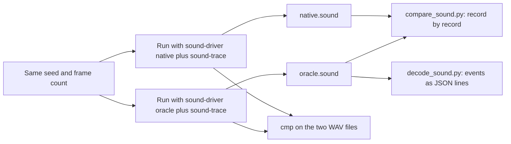

# Sound traces and sound tools

This page explains the tools that check sound behavior.
You will learn how to record and decode an `F3SND2` trace.
You will also learn how to compare drivers and play selected commands with `f3rt-sound-extract`.

The internals of the sound driver are in [Audio and sound CPU](/developer/runtime/audio/) and [Sound-CPU compiler](/developer/recompiler/sound-compiler). This page covers only the tools that verify them.

## The idea: two drivers, one trace

The sound CPU of the F3 board is a 68000 that runs a driver program from the sound ROM. The project has two ways to run this driver:

| Name | Option | How it runs |
| --- | --- | --- |
| Oracle driver | `--sound-driver oracle` | The Musashi interpreter runs the driver ROM. This is the reference. |
| Native driver | `--sound-driver native` | C code made from the driver ROM by `tools/compile_sound.py` runs the driver. No interpreter is used. |

Both drivers must make the same bus accesses at the same times. A **sound trace** records these accesses. If two traces are equal, the drivers are equal at the bus level. This is a stricter test than comparing the audio output.



## The `F3SND2` trace format

`runtime/sound_trace.cpp` writes the trace. The file starts with the 8 bytes `F3SND2` and two zero bytes. Then it holds records of 32 bytes each, little-endian.

| Offset | Size | Field | Meaning |
| --- | --- | --- | --- |
| 0 | 8 | `tick` | For a main-CPU write: the main CPU cycle count. For all other records: the audio clock in 16 MHz ticks. |
| 8 | 8 | `sample` | Number of PCM sample frames generated so far. |
| 16 | 4 | `pc` | Program counter of the code that made the access. |
| 20 | 4 | `address` | Bus address (or a RAM address, or a node, depending on `kind`). |
| 24 | 4 | `value` | Value that moved on the bus (or extra data). |
| 28 | 1 | `kind` | Record kind (see the next table). |
| 29 | 1 | `width` | Access width in bytes. |
| 30 | 2 | padding | Zero. |

The record kinds are in the enum `SoundTrace::Kind`.

| `kind` | Name | Meaning |
| --- | --- | --- |
| 1 | `MainWrite` | The main CPU wrote to the sound-related address space (shared RAM and the reset line). |
| 2 | `SoundRead` | The sound CPU read from the bus. |
| 3 | `SoundWrite` | The sound CPU wrote to the bus (OTIS, DSP, DUART, volume, mailbox, bank registers). |
| 4 | `Reset` | A whole-board reset. |
| 5 | `End` | End of the trace. Written by `finish()`. |
| 6 | `VoiceContext` | The driver started to use a voice. The address is the voice state in sound RAM. |
| 7 | `RamSnapshot` | A 4-byte piece of sound work RAM. These records give the ownership context. |
| 8 | `NoteContext` | A note was allocated. It carries the track and channel pointers. |
| 9 | `DirectNote` | A direct note-on command from the main CPU mailbox. |
| 10 | `NoteEvent` | The address of the note event that follows. |

The trace is lossless and does not read device registers. A device read would change device state. The trace code reads only work RAM mirrors, which have no side effects.

::: warning
A trace holds ROM-derived data. Keep traces under the ignored folder `build/`. Do not commit them.
:::

## Record a trace

The gameplay harness, the `landmakr` and `f3rt-run` programs and `f3rt-sound-extract` accept `--sound-trace FILE`. The frontend refuses `--sound-trace` together with netplay.

```sh
build/f3rt-gameplay-regression --seed 5 --frames 6000 --sound-driver oracle \
  --sound-trace build/seed5-oracle.sound --wav build/seed5-oracle.wav
build/f3rt-gameplay-regression --seed 5 --frames 6000 --sound-driver native \
  --sound-trace build/seed5-native.sound --wav build/seed5-native.wav
```

Trace files grow fast. The seed-5 run of 6,000 frames has 12,258,121 records, which is about 392 MB at 32 bytes each.

## `decode_sound.py`

`tools/decode_sound.py` decodes a trace into events. It only reads the file. It does not touch any running device.

```sh
python3 tools/decode_sound.py build/seed5-oracle.sound --output build/seed5-writes.jsonl.gz
python3 tools/decode_sound.py build/music.sound --notes-only --output build/music.jsonl
```

| Option | Meaning |
| --- | --- |
| `trace` | The input trace. |
| `--output FILE` | Required. A JSON-lines file. The program compresses it with gzip when the name ends in `.gz`. |
| `--notes-only` | Keep only commands, voice starts, board resets and the end event. |
| `--commands-only` | Keep only submitted and consumed command packets. |

At the end the program prints the count of each event name as JSON.

### Validation in `records()`

The function `records()` checks the whole file while it reads:

- The header must be `F3SND2`.
- The file size must be a multiple of the record size (32 bytes).
- The `tick` value must never decrease.
- The `End` record (kind 5) must exist and must be the last record.

A bad file raises `ValueError`. The same function feeds `compare_sound.py`, so a truncated trace also fails the comparison.

### What the decoder tracks

The `Decoder` class keeps a model of the sound hardware, built only from the trace.

| State | Meaning |
| --- | --- |
| `voices[32]` | 12 OTIS registers per voice. Writes use the byte lane masks and the allowed-bit masks of each register. |
| `page` | The selected OTIS register page. Pages below 32 are voice pages. |
| `banks[32]` | The sample bank per voice (bank registers at `0x300000`). |
| `dsp` | ES5510 write buffer, and a flag set that tells which GPR and instruction bytes are known. |
| `ram` | A copy of sound work RAM, rebuilt from `RamSnapshot` records. |
| `commands` | A `CommandRing` (see below). |

The decoder handles these address ranges.

| Range | Device | Events |
| --- | --- | --- |
| `0x200000` to `0x20001f` | OTIS (ES5505) | `page`, `active_voices`, `voice_write`, `voice_start`, `otis_write` |
| `0x300000` to `0x30003f` | Bank registers | `bank` |
| `0x260000` to `0x2601ff` | ES5510 DSP | `dsp_write` |
| `0x280000` to `0x28001f` | DUART | `duart_write` |
| `0x340000` to `0x340003` | Volume device | `volume_write` |
| `0x140000` to `0x140fff` | Mailbox | `mailbox_write`, `mailbox_read` |

A `voice_start` event includes the sample address in words, the pitch step, the loop and direction flags, the left and right volume, the output pair, and the driver context (voice state address, patch descriptor, sequence, note node and origin).

### The command ring

The main CPU sends sound commands through a ring buffer in shared RAM at `0xc00000` (0x400 bytes of ring, 0x800 bytes of shared RAM). `CommandRing` follows the ring from the bus writes:

1. `main_write()` stores each byte that the main CPU writes to `0xc00000` to `0xc007ff`.
2. A write to `0xc00481` commits the producer pointer (the doubled pointer at `0xc00480`). The decoder then cuts out each new packet. A packet has a size byte, an opcode byte and a payload. It becomes a `command` event with a unique `command_id`.
3. The sound CPU reads the packet at PC `0xc11116` (`consume`). The decoder matches it by ring offset.
4. The driver dispatches it at PC `0xc12ecc` or `0xc0b414` (`dispatch`). The decoder emits `command_consumed` and `command_dispatch`.
5. A main write to `0xc80100` to `0xc80103` (the reset line) clears the ring state.

The decoder does not use timing to match a packet. It uses the ring offsets. A packet that is consumed before it is published, or a packet with a wrong length, raises `ValueError`.

This lets the decoder connect each voice start to the command that caused it. A note carries a `trigger` of `sequence` or `mailbox`.

## `compare_sound.py`

`tools/compare_sound.py` compares two traces. The first argument is the oracle trace. The second is the model trace.

```sh
python3 tools/compare_sound.py build/seed5-oracle.sound build/seed5-native.sound \
  --json build/seed5-parity.json
cmp build/seed5-oracle.wav build/seed5-native.wav
```

The program compares the seven fields `tick`, `sample`, `pc`, `address`, `value`, `kind` and `width` of every record, in order. It does these things:

- It does not fit a lag.
- It does not sort records.
- It does not remove duplicate writes.
- It does not use a timestamp tolerance.
- It compares reads as well as writes.

If the traces are equal, the result has `equal: true`, `records_compared` and the count of each record kind. Exit code 0.

If any record differs (or one trace is shorter), the result has `equal: false`, the number of records that matched, the first differing record of each trace with `pc`, `address` and `value` in hexadecimal, and `recent_commands`. This list holds the last eight sound commands that the main CPU submitted before the difference. Exit code 1. A malformed or truncated file gives `equal: false` with an `error` text.

The WAV comparison with `cmp` is a separate check. Equal audio does not prove equal drivers, and equal traces do not replace listening checks. Run both.

### Recorded results

`docs/SOUND-DRIVER.md` records these results of the final seed-5 gate: 12,258,121 identical records, 3,768 voice contexts, 1,639 note allocations, 852 commands and byte-identical WAV files of 3,029,425 frames. The 3,600-frame attract run also gives identical WAVs for native main CPU with oracle sound, interpreted main CPU with oracle sound, and native main CPU with native sound.

## `f3rt-sound-extract`

`tools/sound_extract.cpp` builds `f3rt-sound-extract`. It runs the sound system without the game logic. Use it to hear one music sequence or one effect, and to test the driver with chosen commands.

```sh
build/f3rt-sound-extract --rom-dir /path/to/roms/landmakr \
  --sound-driver native --packet 038108 --packet 04860874 --seconds 5 \
  --wav-window event --sound-trace build/music.sound --wav build/music.wav
```

### How it works

1. It creates the `Machine`. If you pass `--sound-driver native`, it attaches the native driver. It opens the trace and the WAV file.
2. **Boot.** It runs the main CPU with the interpreter (`run_frame(false)`) for `--boot-frames` frames (default 900, about 15.3 seconds). The game starts the sound system and writes its own gain commands. If the sound CPU is still in reset after the boot, the program stops with an error.
3. **Freeze.** It stops the main CPU. It runs the sound system until the command ring has no pending packet, within one second of main clock time. The time of this moment is the **event origin**. The program prints it.
4. **Inject.** It advances only the audio side in slices of at most 1000 ticks. It writes each scheduled packet into the real ring buffer with `publish_packet()`: it copies the bytes, then writes the new doubled producer pointer to `0xc00480` and `0xc00481`. No hidden setup packet is added.
5. **Drain and finish.** It renders audio at least every 16000 ticks, writes the `End` record and prints a `SUCCESS` line with `packets`, `audio_frames`, `audio_peak`, `nonzero_samples` and `sound_pc`.

Errors stop the run: a packet that does not fit in the ring, a packet time at or after `--seconds`, a malformed hex string, and a sound CPU that is still in reset.

### Options

| Option | Default | Meaning |
| --- | --- | --- |
| `--rom-dir DIR` | compiled default | ROM directory. |
| `--set SET` | `landmakrj` | ROM set. |
| `--packet HEX` | none | Inject a packet at the event origin. Repeat the option for more packets. |
| `--at SECONDS:HEX` | none | Inject a packet at a time after the event origin. |
| `--seconds N` | 5.0 | Length of the run after the event origin. |
| `--boot-frames N` | 900 | Interpreted boot frames before the freeze. |
| `--sound-trace FILE` | none | Write a trace from cold boot. |
| `--wav FILE` | none | Write the audio. |
| `--wav-window full\|event` | `full` | `full` records from cold boot. `event` records only from the event origin. |
| `--sound-driver oracle\|native` | `oracle` | Driver to use. |

A packet is a hexadecimal string. The first byte is the total size of the packet. Example: `038108` has size 3, opcode `0x81` and parameter `0x08`. Packets with equal times keep the order of the arguments.

::: tip
The default 900 boot frames include the gain commands that the game writes at about 13.23 seconds. A smaller `--boot-frames` value can leave the startup attenuation in place and give very quiet output.
:::

### Verification use

Run the same packets with both drivers. Compare the traces with `compare_sound.py` and the WAV files with `cmp`.

```sh
for d in oracle native; do
  build/f3rt-sound-extract --rom-dir /path/to/roms/landmakr --sound-driver $d \
    --packet 038108 --packet 04860874 --seconds 5 --wav-window event \
    --sound-trace build/music-$d.sound --wav build/music-$d.wav
done
python3 tools/compare_sound.py build/music-oracle.sound build/music-native.sound
cmp build/music-oracle.wav build/music-native.wav
```

`docs/SOUND-DRIVER.md` records a music run with 1,697,152 identical records and a sound effect run with 1,446,519 identical records. Both WAV files were byte-identical across the two drivers.

## Unit tests for the decoder

`tools/test_decode_sound.py` has five tests that use synthetic traces. They need no ROM. See [Unit checks](/developer/testing/unit-checks). They check:

- Voice pages, byte lanes and fixed-point addresses (an unconnected byte lane must not change a register).
- That a board reset keeps OTIS state but marks DSP values as unknown.
- Wrap-around of the command ring and delayed dispatch (a new packet must not overwrite the identity of an older queued packet).
- That the origin of a voice survives the reuse of a note node.
- That a trace needs an end record and a clock that never goes back.

## Limits

- Equal traces prove equality with the interpreted driver. They do not prove equality with MAME or the real board.
- The test covers the commands that the runs use. `docs/SOUND-DRIVER.md` states that not all packet variants and error paths are exercised.
- Trace files are large. A long run needs hundreds of megabytes of disk.
