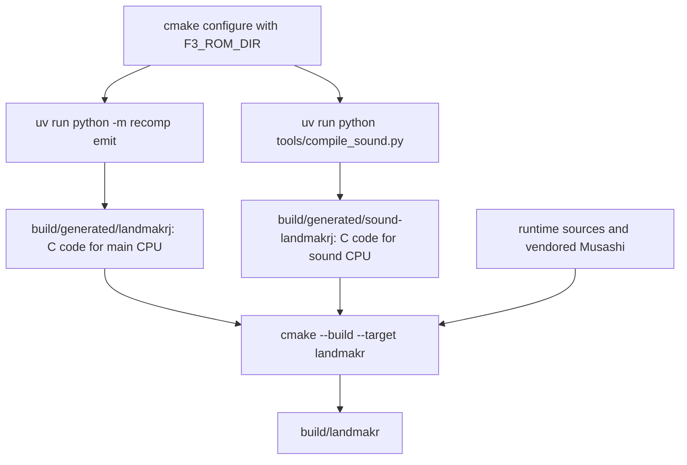

# Getting started

Install the tools and prepare your ROM files. Then build the game and start `landmakr`. This page gives each command.

::: warning You need your own ROM files
The repository contains no ROM data. You must supply a legally obtained Land Maker ROM set. The project cannot help you find ROM files.
:::

## Prerequisites

Install these tools before you build.

| Tool | Version | Used for |
| --- | --- | --- |
| CMake | 3.24 or newer | Configure and build. The top-level `CMakeLists.txt` requires 3.24. |
| Ninja | any recent version | Build backend. The commands below use `-G Ninja`. |
| C and C++ compiler | C11 and C++20 | Compile the runtime and the generated C. Use Clang or GCC. |
| SDL3 | development files | Window, keyboard and audio. CMake runs `find_package(SDL3 CONFIG REQUIRED)`. |
| Google Highway | 1.0 or newer (optional) | SIMD for Enhanced audio. If CMake can't find it, it downloads Highway 1.4.0 while configuring. |
| uv | any recent version | Manages Python (3.11+) and pinned dependencies (`capstone==5.0.9`; analysis group: NumPy, SciPy) defined in `pyproject.toml` and `uv.lock`. |
| Shader tools | `glslangValidator` and `spirv-cross` | Required by the default GPU-enabled build; omit with `-DF3RT_GPU=OFF` for CPU-only presentation. |

The authors tested on macOS (Apple silicon). Other systems are untested.

## Step 1: Get the source

Clone the repository.

```sh
git clone https://github.com/ansxor/f3-recomp.git
cd f3-recomp
```

## Step 2: Prepare the ROM files

The runtime loads 15 files from one directory. Put all of them in the same directory. The names must match exactly. The runtime checks the size and the CRC32 of each file.

The recompiler uses only the four program files. The runtime and the sound compiler use the other files.

| File | Content | Size in bytes | CRC32 |
| --- | --- | ---: | --- |
| `e61-13.20` | Main program, byte lane 0 | 524288 | `0af756a2` |
| `e61-12.19` | Main program, byte lane 1 | 524288 | `636b3df9` |
| `e61-11.18` | Main program, byte lane 2 | 524288 | `279a0ee4` |
| `e61-10.17` | Main program, byte lane 3 | 524288 | `daabf2b2` |
| `e61-03.12` | Sprite graphics | 2097152 | `e8abfc46` |
| `e61-02.08` | Sprite graphics | 2097152 | `1dc4a164` |
| `e61-01.04` | Sprite graphics, high planes | 2097152 | `6cdd8311` |
| `e61-09.47` | Tile graphics | 2097152 | `6ba29987` |
| `e61-08.45` | Tile graphics | 2097152 | `76c98e14` |
| `e61-07.43` | Tile graphics, high planes | 2097152 | `4a57965d` |
| `e61-14.32` | Sound program | 262144 (see below) | `18961bbb` |
| `e61-15.33` | Sound program | 262144 (see below) | `2c64557a` |
| `e61-04.38` | Sound samples | 2097152 | `c27aec0c` |
| `e61-05.39` | Sound samples | 2097152 | `83920d9d` |
| `e61-06.40` | Sound samples | 2097152 | `2e717bfe` |

The sound program files have two accepted forms. The runtime accepts a 262144-byte file with the CRC32 in the table. It also accepts a 131072-byte file. The runtime pads that file with `0xff` bytes to 262144 bytes. The short CRC32 values are `b905f4a7` for `e61-14.32` and `87909869` for `e61-15.33`. The sound compiler also pads a 131072-byte file. It then checks the CRC32 of the combined sound ROM. That value is `5a7e9117`.

The four program files for the Japanese set have the names `e61-10` to `e61-13`. The World set uses different program files (`e61-16` to `e61-19`). Do not use World program files. The `landmakr` program supports only `landmakrj`.

The build also checks the SHA-1 of each program file against `games/landmakrj/config.toml`. A wrong or damaged file stops the build with a clear message. See [Troubleshooting](/guide/troubleshooting).

## Step 3: Python dependencies with uv

Dependencies are managed through `uv` and declared in `pyproject.toml` with `uv.lock`. CMake invokes `uv run` during configure to run the recompiler tools inside a managed virtual environment (`.venv`).

You can pre-sync dependencies from the repository root:

```sh
uv sync
```

## Step 4: Configure and build

Run this command in the repository root. Replace `../roms/landmakr` with the path of your ROM directory.

```sh
cmake -S . -B build -G Ninja -DCMAKE_BUILD_TYPE=Release -DF3_ROM_DIR=../roms/landmakr &&
cmake --build build --target landmakr -j 4
```

Run the command from the repository root. A relative `F3_ROM_DIR` is relative to that directory. The program stores the ROM directory as its default.

The Japan config exclusions and full-coverage compile tiers are on by default.
Hot code uses `-O2`; cold code uses Clang `-Oz` (or `-Os` on other supported
compilers). Every nonexcluded entry remains native. To keep exclusions but
disable automatic tiers, add `-DF3_PROFILE_DEFAULT_TIERS=OFF` (and
`-DF3_PROFILE_TIERS=` if reusing an explicit profile override).
An explicit `-DF3_PROFILE_TIERS=/path/to/profile` replaces the frozen corpus. The frozen `profiles/landmakrj.profile` is local and gitignored, not in the repository: a Japan ROM configure needs it or `-DF3_PROFILE_DEFAULT_TIERS=OFF`.
`F3_PROFILE_SLIM` removes cold code and is not the playable default.


::: tip Use a Release build
Use the `Release` build type for gameplay.
:::

### What the build does

The configure step does the recompilation. The build step compiles the result.



1. CMake runs `uv run python -m recomp emit`. The tool verifies the four program files, finds all instructions and writes C into `build/generated/landmakrj`.
2. CMake runs `uv run python tools/compile_sound.py`. The tool verifies the sound ROM and writes C into `build/generated/sound-landmakrj`.
3. Ninja compiles the runtime library `f3rt`, the generated code and the frontend. It links them into `build/landmakr`.

Generated C is large. Allow enough disk space and adjust `-j 4` to match your computer's memory and CPU. Historical size measurements are in the [combined build report](https://github.com/ansxor/f3-recomp/blob/main/docs/developer/BINSIZE-COMBINED.md).

The generated directories are in `build/`, which Git ignores. Do not commit them.

## Step 5: Start the game

Run the program from the repository root.

```sh
./build/landmakr
```

The program opens a window and starts the game. The game uses the ROM directory that you gave to CMake. To use another ROM directory, add `--rom-dir`:

```sh
./build/landmakr --rom-dir /path/to/other/landmakr
```

Press `5` to insert a coin. Press `1` to start. The next page lists all keys: [Controls and options](/guide/running).

::: info The first seconds are quiet
The game runs its own boot sequence and sets output gain later in startup. Brief recordings can be silent; wait through startup before diagnosing missing audio.
:::

## Check that the build works without a window

You can test the build without a display. This command runs 300 frames and prints one summary line.

```sh
./build/landmakr --headless --frames 300 --no-audio
```

The last line starts with `set=landmakrj frames=300`. It also shows `fallback_instructions=0`. This value means that the generated code ran every instruction. A larger value means the game used the slow diagnostic interpreter. Read [Controls and options](/guide/running#the-summary-line) for all fields.

## Other build targets

The build creates more programs. You do not need them to play.

| Target | Purpose |
| --- | --- |
| `landmakr` | The game. Strict native code, native sound, game-data video. |
| `f3rt-run` | A diagnostic frontend. It can interpret the main CPU instead of using generated code. |
| `f3rt-replay` | Replays MAME capture data through the renderer and the audio chips. Used for tests. |
| `f3rt-tool` | Runtime diagnostic tool and regression harness (`gameplay`, `gpu-compare`, `motion`, `sound-extract`, `sprite-check`). |
| `f3rt-test-<area>` | Per-area runtime unit checks, run by CTest. |

Build one with `cmake --build build --target NAME`. For all CMake options see the [build options reference](/reference/build-options).

## Make shortcuts

The top-level `Makefile` wraps the CMake, Ninja and CTest commands above. It adds no build logic; CMake does all the work. Run these from the repository root. Each set gets its own build directory, `build-SET`. Every target that builds runs the configure step first:

```sh
make list-games                        # ROM sets that have a games/SET/config.toml
make build GAME=rayforce               # configure and build the rayforce title
make test GAME=rayforce                # build, then ctest --output-on-failure
make smoke GAME=rayforce FRAMES=300    # build, then a headless run
make run GAME=rayforce                 # build, then open the window
make headless GAME=rayforce            # build and test without SDL or GPU, in build-rayforce-headless
```

ROMs are read from `roms/SET` by default. Set `ROM_DIR=/path/to/roms/SET` if they are elsewhere. `make` stops at once when the directory is missing. `make help` lists the other variables: `BUILD_TYPE`, `BUILD_DIR`, `GENERATOR`, `JOBS`, `CC`, `CXX` and `CMAKE_ARGS`.

## Next steps

- Learn the keys and options: [Controls and options](/guide/running).
- Change picture size and filter: [Video and presentation](/guide/video).
