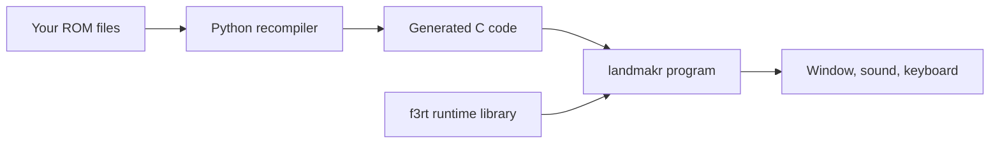

# What is f3-recomp?

This guide explains the project and its limits. Use the page list below to find your task.

## What the project does

f3-recomp runs the Taito F3 arcade game **Land Maker** on a modern computer. It does this in two steps:

1. **Recompile.** A Python tool reads the game ROM files. It finds the 68EC020 instructions of the main CPU. It writes them as C functions. A second tool does the same for the 68000 sound CPU.
2. **Run.** The C++ runtime library `f3rt` provides memory, interrupts, video, sound, input and EEPROM. The SDL3 program `landmakr` links it with generated C code. It opens the game window.

The design follows N64Recomp. The recompiler and the runtime meet at one small interface, the runtime ABI. (ABI means application binary interface.)

## What the project does not do

- It does **not** include ROM files. Supply your own legally obtained chips for the selected exact revision.
- Support is bounded: Land Maker Japan 2.01J plus native FDP/accurate-sound bring-up for RayForce America 2.3A, Command War 0.0J prototype and Riding Fight World 1.0O. See [porting](/developer/porting) for durations, source limitations and audio investigation; no arbitrary F3 or full-campaign claim.
- World Land Maker remains config-only/unverified. `F3_GAME` selects the build and matching runtime set; both LM targets are named `landmakr`, while new targets use their set names.
- Game-data video, HLE audio, enhanced GPU/motion and netplay remain Japan-only.
- The relay server does not authenticate players and does not encrypt traffic. See [Online play](/guide/netplay).
- The authors tested the build on macOS with Apple silicon. The netplay client uses POSIX sockets. Windows is not a target of the project.

## Scope and accuracy

Japan support is based on finite captures and seeded gameplay, not exhaustive coverage of every game state. Video is MAME-derived and reference-output matched, not verified against physical TC0630FDP hardware. Sound devices are also MAME-derived; native sound executes the recompiled sound ROM rather than replacing it with high-level sound commands. Optional HLE audio is approximate, not accurate-PCM equivalent.

See [Developer evidence](/developer/evidence) for validation limits, the [ImGui and netplay evidence](https://github.com/ansxor/f3-recomp/blob/main/docs/developer/IMGUI-NETPLAY.md) for menu/shader and versus lifecycle coverage, and [Porting another game](/developer/porting) for shared versus Land Maker-specific code.

## Pages in this guide

| Page | Task |
| --- | --- |
| [Getting started](/guide/getting-started) | Install tools, prepare ROM files, build and start the game. |
| [Controls and options](/guide/running) | F1 menu, keyboard/gamepad remaps, saved preferences, slots, screenshots and headless output. |
| [Video and presentation](/guide/video) | Renderer, scale/border/filter, GPU postprocess and user shader examples. |
| [Sound](/guide/sound) | Choose the sound driver. Write WAV files and sound traces. |
| [Online play](/guide/netplay) | Start the relay server. Play a 1v1 match. |
| [Troubleshooting](/guide/troubleshooting) | Find the cause of an error message. |

For a complete list of command-line options, read the [command-line reference](/reference/cli). To learn how the code works, read the [developer documentation](/developer/).
