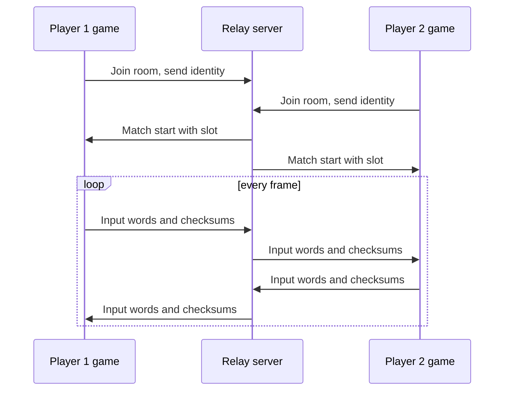

# Online play (netplay)

This page shows how to start the relay and join a two-player match. It explains synchronization and netplay limits.

Netplay is optional. Offline play does not change.

## How it works

Each player runs the complete game locally. Both machines exchange input words, checksums and connection messages through a relay server. The server forwards packets. It does not run the game.

Each game must produce the same result from the same input. To keep a smooth game on a real network, the game uses *rollback*:

1. The game predicts that the other player keeps the same input as before.
2. If a real input arrives and differs from the prediction, the game goes back to the frame of the difference. It then runs the frames again with the correct input.

Every 60 confirmed frames, both games compute a CRC32 (a checksum) of the full machine state and compare it. A different value stops the match with a desync error.



## What both players need

- **The same build.** Both players must build from the same source with the same compiler, platform and options. The game computes a build hash and the relay rejects a different hash. A build on macOS and a build on another system do not match.
- **The same ROM files.** The relay compares the CRC32 of the ROM regions.
- **The same input delay.** See [Choose the delay](#choose-the-delay).
- **A computer that can reach the relay.** The relay listens on one UDP port.

The netplay client uses POSIX sockets. The authors tested it on macOS only.

## Step 1: Build the relay

The relay is a Go program. It uses only the Go standard library.

```sh
(cd netplay/server && go build -o ../../build/netplay-server .)
```

## Step 2: Start the relay

Run the relay on a computer that both players can reach.

```sh
build/netplay-server -addr 0.0.0.0:9000
```

::: warning The default address is local only
Without `-addr` the relay listens on `127.0.0.1:9000`. Only programs on the same computer can connect. Use `0.0.0.0:9000` to accept other computers. Open the UDP port in your firewall.
:::

The relay prints `F3 Netplay Relay Server listening on ADDRESS`. Press Ctrl-C to stop it.

| Relay option | Default | Meaning |
| --- | --- | --- |
| `-addr HOST:PORT` | `127.0.0.1:9000` | UDP listen address. |
| `-port N` | 0 (not used) | Listen on `127.0.0.1:N`. This option replaces the whole `-addr` value, including the host. |
| `-rtt D` | 0 | Test aid. Add a simulated round-trip time. The one-way delay is half. |
| `-delay D` | 0 | Test aid. Add a one-way delay directly. |
| `-jitter D` | 0 | Test aid. Add random delay change of plus or minus D. |
| `-loss P` | 0.0 | Test aid. Drop a fraction P of packets (0.0 to 1.0). |
| `-reorder P` | 0.0 | Test aid. Reorder a fraction P of packets. |
| `-duplicate P` or `-dup P` | 0.0 | Test aid. Send a fraction P of packets twice. |
| `-seed N` | 0 | Seed for the random test aids. 0 means a random seed. |

D is a Go duration, for example `80ms`. The test aids only change the packets that the relay sends. Do not use them for a real match. Example for a test with a bad network:

```sh
build/netplay-server -addr 127.0.0.1:9000 -rtt 80ms -jitter 20ms -loss .03 -reorder .03 -seed 5
```

## Step 3: Start both games

Run one command on each player's computer. Use the same server address, the same room name and the same delay. Replace `SERVER` with the address of the relay.

```sh
build/landmakr --netplay-server SERVER:9000 --netplay-room example --netplay-player 1 --netplay-delay 2
```

```sh
build/landmakr --netplay-server SERVER:9000 --netplay-room example --netplay-player 2 --netplay-delay 2
```

| Option | Range | Default | Meaning |
| --- | --- | --- | --- |
| `--netplay-server HOST:PORT` | host name or address, and port | none | The relay. Required. IPv4 and IPv6 are supported. |
| `--netplay-room CODE` | 1 to 32 characters: letters, digits, `_` and `-` | none | The room name. Required. Two players with the same name play together. |
| `--netplay-player N` | 1 or 2 | automatic | The slot you want. Omit it to let the relay assign the slots. |
| `--netplay-delay N` | 0 to 8 | 2 | Input delay in frames. Both players must use the same value. |

Player numbers on the command line start at 1. The window title shows the slot with numbers that start at 0.

The first game waits in the room for at most 120 seconds. If no opponent joins, it stops with an error. Start the second game soon after the first. After a finished or failed match, use a new room name. The relay also frees a finished room after about 30 seconds.

Any `--netplay-*` option turns netplay on. Then `--netplay-server` and `--netplay-room` are both required.

### Rules for a netplay run

Netplay needs the strict native game. The program stops at the start with an error if one of these rules is broken:

- Video mode must be `game`, with scale 1 and border 0.
- Sound driver must be `native`.
- Do not use `--allow-fallback`.
- Do not use `--eeprom`, `--sound-trace` or `--fallback-report`.

`--video-filter linear` is permitted because it changes window presentation, not synchronized state. Automatic scaling is rejected; use fixed scale 1 and border 0.

## Step 4: Play

1. Wait until the window title shows `ready`.
2. Insert a coin on each computer: press `5` or `6`.
3. Press `1` or `2` on each computer to start.
4. The second player joins through the normal challenge and character-selection screens of the game.

Both games start from power-on with an erased EEPROM. The game runs its own factory setup. The program injects no coins and changes no memory.

### Keys in netplay

The keys control **your** player, not a fixed player 1.

| Key | Input |
| --- | --- |
| Arrow keys | Direction |
| `Z` / `X` / `C` | Button 1 / 2 / 3 |
| `1` or `2` | Your start button |
| `5` or `6` | Your coin |
| `F1` | Your service switch |
| `F2` | Test switch. Shared. The machine sees the test switch as pressed if either player presses it. |
| `Escape` | Quit |

Every key goes through the same delayed network path, including coin, service and test. No key acts at once on only one computer. When your window loses focus, the game releases your keys through the same path.

### What the window title shows

The title shows the state. The values change in each match. The form is this: `Land Maker — ready slot=0 rtt=3.1ms adv=0 sim=1200 ack=1198 ping=3ms rollback=0`.

| Part | Meaning |
| --- | --- |
| `connecting room=NAME` | The game is waiting for the relay or the opponent. |
| `ready slot=N` | The match runs. N is your slot, starting at 0. |
| `rtt=` and `ping=` | The measured round-trip time in milliseconds. |
| `adv=` | How many frames you are ahead of the opponent. |
| `sim=` | The last frame that your game has run. |
| `ack=` | The last frame that the opponent confirmed. |
| `rollback=` | The depth (in frames) of the last rollback. |
| `[finished]` | A finite match is complete. |

An error shows in a message box with the title `Netplay stopped`, and also on the console. The program then ends with exit code 1.

## Choose the delay

The delay is the number of frames between your key press and the moment the game uses it. One frame lasts about 17 milliseconds.

| Delay | Effect |
| --- | --- |
| Low (0 or 1) | The game feels responsive. On a slow network, rollbacks are frequent and deep. |
| Default (2) | A starting point; adjust both clients together to suit the connection. |
| High (up to 8) | Fewer rollbacks. The input feels late. |

Both players must give the same value. If the values differ, the relay rejects the second player with `delay configuration mismatch`.

## What is synchronized

| Synchronized | Not synchronized |
| --- | --- |
| The input of each player: directions, three buttons, start, coin, service. | The picture. Each computer draws its own picture. |
| The shared test switch. | The window, filter and sound device. |
| A CRC32 of the full machine state every 60 confirmed frames. | Local files such as `--wav` output. |

Audio is released only after frames are confirmed, so predicted frames do not play sound twice. Confirmation adds audio latency; it is not a physical-hardware accuracy guarantee.

## Limits

- **Two players only.** There are no spectators and no accounts.
- **No reconnect.** If a player is silent for 8 seconds, or leaves, the relay ends the session. Both players must start a new session with a new room name.
- **No encryption and no authentication.** Room names are routing labels, not passwords. Use a network that you trust.
- **Rollback cost.** The game retains 16 frames of history, but replaying a deep correction can exceed a display interval and cause a visible stall. History capacity is not a real-time performance guarantee. Historical measurements are in the [developer limits](/developer/netplay/limits).
- **Same build only.** A different compiler, platform or source gives a different build hash. The relay rejects it.
- **One platform tested.** The authors tested on macOS. Windows is not supported.
- **Relay limits.** The relay holds at most 1024 rooms. It accepts 500 packets per second from each IP address (burst 250). A game stops with an error after 10 seconds without any reply from the relay.

For the protocol, the rollback design and the measurements, read the [developer netplay pages](/developer/netplay/) and the [netplay document](https://github.com/ansxor/f3-recomp/blob/main/docs/NETPLAY.md).

## Test on one computer

You can run both players and the relay on one computer. Start the relay with the default address. Then start two games in two terminals.

```sh
build/netplay-server
```

```sh
build/landmakr --netplay-server 127.0.0.1:9000 --netplay-room test --netplay-player 1
```

```sh
build/landmakr --netplay-server 127.0.0.1:9000 --netplay-room test --netplay-player 2
```

Use the same keyboard. You cannot control both windows at once. This test is useful to check that the build works.

### Run a finite match without windows

Add `--headless --frames N` to both games. Both games run N frames and then compare a final CRC32 through the relay.

```sh
build/landmakr --headless --frames 300 --netplay-server 127.0.0.1:9000 --netplay-room smoke --netplay-player 1
build/landmakr --headless --frames 300 --netplay-server 127.0.0.1:9000 --netplay-room smoke --netplay-player 2
```

Run each command in its own terminal and start both within 120 seconds. Each prints `netplay_ready` when connected and `netplay_confirmed=` at exit. A finite match compares final state checksums through the relay; disagreement stops it with an error. These commands check connectivity and a finite run, not a full online gameplay campaign.

## If the match does not start

Read the message. The relay and the game give a reason. The most common reasons are in the table. See also [Troubleshooting](/guide/troubleshooting#netplay-errors).

| Message | Cause and action |
| --- | --- |
| `netplay join rejected: ROM CRC mismatch` | The ROM files differ. Use the same ROM files. |
| `netplay join rejected: build hash mismatch` | The builds differ. Build the same source with the same compiler and options. |
| `netplay join rejected: delay configuration mismatch` | Use the same `--netplay-delay`. |
| `netplay join rejected: requested slot already taken` | Both players asked for the same `--netplay-player`. Change one. |
| `netplay join rejected: room full (max 2 players)` | Two players are already in this room. Use another room name. |
