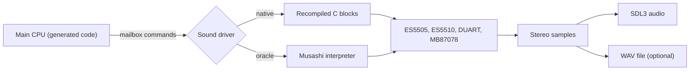

# Sound

This page explains sound generation and driver selection. It shows how to record WAV files and sound traces.

## How the sound works

The F3 board has a separate sound computer. It has these parts:

- A 68000 CPU that runs the **sound driver**. The driver is a program in the sound ROM (`e61-14.32` and `e61-15.33`).
- An ES5505 chip (called OTIS) that plays sampled sounds. It reads the sample ROM files.
- An ES5510 chip that adds effects.
- A 68681 DUART chip that gives the sound CPU its timer interrupts.
- An MB87078 chip that controls the volume.

The main CPU sends commands to the sound CPU through a mailbox in shared memory. The sound driver reads the commands and programs the ES5505 voices.

The runtime uses MAME-derived sound-device implementations, validated against reference output rather than physical hardware. It has two ways to execute the sound ROM; **native sound is not HLE**:

| Driver | Name in the option | What it is |
| --- | --- | --- |
| Native | `native` | The sound ROM, recompiled to C at build time by `tools/compile_sound.py`. This is the default when the build made it. |
| Oracle | `oracle` | The same ROM, run by the Musashi 68k interpreter. This is the reference. |

Both drivers write to the same emulated chips. The chips and the SDL3 audio output do not change.



## Choose the sound driver

Use `--sound-driver native` or `--sound-driver oracle`.

| Situation | Driver |
| --- | --- |
| You built with `F3_ROM_DIR` and give no option | `native` |
| You give `--sound-driver oracle` | `oracle` |
| The program has no generated sound code and you give no option | `oracle`. This happens if you configured the build without `F3_ROM_DIR`. |
| The program has no generated sound code and you give `--sound-driver native` | Error: `Native sound requires a generated sound program (F3_ROM_DIR)` |
| You give another value | Error: `--sound-driver must be oracle or native` |

Finite seeded runs compare native sound bus traces and WAV output with the oracle. These checks do not establish correctness for every reachable game state. See [Developer evidence](/developer/evidence) and the [sound-driver document](https://github.com/ansxor/f3-recomp/blob/main/docs/SOUND-DRIVER.md) for coverage and limits.

::: info Why two drivers
Use the oracle to investigate a suspected native sound CPU bug. Use the native driver for normal play and netplay. Both execute the same ROM and feed the same emulated sound devices.
:::

The native driver needs exactly the sound ROM with CRC32 `5a7e9117`. For another ROM the program stops with `SoundNative: unsupported sound ROM CRC 0x... (expected 0x5a7e9117)`.

## Play without sound

Add `--no-audio` to skip the sound device. The machine still makes the samples. A `--wav` file still has the full audio. Headless runs never open a sound device.

## Record a WAV file

Use `--wav FILE` to record 16-bit stereo PCM. The ES5505 audio core sets the sample rate. Offline runs record generated audio; netplay records confirmed audio.

```sh
./build/landmakr --headless --frames 3600 --wav build/audio.wav
```

The program fills in the WAV header at the end of the run. Do not read the file while the program runs.

::: tip The first seconds are quiet
The game sets its output gain at about 13.23 seconds (780 frames at the native frame rate). A recording that stops earlier can be very quiet or silent.
:::

Keep WAV files in the ignored `build/` directory. They contain audio from the ROM.

## Record a sound trace

A sound trace records every read and write that the sound CPU makes on its bus, and every write from the main CPU to the sound mailbox. The trace does not change the timing and does not read any device register a second time.

```sh
./build/landmakr --headless --frames 6000 --sound-trace build/run.sound --wav build/run.wav
```

Notes:

- The trace file starts with the 8 bytes `F3SND2` and two zero bytes. Each record has 32 bytes.
- The trace contains data from the ROM. Keep it in `build/`. Do not commit it.
- Online play rejects `--sound-trace`.

Decode the trace with the Python tools. All paths are examples.

```sh
python3 tools/decode_sound.py build/run.sound --output build/run-writes.jsonl.gz
python3 tools/decode_sound.py build/run.sound --notes-only --output build/run-notes.jsonl
```

| Option of `decode_sound.py` | Effect |
| --- | --- |
| `--output FILE` | Required. Writes JSON lines. A name that ends in `.gz` gives a compressed file. |
| `--notes-only` | Keeps only voice starts, commands and reset or end events. |
| `--commands-only` | Keeps only the submitted and consumed command packets. |

To compare the traces of the two drivers, record one trace with each driver and run the comparison tool.

```sh
python3 tools/compare_sound.py build/oracle.sound build/native.sound
```

The tool needs exact records, timestamps and ownership data. Add `--json FILE` to save the result.

## Extract one sound or one music sequence

The `f3rt-sound-extract` program boots the game, freezes the main CPU, and then sends sound commands that you choose. It writes a WAV file and a trace of only that sound.

```sh
cmake --build build --target f3rt-sound-extract
build/f3rt-sound-extract --rom-dir /path/to/roms/landmakr \
  --sound-driver native --packet 038108 --packet 04860874 --seconds 5 \
  --wav-window event --sound-trace build/music.sound --wav build/music.wav
```

| Option | Default | Effect |
| --- | --- | --- |
| `--rom-dir DIR` | Build-time ROM directory, if any | ROM directory. |
| `--set SET` | `landmakrj` | ROM set. |
| `--packet HEX` | none | Send a packet at time zero of the event. You can repeat the option. |
| `--at SECONDS:HEX` | none | Send a packet at the given time. You can repeat the option. |
| `--seconds N` | 5.0 | How long to run after the event origin. Must be greater than 0. |
| `--boot-frames N` | 900 | Frames to boot before the program freezes the main CPU. Must be greater than 0. |
| `--sound-trace FILE` | none | Write a trace from cold boot. |
| `--wav FILE` | none | Write a WAV file. |
| `--wav-window full\|event` | `full` | `full` records from cold boot. `event` records from the event time. |
| `--sound-driver oracle\|native` | `oracle` | Driver to use. |

A packet is a hex string. The first byte is the total packet size, including the size byte and the opcode byte. For example, `038001` has size 3, opcode `0x80` and parameter `0x01`. The program adds no hidden setup packets.

The default of 900 boot frames is after the output-gain writes of the game. A smaller number can leave the sound attenuated. For packet meanings and timing, read the [sound documentation](https://github.com/ansxor/f3-recomp/blob/main/docs/SOUND-DRIVER.md).

## Next steps

- [Online play](/guide/netplay) uses the native driver only.
- The sound compiler: [Developer: sound compiler](/developer/recompiler/sound-compiler).
