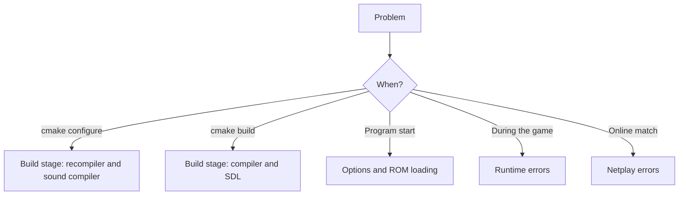

# Troubleshooting

This page lists errors, causes and corrective actions. Find the stage where the problem occurs. Then find the message.

The frontend prints `f3rt: MESSAGE` and exits with code 1. The recompiler prints `f3-recomp: MESSAGE` and exits with code 1. Other tools use different messages and codes. `f3rt-replay` prints the error without a prefix and exits with code 2. See [CLI reference](/reference/cli#general-rules).

## Build stage: configure

The configure step runs the recompiler and the sound compiler. Both read your ROM files. If one fails, CMake stops with an error from `execute_process`. The real message is in the text above that error.

### Recompiler messages

| Message | Cause and action |
| --- | --- |
| `f3-recomp: Missing ROM lane file 'e61-13.20' in 'DIR' for game 'landmakrj'.` | The file is not in the ROM directory. Check the path in `F3_ROM_DIR` and the file name. The same message exists for `e61-12.19`, `e61-11.18` and `e61-10.17`. |
| `f3-recomp: ROM lane 'FILE' size mismatch: expected 524288 bytes, got N bytes.` | The file has a wrong size. Use the original dump. |
| `f3-recomp: ROM lane 'FILE' CRC32 mismatch: expected X, got Y.` | The file has a different content, or a different version of the game. Use the files in the table in [Getting started](/guide/getting-started#step-2-prepare-the-rom-files). |
| `f3-recomp: ROM lane 'FILE' SHA1 mismatch: expected X, got Y.` | Same cause as for CRC32. The tool checks both values. |
| An error that names a missing module, for example `No module named 'capstone'` | Capstone is not installed, or Python cannot find it. Run the `pip install --target build/python -r recomp/requirements.txt` command from [Getting started](/guide/getting-started#step-3-install-capstone). |
| An error that names `tomllib` | The Python version is older than 3.11. Use Python 3.11 or newer. |

The recompiler checks only the four program files. The other 11 ROM files are checked when you start the program. See [Program start](#program-start-rom-files).

The recompiler also has messages about the config file, for example `Config ... is missing [rom] section.`, `Unknown discovery coverage mode` and `Entry point must be word-aligned (even)`. They appear only if you edit `games/landmakrj/config.toml`. Restore the original file. (Code hooks were removed; `[[hooks]]` is no longer a valid key.)

### Sound compiler messages

| Message | Cause and action |
| --- | --- |
| `FileNotFoundError: Sound ROM chips e61-14.32 / e61-15.33 not found in DIR` | Add the two sound program files to the ROM directory. |
| `ValueError: Unexpected ROM chip sizes: A / B` | A sound file has a size other than 131072 or 262144 bytes. Use the original dump. |
| `ValueError: Sound ROM CRC mismatch: got 0x..., expected 0x5a7e9117` | The sound files do not match the Japanese set. |

### Other configure problems

| Symptom | Cause and action |
| --- | --- |
| CMake says it needs a newer version | The top-level `CMakeLists.txt` needs CMake 3.24 or newer. |
| CMake cannot find a package configuration file for `SDL3` | Install the SDL3 development files. If they are in a non-standard place, set `CMAKE_PREFIX_PATH` or `SDL3_DIR`. |
| You want no window program | Add `-DF3RT_SDL=OFF`. The `landmakr` program is then not built. |
| `Set F3_GENERATED_DIR to emitted program directory (sources.cmake missing)` | You used the `recomp` directory alone and gave no generated code. Use the top-level build with `F3_ROM_DIR`, or run `python3 -m recomp emit` first. |

## Build stage: compile

| Symptom | Cause and action |
| --- | --- |
| The build takes very long and uses much disk space | Generated C is large. Use `-DCMAKE_BUILD_TYPE=Release` and reduce parallel jobs if memory is limited. |
| The compiler stops on warnings in `f3_recompiled` | The generated code is built with `-Wall -Wextra -Werror` on GCC and Clang. Report this as a bug with your compiler version. |

## Program start: options

These messages come from the option checks in `runtime/frontend.cpp`.

| Message | Cause and action |
| --- | --- |
| `Unknown argument: X` | The option name is wrong. Run `./build/landmakr --help`. |
| `Missing value for --X` | The option needs a value and it is last on the line. |
| `stoull: no conversion` or `stoul: no conversion` | A number option got text, for example `--frames abc`. Give a number. |
| `Headless execution requires --frames` | Add `--frames N` to `--headless`. |
| `--rom-dir required; --dump-every must be positive` | No ROM directory is known, or `--dump-every` is 0. |
| `This generated executable requires landmakrj` | `landmakr` accepts only `--set landmakrj`. |
| `--sound-driver must be oracle or native` | Use one of the two names. |
| `Native sound requires a generated sound program (F3_ROM_DIR)` | The build has no generated sound code. Configure with `F3_ROM_DIR`, or use `--sound-driver oracle`. |
| `--renderer must be accurate, enhanced, game-cpu, compare-cpu or compare-gpu` | Use one of the five names (`accurate` and `enhanced` are the user-facing ones). |
| `Game-data video requires strict native execution` | You used `enhanced` or a developer game/compare renderer with `--allow-fallback`, `--set` other than `landmakrj`, or in `f3rt-run`. Use `landmakr` without `--allow-fallback`. |
| `--video-scale must be 1..4, auto or auto-integer` | Use a numeric scale 1–4 or one of the automatic GPU modes. |
| `--video-scale auto/auto-integer requires --renderer enhanced or compare-gpu` | Use `--renderer enhanced` or keep a fixed numeric scale. |
| `--video-border must be 0..160` | Use a value from 0 to 160. |
| `--video-filter must be nearest or linear` | Use one of the two names. |
| `Scale, border and filter options require --renderer enhanced (or a developer game/compare renderer)` | You gave scale, border or a filter other than `nearest` with `--renderer accurate`. Use `--renderer enhanced`. |
| `--netplay-player must be 1 or 2` | Use 1 or 2. |
| `--netplay-delay must be 0..8` | Use a value from 0 to 8. |
| `Netplay requires --netplay-server and --netplay-room` | Give both options. |
| `Netplay requires --netplay-host or --netplay-join` | Choose exactly one role for CLI entry, or use F1 Host/Join. |
| `Netplay requires strict-native main execution without sound tracing` | Use generated main execution without fallback or a sound trace. Presentation geometry and EEPROM persistence are allowed. |
| `Netplay frame limit exceeds protocol range` | The `--frames` value is too large for netplay. |
| `This binary was built without F3_GENERATED_DIR` | You used `--translated` with a program that has no generated code. |
| `Generated block registration failed` | The generated code does not match the runtime. Rebuild everything. |

### Program start: ROM files

The runtime loads 15 files. Each file is checked for size and CRC32. The paths in the messages are the paths that the runtime tried to open.

| Message | Cause and action |
| --- | --- |
| `Cannot open ROM: PATH` | The file is missing or not readable. Check the file name in the ROM directory. The recompiler did not check this file. |
| `Wrong ROM length: PATH` | The file has a different size from the table in [Getting started](/guide/getting-started#step-2-prepare-the-rom-files). |
| `ROM CRC mismatch: PATH` | The file content is different. Use the original dump. |
| `Padded sound ROM CRC mismatch: PATH` | A short sound file has a good CRC, but the padded result does not. Use the original dump. |
| `Cannot read ROM: PATH` | The file could not be read. Check permissions. |
| `Unsupported ROM set: X` | The set name is not `landmakrj` or `landmakr`. |
| `SoundNative: unsupported sound ROM CRC 0x... (expected 0x5a7e9117)` | The native sound driver supports only the Japanese sound ROM. |

### Program start: other files

| Message | Cause and action |
| --- | --- |
| `Invalid EEPROM file: PATH` | The `--eeprom` file does not have exactly 128 bytes. Delete it to start with a new EEPROM. |
| `EEPROM read failed` or `EEPROM write failed` | The program cannot read or write the file. Check the path and permissions. |
| `Cannot open sound trace: PATH` or `Sound trace write failed` | Check the `--sound-trace` path and the free disk space. |
| `WAV open failed` or `WAV write failed` | Check the `--wav` path and the free disk space. |
| `Fallback report write failed` | Check the `--fallback-report` path. |

### Program start: window and sound device

If SDL cannot start, the program prints the text that SDL gives. Typical causes: no display, or no sound device. To run without both, use `--headless --frames N`. To run with a window but without a sound device, use `--no-audio`.

## During the game

| Message or symptom | Cause and action |
| --- | --- |
| `Untranslated main CPU instruction at PC 0x...` | The generated code does not cover this address. The `landmakr` program stops by design. Please report it with the address. You can try `--allow-fallback` for a diagnostic run, but that run does not count as the native game. |
| `CPU halted at N` | The main CPU stopped. Please report the number. |
| `SoundNative: fatal unsupported reachable PC: 0x... (opcode 0x...)` | The native sound driver reached code that it does not cover. Please report it. Try `--sound-driver oracle` to continue. |
| `Game composite frame N: ... RGB pixel mismatches` | With `--renderer compare-cpu` or `compare-gpu` the two renderers disagree. See [Video and presentation](/guide/video#what-an-error-means-in-the-compare-renderers). |
| The game is slow | Check that you configured `-DCMAKE_BUILD_TYPE=Release`. Try `--renderer accurate` if GPU device or driver behavior is problematic.
| `f3rt: warning: GPU renderer unavailable (...); falling back to --renderer accurate` | The default or saved `enhanced` renderer could not start a GPU device or claim a window, so this session runs `accurate`. Fix the GPU driver, or set Renderer to `accurate` in F1 → Video. Passing `--renderer enhanced` explicitly makes this an error instead. | |
| No sound at the start | The game sets the output gain at about 13 seconds. Wait. Check that you did not give `--no-audio`. |
| Frontend settings or remaps are lost | Choose **Save preferences** in F1 and check the selected `--config` path. |
| Arcade game settings are lost | Add `--eeprom FILE`. See [Controls and options](/guide/running#settings-and-the-eeprom). |
| The keys do not work | Focus the window and close F1; game input is neutral with the menu open. Check bindings; P2 has only start/coin defaults, and gamepads require explicit bindings. Netplay uses local P1 for your assigned player. |

## Netplay errors

Session failures appear in the F1 status and console and return local. A new Host/Join creates a fresh handoff rather than restarting the process.

### Before the match

| Message | Cause and action |
| --- | --- |
| `netplay room name cannot be empty` | Give a name with `--netplay-room`. |
| `netplay room name must be 1 to 32 characters, got N` | Shorten the name. |
| `netplay room name contains invalid characters: NAME` | Use only letters, digits, `_` and `-`. |
| `netplay player option must be 0 (auto), 1, or 2, got N` | Use 1 or 2, or omit the option. |
| `netplay delay must be between 0 and 8, got N` | Use a value from 0 to 8. |
| `failed to resolve netplay server address: HOST:PORT (REASON)` | The host name or address is wrong. Write it as `HOST:PORT`. |
| `failed to create UDP socket`, `failed to set non-blocking UDP socket`, `failed to connect UDP socket to server` | The operating system refused a socket. The text after the colon gives the reason. |
| `netplay handshake timeout: no response from server for 10 seconds` | The relay is not running, the address or port is wrong, or a firewall blocks the UDP port. |
| `netplay room wait timeout: exceeded 120 seconds waiting for opponent` | The other player did not join. Start the second game. |
| `netplay join rejected: protocol mismatch` | The relay and the game use different protocol versions. Build both from the same source. |
| `netplay join rejected: room full (max 2 players)` | Two players are in the room. Use another room name. |
| `netplay join rejected: requested slot already taken` | Both players asked for the same slot. |
| `netplay join rejected: ROM CRC mismatch` | The ROM files differ between the players. |
| `netplay join rejected: build hash mismatch` | The builds differ. Both players must build the same source with the same compiler, platform and options. |
| `netplay join rejected: snapshot format mismatch` | Match audio/video simulation configuration and state format. |
| `netplay join rejected: host/join role conflict` | Choose one host and one guest; either may be P1 or P2. |
| `netplay join rejected: invalid room name` | The relay rejected the name. Use 1 to 32 letters, digits, `_` or `-`. |
| `netplay join rejected: rate limited` | Too many packets from your IP address. Wait and try again. |
| `netplay join rejected: match already in progress` | The room has a running match. Use a new room name. |
| `netplay join rejected: invalid identity payload` | The relay and the game do not agree on the packet format. Build both from the same source. |
| Guest requested a different delay | This is supported: the guest adopts the host's 0–8 frame delay. |
| `netplay handshake peer identity mismatch` | The other player's identity differs from yours. Use the same build and ROM files. |
| `netplay invalid slot assigned: N` or `netplay invalid session id 0` | The relay sent a bad answer. Check that the relay is the one from this repository. |

### During the match

| Message | Cause and action |
| --- | --- |
| `netplay connection timeout: peer unreachable for 8 seconds` | Check relay/network reachability. After local return, ready a fresh Host/Join; the same room can be reused. |
| `netplay disconnected: REASON` | The relay ended the session. Restore/return is automatic; ready a fresh handoff. |
| `netplay desync detected at frame N ...` or `DESYNC at frame N ...` | The two machines have different state. The message gives both CRC32 values. This is a bug or a build mismatch. Please report it with the build details of both players. |
| `netplay finish CRC mismatch ...` | At the end of a `--frames` match, the final CRC32 values differ. |
| `netplay input buffer overflow (peer stalled/backpressure) ...` | The other player stopped for too long. |
| `netplay peer sent invalid input word: 0x...`, `netplay input mutation detected at frame N ...` | A packet had wrong content. Check the network, and that both sides run the same build. |
| `Netplay strict-native execution halted at frame N` | The native CPU code stopped. Please report it. |
| `Netplay frame counter exhausted; start a new match` | The match reached the end of the frame counter range. Start a new match. |
| `Confirmed audio queue full; drain render_audio while stalled` or `Rollback exceeded retained snapshot window` | These messages show an internal limit. Please report them. |

## Ask for help

Open an issue at [github.com/ansxor/f3-recomp](https://github.com/ansxor/f3-recomp/issues). Include the full message, the command line, your operating system and your compiler version. Do not attach ROM files.
