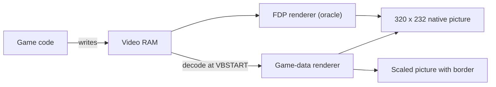

# Video and presentation

This page explains the two renderers. It shows how to change picture size, border columns and filtering. It also explains the video report.

## Background: two ways to draw

The F3 board draws its picture with a custom chip, the FDP. The game writes tile maps, sprite lists and text into the video RAM of this chip. The chip reads the RAM and draws the picture.

The runtime has two ways to make the same picture:

- **FDP renderer.** A MAME-derived implementation reads the video RAM written by the game. It is called the *oracle* because it is the reference for the game-data renderer, not because it has been verified against physical TC0630FDP hardware.
- **Land Maker game-data renderer.** At VBSTART it decodes the same video RAM into scene geometry, then uses that geometry for higher resolutions and extra border columns.



## Choose the renderer

Use `--renderer NAME`, or the **Renderer** setting on the Video tab of the F1 menu (it takes effect on restart and is saved in the settings file as `renderer=`).

| Renderer | What it does |
| --- | --- |
| `enhanced` | Draws with the game-data renderer on the GPU (SDL3 GPU: Metal on macOS, Vulkan elsewhere). Only this renderer has scale, border, interpolation, post-processing and the display-rate presentation features. This is the default in `landmakr` (strict native, GPU-enabled build). |
| `accurate` | Draws with the FDP renderer on the CPU. This is the default if you add `--allow-fallback`, in `f3rt-run`, and in builds without GPU support. Scale, border, filter and interpolation do not apply. |

Two more names exist for developers and are accepted only on the command line, never in the settings file or the menu:

| Developer renderer | What it does |
| --- | --- |
| `game-cpu` | Game-data renderer composited on the CPU. This is the parity baseline that produces the canonical native pixels and CRCs. |
| `compare-cpu`, `compare-gpu` | Draw with both renderers. For each frame that the game-data renderer draws, they compare the two pictures and stop with an error if one pixel differs. `compare-gpu` also enables the GPU-only sprite presentation state. |

Any other value stops the program with `--renderer must be accurate, enhanced, game-cpu, compare-cpu or compare-gpu`.

`enhanced` and the developer game/compare renderers need the strict native `landmakrj` run. If you add `--allow-fallback`, or you run `f3rt-run`, the program stops with `Game-data video requires strict native execution`. Only the `landmakr` program can use them. `enhanced` in a build without `F3RT_GPU` stops with `The GPU renderer requires F3RT_GPU build support` (headless runs are allowed).

### When the game-data renderer uses the oracle

The game-data renderer cannot draw every frame. Unsupported frames use the MAME-derived FDP reference instead. Matching this reference is not a claim of exhaustive game coverage or physical-board accuracy.

Known fallback cases are described in the [video documentation](https://github.com/ansxor/f3-recomp/blob/main/docs/developer/VIDEO-HLE.md):

| Case | What happens |
| --- | --- |
| Startup | The game renderer draws it: the decoders build a complete scene from the current video RAM. |
| Bitmap pivot layer (including ending transitions) | The oracle draws the frame. |
| Screen flip and sprite trails | The oracle draws the frame while the command is active. |
| Unknown video writer | Nothing changes. With `--discovery-log FILE` the store PC is logged once. |
| Very large sprite groups | The renderer rejects groups above 32 by 32 tiles or above 1024 sprites per batch. |

## Set scale, border and filter

After the pictures match at native size, you can add the options below. They need `--renderer enhanced` (or a developer game/compare renderer). Under `accurate`, saved values are ignored and the menu shows them disabled; the same options on the command line are an error.

| Option | Range | Default | Effect |
| --- | --- | --- | --- |
| `--video-scale S` | 1 to 4, `auto`, `auto-integer` | 1 | Fixed internal scale, or GPU-only automatic window-pixel fit. |
| `--video-border N` | 0 to 160 | 0 | Adds N native columns to **each** side of the picture. |
| `--video-filter F` | `nearest` or `linear` | `nearest` | Sets the filter that SDL uses to scale the final picture to the window. |
| `--video-interp I` | `off`, `linear` or `fit` | `off` | Opt-in GPU interpolation for recognized playfield line effects. |
| `--video-interp-fields F` | `none`, `geometry`, `palette`, `geometry,palette` | `geometry` | Choose geometry smoothing, same-pen RGB palette blending, both or neither. |
| `--motion-interp` | No argument | off | Experimental GPU temporal sprite/scroll interpolation at display refresh. |

Example:

```sh
./build/landmakr --renderer enhanced --video-scale 4 --video-border 48 --video-filter linear
```

The internal picture size is:

- width = (320 + 2 × border) × scale
- height = 232 × scale

| Scale | Border | Internal size |
| ---: | ---: | --- |
| 1 | 0 | 320 × 232 |
| 1 | 48 | 416 × 232 |
| 2 | 48 | 832 × 464 |
| 4 | 160 | 2560 × 928 |

Important facts:

- **Scale redraws the scene.** The renderer evaluates the scroll, zoom and sprite positions at the higher resolution. It does not enlarge the finished picture. The artwork stays the same. The game ROM tiles are not made sharper.
- **Border shows more of the map.** The game does not know about the extra columns. Game logic and the on-screen display keep their native layout. The extra columns can be empty or show wrapped map data.
- **Linear filtering** changes only how SDL scales the final picture. It does not add detail.
- **Native data stays native.** The frame CRC, the dumps and the compare renderers always use the 320 × 232 picture.
- **Unsupported frames use the reference.** In expanded mode, the reference picture is centered with black columns at the sides. The renderer does not invent geometry for these frames.

The GPU renderer uses Metal on macOS and SPIR-V/Vulkan on supported hosts. It and the CPU compositor
use the same integer sampling, sprite raster rules and blend ordering.
Headless, native captures/CRCs, audio and rollback checksums remain CPU-produced.
If the renderer came from the default or the settings file and the GPU cannot be used (no SDL GPU driver, or the window cannot be claimed by a GPU device), the program prints `f3rt: warning: GPU renderer unavailable (...); falling back to --renderer accurate` and runs `accurate` for that session; the F1 menu shows "Active this session: accurate" and the saved preference is unchanged. An explicit `--renderer enhanced` does not fall back: it stops with the SDL error.

`--video-scale auto-integer` selects the largest scale fitting the physical
window pixels, including border, clamped to 1–4. The picture stays at exactly
that integer size, nearest-filtered even if you request linear, with centered
black bars. `--video-scale auto` uses the ceiling of the fit ratio, clamped to
1–4, and fills the aspect-preserving viewport with the chosen filter.
Above the 4x cap, auto scales the 4x image rather than supersampling further.
Below the 1x footprint, auto-integer crops centrally instead of shrinking.

Both modes follow resize, fullscreen and display density after 100ms quiet
(250ms maximum live-drag delay). F11 or Alt+Enter toggles fullscreen.
Numeric scales retain their existing behavior on either compositor. Headless auto
keeps scale 1 without opening/querying a window. Online peers can choose independent presentation modes.
The GPU port does not interpolate adjacent native line values by default.

`--video-interp linear` samples between adjacent valid playfield rows.
`--video-interp fit` uses a guarded smooth model across a recognized effect.
Both require `--renderer enhanced` and apply above scale 1; native captures
and sprites do not change. Geometry sampling is enabled by default when
interpolation is selected. `--video-interp-fields palette` additionally permits
same-pen RGB palette-bank blending, which invents intermediate colors.
Discrete clipping, priority, mosaic and uncertain transitions are not smoothed.

Unknown effects, invalid or disabled rows, jumps and uncertain fits use the
non-interpolated picture. This is distinct from `--video-filter linear`, which
only filters the finished window image. See [GPU presentation and historical
measurements](https://github.com/ansxor/f3-recomp/blob/main/docs/developer/GPU-VIDEO.md)
for implementation limits.

The program checks the values:

| Wrong input | Message |
| --- | --- |
| `--video-scale 0` or `5` | `--video-scale must be 1..4, auto or auto-integer` |
| `--video-border 161` | `--video-border must be 0..160` |
| `--video-filter` other than the two names | `--video-filter must be nearest or linear` |
| Scale, border or filter with `--renderer accurate` | `Scale, border and filter options require --renderer enhanced (or a developer game/compare renderer)` |
| Auto scaling with `accurate` or a CPU renderer | `--video-scale auto/auto-integer requires --renderer enhanced or compare-gpu` |

## Temporal motion interpolation

```sh
./build/landmakr --renderer enhanced --video-scale auto-integer --motion-interp
```

`--motion-interp` interpolates positions between consecutive emulated frames,
not adjacent scanlines or finished images. GPU presentation can draw multiple
times per native frame on a high-refresh display. It adds one native frame of
positional latency; artwork, animation frames, palette and layer controls stay
discrete. Scale 2–4 exposes subpixel motion better than native scale 1.

Sprites are matched by the game's own object identity when the game declares sprite
units, otherwise by tile/palette appearance groups and mutually unique closest
positions. A sprite whose identity is new or has vanished (some games re-key a sprite
that stays on screen) is also matched by appearance, but only against other re-keyed
sprites. Count changes therefore do not reject surviving sprites. A sprite whose artwork
changed under the same identity is matched by appearance first, so a same-artwork sprite
that stayed in place wins over a neighbouring cell of the same object; the identity pairing
is kept only when nothing else claims either sprite. A matched sprite that
changes artwork, or that was re-matched by appearance, still moves smoothly if it travels
with the rest of its object (within one native pixel of the object's common movement); a
pose change or mis-pairing that moves parts of one object differently snaps. Ambiguous
matches, zoom/flip changes, movement over
32 native pixels per axis and wraps also snap. Playfield/line and text scroll
check their own layer controls; each axis can interpolate independently.
State loads, rollback corrections, pause/resume and long stalls reset history.

This experimental flag is GPU-only and CLI-only, default off. CPU/headless
pixels, captures, replay state and netplay checksums remain native.
`--unthrottled` presents current geometry rather than synthesizing intermediate
timed frames. `--video-interp linear|fit` remains an independent spatial option
and can be combined with it. See [design and measured limits](https://github.com/ansxor/f3-recomp/blob/main/docs/developer/MOTION-INTERP.md).

Every two seconds the console reports `MOTION` display mode/request/callback Hz,
`drawable_submissions_s`, `interpolated_pct` and `moving_interpolated_pct`, plus
candidate/rejection counts. macOS 14+ requests the window's maximum display
rate and paces before choosing the native pair. Callback/submission rates are
not physical scanout measurements. Static screens legitimately show little
interpolation even with 120Hz callbacks.

For a repeatable side-by-side test:

```sh
./build/f3rt-motion-regression --demo --frames 1560 --seed 5 --scale 3 --demo-seconds 30
```

Left: native-rate steps. Right: interpolated positions. Watch the purple floor
and playfield edges pan; Escape closes the window. This deliberately applies
steady render-only motion to a frozen real-ROM scene, not to emulation state.
Optional `--dump-dir DIR` saves only app-owned comparison images.


## F1 shaders and live controls

F1 → Video applies **scale and filtering live under the enhanced renderer**. The renderer, border and interpolation are restart preferences. Scale, filter, border and interpolation are disabled while `accurate` is selected. A developer `--renderer` value is shown as the active renderer; the saved preference is unchanged. Save preferences explicitly; CLI values override them at launch.

F1 → Shaders offers **Off**, **CRT** and **User**. Off is the default. Effects require the enhanced renderer; `accurate` retains the preference but does not apply it. Select a user file and press **Load / reload shader**. Failed reloads keep the last valid shader; the Active label shows what is actually running.

```sh
build/landmakr --renderer enhanced --postprocess crt
build/landmakr --renderer enhanced --postprocess user --user-shader runtime/renderer/shaders/user_transform.metal
# Vulkan: compile source offline, then load SPIR-V
glslangValidator -V --target-env vulkan1.0 -o build/user_transform.spv runtime/renderer/shaders/user_transform.frag
build/landmakr --renderer enhanced --postprocess user --user-shader build/user_transform.spv
```

The small shader ABI uses a source texture/sampler at slot 0 and a float4 containing internal width, height, scale and elapsed seconds. Metal loads `.metal` source with entry `f3_postprocess`; Vulkan loads `.spv` with entry `main` (sampled image set 2/binding 0, uniform set 3/binding 0). Use the provided examples rather than arbitrary shaders. See the [full ABI and verified limits](https://github.com/ansxor/f3-recomp/blob/main/docs/developer/IMGUI-NETPLAY.md).

Postprocessing affects GPU presentation and its screenshots, not the menu, native pixels, simulation or checksums. F12 saves a PNG alongside preferences in `screenshots/`. Scale, border, filter and shader settings can differ between [online peers](/guide/netplay).

## The video report

When the game-data renderer is enabled, the program prints `VIDEO` diagnostic lines at exit. They summarize renderer use and, in `compare-cpu` / `compare-gpu`, reference differences. Their counts depend on the run; historical examples belong in [developer evidence](/developer/user-doc-evidence).

| Line | Meaning |
| --- | --- |
| `VIDEO layer=composite ...` | Only in `compare-cpu` / `compare-gpu`. Number of frames and pixels that the program compared, and the number of mismatches. |
| `VIDEO game_frames=A oracle_fallback_frames=B` | A frames came from the game-data renderer. B frames came from the oracle. |
| `VIDEO fallback=REASON frames=N first=F last=L` | The oracle drew N frames because of REASON (`flipped-screen`, `sprite-trails` or `bitmap-pivot`). F and L are the first and last frame. |

## What an error means in the compare renderers

With `--renderer compare-cpu` or `compare-gpu` the program compares only the frames that the game-data renderer drew itself. It skips the frames that the oracle drew. If one pixel differs, the program stops with a message like this:

```text
Game composite frame 700: 12 RGB pixel mismatches; first (10,20) game=0x... oracle=0x...
```

The message gives the frame, the number of different pixels, the first different position, and the two color values. This message shows a bug in the game-data renderer. Please report it. See [Troubleshooting](/guide/troubleshooting).

## Next steps

- [Sound](/guide/sound)
- [Command-line reference](/reference/cli)
- How the game-data renderer works: [Developer: video](/developer/runtime/video/)
