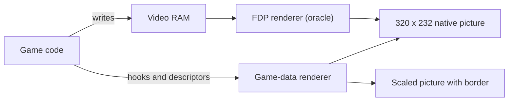

# Video and presentation

This page explains the three video modes. It shows how to change picture size, border columns and filtering. It also explains the video report.

## Background: two renderers

The F3 board draws its picture with a custom chip, the FDP. The game writes tile maps, sprite lists and text into the video RAM of this chip. The chip reads the RAM and draws the picture.

The runtime has two ways to make the same picture:

- **FDP renderer.** The runtime emulates the chip. It reads the video RAM that the game wrote and draws the picture. The authors call this renderer the *oracle*. It is the reference.
- **Game-data renderer.** Runtime hooks observe the game code that builds the scene. The renderer reads tile blocks, sprite lists and line data from ROM and work RAM. It uses scene geometry to draw at higher resolutions and with extra border columns.



## Choose the video mode

Use `--video MODE`.

| Mode | What it does |
| --- | --- |
| `game` | Draws with the game-data renderer. This is the default in `landmakr`. |
| `fdp` | Draws with the FDP renderer only. This is the default if you add `--allow-fallback`, and in `f3rt-run`. |
| `compare` | Draws with both renderers. For each frame that the game-data renderer draws, it compares the two pictures. It stops with an error if one pixel differs. |

Any other value stops the program with `--video must be fdp, game or compare`.

The modes `game` and `compare` need the strict native `landmakrj` run. If you add `--allow-fallback`, or you run `f3rt-run`, the program stops with `Game-data video requires strict native landmakrj`. Only the `landmakr` program can use the game-data modes.

### When the game-data renderer uses the oracle

The game-data renderer cannot draw every frame. For a frame that it does not support, it shows the picture of the FDP renderer instead. This is a per-frame decision. The result is still the correct picture.

The known cases, from the [video documentation](https://github.com/ansxor/f3-recomp/blob/main/docs/VIDEO-HLE.md):

| Case | What happens |
| --- | --- |
| The first frames after power-on | The oracle draws the first 231 measured frames, up to frame 418. The game has not yet set up all its data. |
| Ending transitions | The oracle draws until the game sets up its line data again. |
| Bitmap pivot layer | The oracle draws the frame. |
| Screen flip and sprite trails | The oracle draws the frame while the command is active. |
| Unknown video writer or unsupported descriptor | The oracle draws the affected part until the game sets up its data again. |
| Very large sprite groups | The renderer rejects groups above 32 by 32 tiles or above 1024 sprites per batch. |

## Set scale, border and filter

After the pictures match at native size, you can add three options. All three need `--video game` or `--video compare`.

| Option | Range | Default | Effect |
| --- | --- | --- | --- |
| `--video-scale N` | 1 to 4 | 1 | Draws the scene at N times the native resolution. |
| `--video-border N` | 0 to 160 | 0 | Adds N native columns to **each** side of the picture. |
| `--video-filter F` | `nearest` or `linear` | `nearest` | Sets the filter that SDL uses to scale the final picture to the window. |
| `--video-backend B` | `cpu` or `gpu` | `cpu` | CPU row workers or SDL3 GPU internal-resolution compositing. |
| `--video-interp I` | `off`, `linear` or `fit` | `off` | Opt-in GPU line sampling for validated PF2 water/puzzle-board effects. |

Example:

```sh
./build/landmakr --video game --video-backend gpu --video-scale 4 --video-border 48 --video-filter linear
```

The internal picture size is:

- width = (320 + 2 × border) × scale
- height = 232 × scale

| Scale | Border | Internal size |
| ---: | ---: | --- |
| 1 | 0 | 320 × 232 |
| 1 | 48 | 416 × 232 |
| 2 | 48 | 832 × 464 |
| 4 | 160 | 2560 × 928 |

Important facts:

- **Scale redraws the scene.** The renderer evaluates the scroll, zoom and sprite positions at the higher resolution. It does not enlarge the finished picture. The artwork stays the same. The game ROM tiles are not made sharper.
- **Border shows more of the map.** The game does not know about the extra columns. Game logic and the on-screen display keep their native layout. The extra columns can be empty or show wrapped map data.
- **Linear filtering** changes only how SDL scales the final picture. It does not add detail.
- **Native data stays native.** The frame CRC, the dumps and the compare mode always use the 320 × 232 picture.
- **Unsupported frames stay exact.** When the oracle draws a frame in expanded mode, the program shows the exact oracle picture in the center with black columns at the sides. It does not invent new geometry.

GPU uses Metal on macOS and SPIR-V/Vulkan on supported hosts. Both backends
use the same integer sampling, sprite raster rules and blend ordering.
Headless, native captures/CRCs, audio and rollback checksums remain CPU-produced.
Use `--video-backend cpu` if GPU device creation is unavailable.
The GPU port does not interpolate adjacent native line values by default.

`--video-interp linear` smooths scale/scroll and valid palette-bank colors
between adjacent water rows. `--video-interp fit` uses a guarded smooth model
across the effect. They require `--video-backend gpu` and take effect only
above scale 1. This is independent of `--video-filter linear`, which only
filters the finished window image.

Both modes keep the water boundary and discrete palette transition intact.
Sprites and native captures do not change. Unknown effects, invalid/disabled
rows, jumps and uncertain fits use the non-interpolated picture instead.
The measured gain is smoother water perspective, not new texture detail;
see [GPU measurements](https://github.com/ansxor/f3-recomp/blob/main/docs/GPU-VIDEO.md).

The program checks the values:

| Wrong input | Message |
| --- | --- |
| `--video-scale 0` or `5` | `--video-scale must be 1..4` |
| `--video-border 161` | `--video-border must be 0..160` |
| `--video-filter` other than the two names | `--video-filter must be nearest or linear` |
| Scale or border with `--video fdp` | `Presentation enhancements require --video game or compare` |

::: warning Online play needs the native size
Online play rejects `--video-scale` other than 1 and `--video-border` other than 0. See [Online play](/guide/netplay).
:::

## The video report

When the game-data renderer was on, the program prints `VIDEO` lines at the end of the run. Here is an example from a headless `--video compare` run of 700 frames in the author's build:

```text
VIDEO layer=composite domain=320x232-RGB sampled_frames=469 compared_pixels=34818560 pixel_mismatches=0
VIDEO game_frames=469 oracle_fallback_frames=231
VIDEO fallback=lines producer_pc=0x1003a frames=229 first=1 last=417
VIDEO fallback=text producer_pc=0x0 frames=1 first=115 last=115
VIDEO fallback=sprites producer_pc=0x10412 frames=1 first=418 last=418
```

| Line | Meaning |
| --- | --- |
| `VIDEO layer=composite ...` | Only in `compare` mode. Number of frames and pixels that the program compared, and the number of mismatches. |
| `VIDEO game_frames=A oracle_fallback_frames=B` | A frames came from the game-data renderer. B frames came from the oracle. |
| `VIDEO fallback=COMPONENT producer_pc=PC frames=N first=F last=L` | The oracle drew N frames because of COMPONENT. PC is the main CPU address of the game code that caused it. F and L are the first and last frame. |

## What an error means in `compare` mode

In `compare` mode the program compares only the frames that the game-data renderer drew itself. It skips the frames that the oracle drew. If one pixel differs, the program stops with a message like this:

```text
Game composite frame 700: 12 RGB pixel mismatches; first (10,20) game=0x... oracle=0x...
```

The message gives the frame, the number of different pixels, the first different position, and the two color values. This message shows a bug in the game-data renderer. Please report it. See [Troubleshooting](/guide/troubleshooting).

## Next steps

- [Sound](/guide/sound)
- [Command-line reference](/reference/cli)
- How the game-data renderer works: [Developer: video](/developer/runtime/video/)
