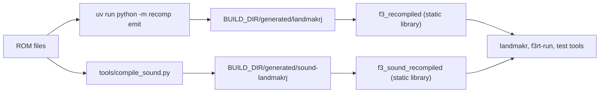

# Generated files

This page lists the files that the main and sound recompilers write. It explains their contents, required C symbols and Git ignore rules.

## Overview

The two tools write to two separate directories. CMake picks default directories when you set `F3_ROM_DIR`.



::: warning
Generated files contain code that comes from the game ROM. Do not commit them and do not share them. Every generated C file starts with a comment that says so.
:::

## Program output (uv run python -m recomp emit)

The `discover` command writes only `coverage.json`. The `emit` command writes all files in this table.

| File | Count | Written by | Meaning |
| --- | --- | --- | --- |
| `blocks_NNNN.c` | many | `generate()` | Native block functions. `NNNN` is a 4-digit index that starts at `0000`. Each file holds up to 128 blocks (`blocks_per_file`, not a command-line option). |
| `program.c` | 1 | `generate()` | Address table and `f3_generated_register`; non-tier builds also keep shared exception bodies here. |
| `exceptions_hot.c`, `exceptions_cold.c` | up to 2, tiers only | `generate()` | Shared exception vectors partitioned by whether any of their entry addresses executed. |
| `program.h` | 1 | `generate()` | Declares `f3_generated_register`. Checks the ABI version. |
| `sources.cmake` | 1 | `generate()` | Complete, hot and cold source lists (`F3_GENERATED_SOURCES`, `F3_GENERATED_HOT_SOURCES`, `F3_GENERATED_COLD_SOURCES`). |
| `program.bin` | 1 | `generate()` | A copy of the interleaved program ROM image. |
| `coverage.json` | 1 | `__main__` and `generate()` | Discovery report. |
| `lowering.json` | 1 | `generate()` | Emit report. `emit` only. |
| `profile_inventory.json` | 1 per CPU | both generators | Version, ROM CRC/base/size, complete original executable entry addresses, retained/hot/cold counts and active generated-C byte total. Address metadata only; stored in ignored generated directories. |

### blocks_NNNN.c

Each file has this layout:

1. A comment: `Generated from user-supplied ROM. Do not commit.`
2. `#include <f3rt/cpu_abi.h>` and an `#error` if `F3RT_ABI_VERSION` is not 3 (`_RUNTIME_ABI_VERSION` in `recomp/generate.py`).
3. `#include "recomp/cpu_ops.h"`. This header holds the helper macros and inline functions that the lowered code calls.
4. The block functions.

Each block function has the name `f3_native_XXXXXX`. `XXXXXX` is the 6-digit lowercase hexadecimal address of the first instruction in the block. The function looks like this:

```c
void f3_native_000000(f3_cpu *cpu) {
    switch (cpu->pc) {
    case 0x00000000u: goto L_000000;
    case 0x00000004u: goto L_000004;
    default: return;
    }
L_000000: {
    /* lowered C statements for the instruction at 0x000000 */
    cpu->pc = 0x00000004u;
    cpu->cycles += 2u;
    if (cpu->pc != 0x00000004u || cpu->stopped || cpu->halted
        || cpu->cycles >= cpu->dispatch_deadline) { f3_cc_flush(cpu); return; }
    goto L_000004;
}
L_000004: { /* ... */ }
    f3_cc_flush(cpu);
}
```

Rules that the emitter follows:

- **Entry by `switch`.** The runtime sets `cpu->pc` to any registered address inside the block. The `switch` jumps to the matching label `L_XXXXXX`. This lets the program enter the middle of a block.
- **Yield at each boundary.** After each instruction, the code checks the next address, the stop and halt flags, and `dispatch_deadline`. If one check says stop, the function flushes the condition codes with `f3_cc_flush` and returns. The runtime then handles events such as interrupts.
- **Untranslated instructions.** If `lower()` cannot translate an instruction, the emitter writes `f3_cc_flush(cpu); if (!f3_fallback(cpu)) cpu->halted = 1; return;`. These are the *fallback* instructions. In `lowering.json`, they appear as `fallback_instructions`.
- **Packing in `all_aligned` mode.** The emitter groups decoded addresses into pages of `max_block_instructions × 2` bytes. A block is one page. Two decoded instructions can overlap, so the emitter packs by address and not by instruction boundary. The code at the end of an instruction jumps to the next label only if that address is in the same block.
- **Packing in `recursive` mode.** The emitter uses the blocks from discovery. It cuts a block when it reaches `max_block_instructions`, or at a gap, or at an address that is already placed. It puts addresses that no block holds into blocks of one instruction.
- **Profile instrumentation.** `F3_PROFILE_HIT_MAIN(address)` runs at every actual label, including fallthrough entries. Shared exception handlers count `cpu->pc`. The macros compile away in ordinary builds.
- **Profile tiers.** Existing pages split into hot/cold subsets. A successor in a different subset flushes flags and returns to dispatch; every entry remains registered. Shared exception vectors have separate hot/cold source files; a vector is hot if any profile-hit entry uses it. `sources.cmake` exports separate hot/cold lists in addition to the complete source list.
- **Profile slim.** Only profile-hit addresses retain executable statements and dispatch entries. Removed successors return to dispatch, where the runtime aborts and records the missing address instead of interpreting it.

### program.c

This file holds these parts, in order:

1. The same preamble as the block files, then `#include "program.h"`.
2. `extern void f3_native_XXXXXX(f3_cpu *cpu);` for every block.
3. In `all_aligned` mode: a shared `f3_rom_exception_N(f3_cpu *cpu)` for each vector number N that occurs (4, 10 or 11). Non-tier builds define it here; tier builds declare it and define it in `exceptions_hot.c` or `exceptions_cold.c`. Each handler counts the actual entry, flushes flags and calls `f3_exception(cpu, N, cpu->pc)`.
4. `static const f3_block translated_blocks[]`. Each entry is `{ 0xADDRESSu, FUNCTION }`. The table is sorted by address. It has one entry for every decoded address, and (in `all_aligned` mode) one entry for every address that holds an illegal opcode or a line-A or line-F opcode.
5. `int f3_generated_register(f3_cpu *cpu)`. It calls `f3_register_blocks` with the table.

The vector numbers have this meaning:

| Vector | Cause | Condition in the emitter |
| --- | --- | --- |
| 4 | Illegal instruction | The base cycle table has no entry for the opcode, and the opcode is not `0x4e70` (`RESET`). |
| 10 | Line-A | The top 4 bits of the opcode are `0xA`. |
| 11 | Line-F | The top 4 bits of the opcode are `0xF`. |

An address that does not decode, but has a valid primary opcode, gets no entry. The count of these addresses is `undecoded_valid_primary_entries` in `lowering.json`.

### program.h

The header has the include guard `F3_GENERATED_PROGRAM_H`. It includes `<f3rt/cpu_abi.h>`, repeats the ABI version check, and declares inside `extern "C"`:

```c
int f3_generated_register(f3_cpu *cpu);
```

The frontends call `f3_generated_register(&m.cpu)`. It returns 1 on success and 0 if `f3_register_blocks` rejects the table (for example, a duplicate address).

### sources.cmake

```cmake
set(F3_GENERATED_SOURCES
    "${CMAKE_CURRENT_LIST_DIR}/blocks_0000.c"
    # ...
    "${CMAKE_CURRENT_LIST_DIR}/program.c"
)
```

`recomp/CMakeLists.txt` includes this file and builds the library `f3_recompiled` from `F3_GENERATED_SOURCES`.

### program.bin

The file is a copy of the interleaved ROM image (the size from `[rom] size`). The runtime loads the individual chip files with `RomSet::load()`; `program.bin` is not the player executable or a substitute for its ROM directory.

### coverage.json

The discovery step writes this file. `emit` writes it again with the same content.

| Field | Type | Meaning |
| --- | --- | --- |
| `coverage_mode` | string | `recursive` or `all_aligned`. |
| `coverage_basis` | string | A sentence that says what the numbers prove. |
| `summary` | object | The counts below. |
| `aligned_candidate_count` | integer | In `all_aligned` mode, `rom size / 2`. Else 0. |
| `aligned_decoded_count` | integer | Number of decoded instructions. |
| `aligned_invalid_count` | integer | Number of addresses that did not decode. |
| `invalid_pcs` | array of strings | Addresses that did not decode, as `0x%06x`. In `recursive` mode, these are the decode failures of the walk. |
| `proven_seeds` | array of strings | Seeds from the vector table and `entry_points`. |
| `speculative_seeds` | array of strings | Seeds from the scanners. |
| `unresolved_branches` | array of objects | Branches that the tool could not resolve. Each has `pc`, `mnemonic`, `op_str` and `reason` (`indirect_transfer` or `decode_failure`). |
| `bank_summary` | array of objects | One object for each 64 KiB bank: `bank`, `range`, `instruction_count`, `code_bytes`, `classification` (`contains_decoded_code` or `unreached_or_data`). |

The `summary` object has these fields: `rom_size_bytes`, `total_instructions`, `total_blocks`, `total_functions`, `potential_entries`, `code_bytes`, `coverage_pct`, `aligned_candidate_count`, `aligned_decoded_count`, `aligned_invalid_count`, `invalid_pcs_count`, `proven_seeds_count`, `speculative_seeds_count` and `unresolved_branches_count`.

::: info
In `all_aligned` mode, every even address is a candidate. Candidates can be data or overlap other code, so `coverage_pct` is a discovery statistic, not a measure of how much gameplay executes natively.
:::

### lowering.json

The emit step writes this report. The command also prints it, without the fields `fallback_pcs` and `source_files`.

| Field | Type | Meaning |
| --- | --- | --- |
| `decoded_instructions` | integer | Number of decoded instructions. |
| `registered_entries` | integer | Number of entries in `translated_blocks`. |
| `native_instructions` | integer | Instructions that `lower()` translated. |
| `exception_entries` | object | Number of exception stubs for each vector (`"4"`, `"10"`, `"11"`). |
| `undecoded_valid_primary_entries` | integer | Addresses with a valid primary opcode that did not decode. Zero in `recursive` mode. |
| `fallback_instructions` | integer | Instructions that call `f3_fallback`. |
| `native_blocks` | integer | Number of block functions. |
| `native_mnemonics` | object | Count for each translated mnemonic. |
| `fallback_mnemonics` | object | Count for each untranslated mnemonic. |
| `fallback_pcs` | array of integers | Addresses of the fallback instructions. |
| `source_files` | array of strings | C files, including `program.c`. |
| `runtime_abi_version` | integer | `4`. Must match `F3RT_ABI_VERSION`. |
| `emit_units` | object | `digest` (hex), per-unit `id`/`enter_hooks`/`exit_hooks`, and `frame_writer_ranges`. See [game config](game-config.md). |
| `coverage_mode` | string | `all_aligned` or `recursive`. |
| `max_block_instructions` | integer | The value that you passed (default 32). |
| `timing` | string | A fixed note: `68EC020 reference instruction costs; runtime deadlines end native blocks at instruction boundaries`. |

A nonzero `fallback_instructions` is not an error. Many of those addresses are data that the all-aligned scan decodes as code. A game run in strict native mode (`landmakr`) stops with an error if it reaches one.

## Configure-time headers (tools/compile_sprite_units.py, tools/compile_roms.py)

Written to `<build>/generated_config/` without a ROM: `sprite_units.h`,
`sprite_units.hpp` (emit units, frame writers, digest) and
`game_video_config.hpp` (compile-time `VideoConfig`). Generated C that contains a
unit hook includes `sprite_units.h`. Field details are in
[game config](game-config.md).

## Sound output (tools/compile_sound.py)

The script compiles the 512 KiB sound ROM. The ROM starts at address `0xc00000` in the sound CPU space. The script compiles every even address.

| File | Count | Meaning |
| --- | --- | --- |
| `sound_blocks_NNNN.c` | many | One C function for each compiled word. Each file holds up to `--blocks-per-file` functions (default 1024). |
| `sound_program.c` | 1 | Address table; non-tier builds also keep shared exception bodies here. |
| `sound_exceptions_hot.c`, `sound_exceptions_cold.c` | up to 2, tiers only | Shared exception vectors classified by profile-hit entry addresses. |
| `sound_program.h` | 1 | Declares `f3_sound_blocks` and `f3_sound_block_count`. |
| `sources.cmake` | 1 | Complete, hot and cold `F3_SOUND_GENERATED_*_SOURCES` lists. |
| `coverage.json` | 1 | Report. |

The function for the word at address `PC` has the name `f3_sound_block_XXXXXX` (6 hexadecimal digits). It has one instruction. It ends with `f3_sound_cc_flush(cpu)`. A word that the script cannot translate gets a function that calls `f3_sound_unsupported_pc(cpu, PC)`. This is an *actionable error stub*: the program reports the address when it runs the stub. A word with an illegal, line-A or line-F opcode does not get a function. The table points to `f3_sound_vector_4`, `f3_sound_vector_10` or `f3_sound_vector_11`, which call `f3_sound_exception`.

The files include `runtime/audio/reference/native/sound_native_ops.h`. That header defines the helper macros for the sound CPU and declares `f3_sound_exception`, `f3_sound_unsupported_pc` and `f3_sound_cc_flush` (an alias of `f3_cc_flush`).

### sound_program.h

```c
extern const f3_block f3_sound_blocks[];
extern const size_t f3_sound_block_count;
```

The generated header also declares `f3_sound_rom_crc32`, `f3_sound_excluded_ranges` and `f3_sound_excluded_count`. Frontends call `m.use_native_sound(f3_sound_blocks, f3_sound_block_count, {f3_sound_excluded_ranges, f3_sound_excluded_count}, f3_sound_rom_crc32)`.

### Sound input check

`load_sound_rom()` uses the selected `[sound]` manifest through `recomp/roms.py`: chip size/CRC32/SHA-1, explicit lane geometry and validated LM short dumps. Command War/Riding Fight mirror their physical 256 KiB bank into 512 KiB; RayForce is physical/mapped 512 KiB. No `sound.bin` fallback exists. The generated per-game CRC binds the runtime image.

### Sound coverage.json

| Field | Meaning |
| --- | --- |
| `rom_crc32` | CRC32 of the selected mapped sound image. |
| `coverage_mode` | `all_aligned`. |
| `total_words` | Number of 16-bit words in the ROM. |
| `compiled_blocks` | Number of entries in the address table. It includes the exception vector entries. |
| `supported_instructions` | Words that the script translated (it also counts exception entries). |
| `unsupported_words` | Words that got an error stub. |
| `source_files` | The C files, including `sound_program.c`. |
| `supported_mnemonics` | Count for each translated mnemonic. |
| `unsupported_mnemonics` | Count for each untranslated mnemonic. |

## Symbols that must match

| Symbol | Defined in | Used in | Notes |
| --- | --- | --- | --- |
| `F3RT_ABI_VERSION` (`3u`) | `include/f3rt/cpu_abi.h` | Both generated CPU programs | The generated files stop the build with `#error` if the version differs. Change `_RUNTIME_ABI_VERSION` and the header together. |
| `f3_generated_register` | `program.c` | Frontend and native harnesses | Registers blocks and immutable exclusions with the CPU. |
| `f3_sound_blocks`, `f3_sound_block_count`, `f3_sound_excluded_ranges`, `f3_sound_excluded_count` | `sound_program.c` | Native callers through `Machine::use_native_sound` | Compact exhaustive-complement table and exclusion span. |
| `f3_register_blocks`, `f3_register_exclusions`, `f3_dispatch`, `f3_boundary`, `f3_exception`, `f3_set_sr`, `f3_reset_devices`, `f3_fallback` | `runtime/cpu_abi.cpp` | Generated code | The runtime side of the CPU ABI. |
| `f3_read8/16/32`, `f3_write8/16/32` | `runtime/cpu_abi.cpp` | Generated code through `recomp/cpu_ops.h` | Memory access. |
| `f3_cc_flush` | `recomp/cpu_ops.h` | Generated code | Turns the lazy condition codes into the status register. |
| `f3_sound_exception`, `f3_sound_unsupported_pc` | `runtime/audio/reference/native/sound_native.cpp` | `sound_blocks_NNNN.c`, `sound_program.c` | Sound CPU exception and error stub handlers. |

For the ABI structure itself, read [CPU ABI](/developer/runtime/cpu-abi). For the emitter, read [Emission](/developer/recompiler/emission).

## What Git ignores

The file `.gitignore` in the repository root lists these patterns:

| Pattern | Covers |
| --- | --- |
| `build/` | The default build directory, and with it `build/generated/...` |
| `games/*/generated/` | Generated output inside a game directory |
| `games/*/rom/` | ROM files inside a game directory |
| `roms/` | ROM files |
| `*.zip` | ROM archives |
| `*.bin` | `program.bin` and every capture `.bin` file |
| `*.wav` | Audio output |
| `captures/`, `diffs/`, `nvram/`, `cfg/` | MAME captures and MAME working files |
| `wt/` | Git worktrees |
| `landmakr`, `landmakrj` | Binary or directory names at any level |
| `__pycache__/`, `*.pyc`, `.venv/` | Python files |
| `.DS_Store` | macOS files |

Because `build/` is ignored, the default output of the CMake configure step is never committed. If you generate the program into another directory, make sure that no generated file enters the repository.
